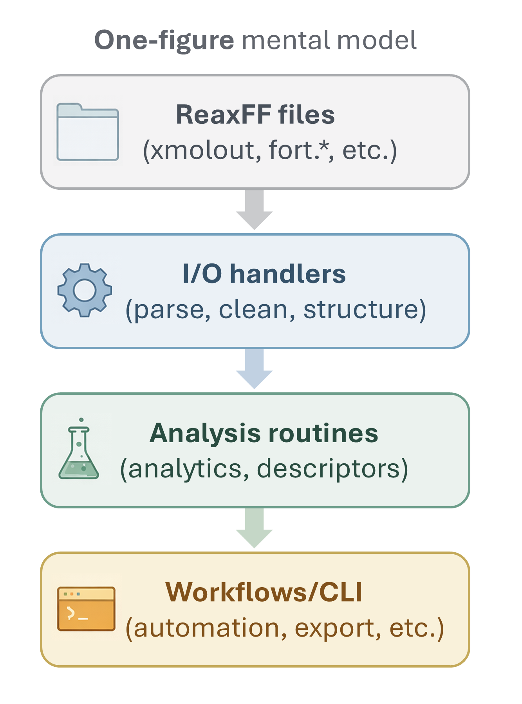

<!-- AUTO-GENERATED by docs/scripts/generate_utils_function_docs.py -->
# Equation Of States Utility

::: reaxkit.utils.equation_of_states
    options:
      show_root_heading: false
      show_root_full_path: false
      members: []

## Function: `vinet_energy_ev`

::: reaxkit.utils.equation_of_states.vinet_energy_ev
    options:
      show_root_heading: false
      show_root_full_path: false

The figure below shows the one-figure mental model used to interpret `vinet_energy_ev` output.

{ style="width:45%; max-width:520px;" }

*Figure: Conceptual mental model for understanding the `vinet_energy_ev` energy-volume response.*

## Function: `vinet_energy_trainset`

::: reaxkit.utils.equation_of_states.vinet_energy_trainset
    options:
      show_root_heading: false
      show_root_full_path: false

