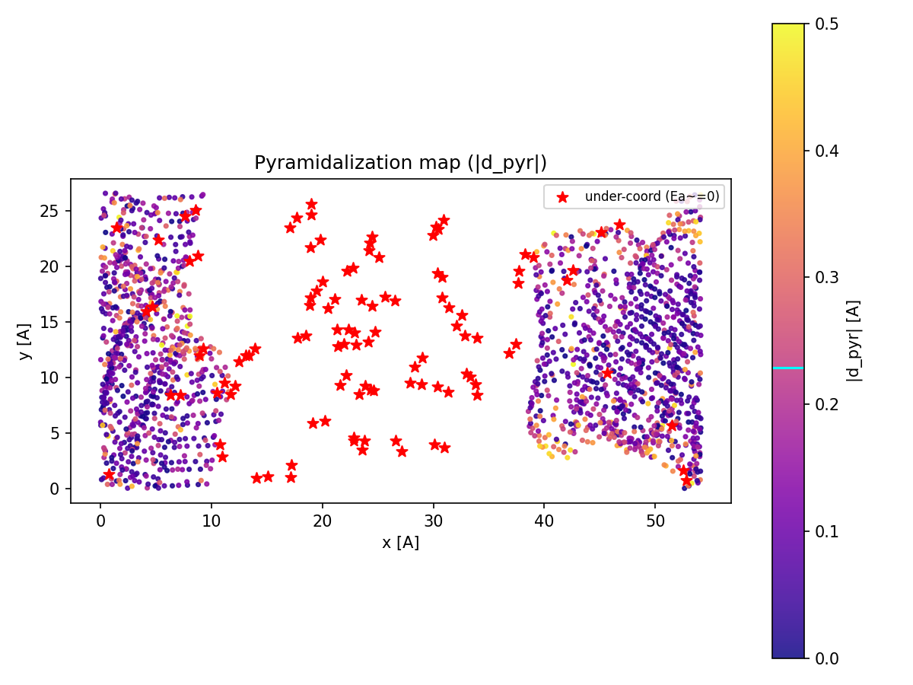
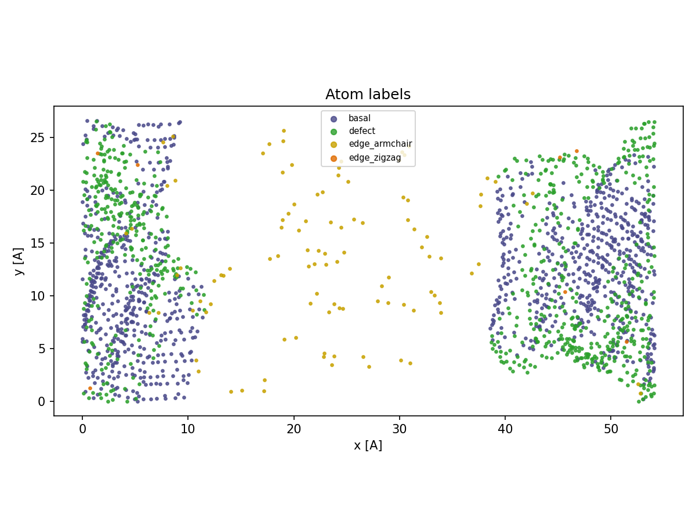
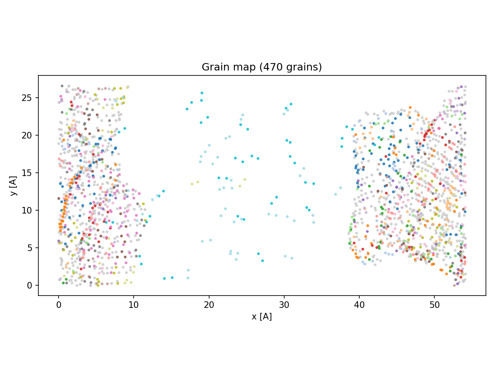
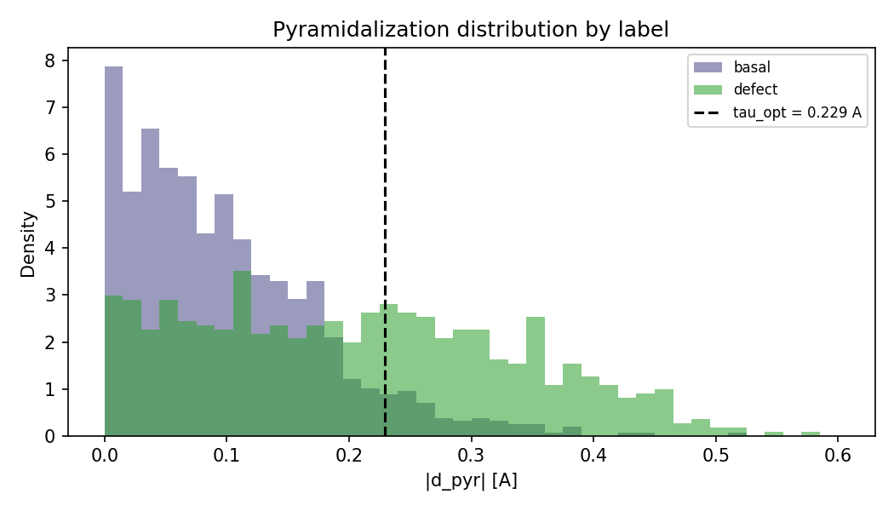

<!-- AUTO-GENERATED by docs/scripts/generate_workflow_cli_docs.py -->
# Active Site Workflow

::: reaxkit.workflows.active_site_workflow
    options:
      show_root_heading: false
      show_root_full_path: false
      members: []

## Command: `get_active_site_structural`

<div class="analysis-section-indent" markdown="1">

Compute per-atom active-site structural descriptors on a selected frame.
Use this command when you need atom-resolved structural labels and geometry metrics
around active sites from connectivity trajectory data.
This command analyzes prepared analysis inputs and does not run a simulation.

### Examples
-----

```text
  1. Baseline structural analysis on frame 0:
   reaxkit get_active_site_structural --frame 0 --bo-threshold 0.3

  2. Strict carbon-focused analysis on a later frame:
   reaxkit get_active_site_structural --frame 100 --no-include-noncarbon --strict-tract

  3. Render and save a structural plot:
   reaxkit get_active_site_structural --plot single --save active_site_structural.png
```

### Arguments

| Flag | Required | Default | Help | Choices |
|---|---|---|---|---|
| `--frame` | No | 0 | Frame index used for structural analysis. Example: --frame 100, which runs the descriptor extraction on frame 100. |  |
| `--bo-threshold` | No | 0.3 | Bond-order threshold used to build connectivity. Example: --bo-threshold 0.4, which requires stronger bonds to count as connected. |  |
| `--bond-mode` | No | bo | Bond graph source: bo (from ConnectivityData.bond_orders) or distance (TRACT geometric cutoffs) | bo, distance |
| `--bond-scale` | No | 1.2 | Scale factor on covalent radii for distance mode |  |
| `--alpha-radius` | No | 0.0 | Alpha-shape radius for non-periodic boundary detection |  |
| `--gap-deg` | No | 220.0 | Angular-gap threshold for boundary fallback |  |
| `--carbon-element` | No | C | Element symbol used for carbon network analysis |  |
| `--include-noncarbon` | No | True | Include non-carbon atoms in output table |  |
| `--strict-tract` | No | False | Raise if canonical structural output cannot satisfy strict TRACT compatibility |  |
| `--soap` | No | False | Compute optional SOAP descriptors (soap_pc1/2/3 and optional soap_score). |  |
| `--soap-ref-path` | No |  | Optional .npy reference SOAP vectors for soap_score. |  |
| `--soap-r-cut` | No | 5.0 | SOAP cutoff radius in angstrom. |  |
| `--soap-n-max` | No | 9 | SOAP radial basis size. |  |
| `--soap-l-max` | No | 9 | SOAP angular basis size. |  |
| `--soap-zeta` | No | 2 | SOAP kernel exponent for reference similarity. |  |

Several plots are generated by this command:

<a id="Spatial_map_of_dpyr_with_undercoordinated_atoms_highlighted"></a>

1. A spatial x-y active-site map where atoms are colored by absolute pyramidalization |d_pyr|, with under-coordinated atoms highlighted as red stars.

<div style="text-align:center;" markdown="1">
{ style="width:90%; max-width:800px;" }

*Figure: Spatial map of pyramidalization with under-coordinated atoms highlighted.*
</div>


<a id="Spatial_map_of_site_labels"></a>

2. A spatial x-y map from active_site_structural showing each atom colored by its assigned active-site label, such as basal, defect, edge_armchair, or edge_zigzag.

<div style="text-align:center;" markdown="1">
{ style="width:90%; max-width:800px;" }

*Figure: Spatial map of active-site labels.*
</div>


<a id="Spatial_map_of_grain_IDs_from_psi6_region-growing"></a>

3. A spatial x-y map from active_site_structural showing atoms colored by detected grain_id regions from psi6 orientation-based region growing.

<div style="text-align:center;" markdown="1">
{ style="width:90%; max-width:800px;" }

*Figure: Spatial map of grain IDs from psi6 region-growing.*
</div>


<a id="Distribution_of_d_pyr_by_label_tau_opt_marker_included"></a>

4. A histogram from active_site_structural comparing the |d_pyr| pyramidalization distribution by site label, with the tau_opt = 0.229 Å threshold marked.

<div style="text-align:center;" markdown="1">
{ style="width:90%; max-width:800px;" }

*Figure: Distribution of pyramidalization by site label.*
</div>


</div>

## Command: `get_active_site_events`

<div class="analysis-section-indent" markdown="1">

Extract persistent active-site C-O and C-Si events across trajectory frames.
Use this command to detect bond-forming or bond-breaking event patterns over time
from connectivity-aware data.
This command analyzes existing data and does not generate force-field input templates.

### Examples
-----

```text
  1. Automatic mode for persistent events:
   reaxkit get_active_site_events --mode auto --persist 5

  2. Bond-order mode on a sampled frame range:
   reaxkit get_active_site_events --frames 0:500:5 --mode bo --bo-threshold 0.8

  3. Distance mode with custom cutoffs:
   reaxkit get_active_site_events --mode dist --r-co 1.65 --r-csi 2.10 --strict-tract
```

### Arguments

| Flag | Required | Default | Help | Choices |
|---|---|---|---|---|
| `--frames` | No |  | Frames: "0,10,20", "0 10 20", "0:20", "0-20", or "0:20:2" |  |
| `--every` | No | 10 | Use every Nth selected frame (default: 10) |  |
| `--mode` | No | auto | Event detection mode | auto, bo, dist |
| `--bo-threshold` | No | 0.8 | Bond-order threshold for bo mode |  |
| `--r-co` | No | 1.65 | C-O distance cutoff in angstrom for dist mode |  |
| `--r-csi` | No | 2.1 | C-Si distance cutoff in angstrom for dist mode |  |
| `--persist` | No | 50 | Required consecutive analyzed frames for confirmed binding |  |
| `--carbon-element` | No | C | Carbon element symbol |  |
| `--oxygen-element` | No | O | Oxygen element symbol |  |
| `--silicon-element` | No | Si | Silicon element symbol |  |
| `--strict-tract` | No | False | Raise if canonical events output cannot satisfy strict TRACT compatibility |  |

</div>

## Common Runtime and Presentation Arguments

<div class="analysis-section-indent" markdown="1">

These are shared workflow-level CLI flags added before command-specific options, covering runtime context (engine/input/storage) and output presentation/export behavior.

| Flag | Required | Default | Help | Choices |
|---|---|---|---|---|
| `--engine` | No |  |  | reaxff, ams, lammps |
| `--input` | No | . | Input file or directory for engine resolution |  |
| `--run-dir, --dir` | No | . | Run directory fallback for engine detection |  |
| `--fort7` | No | fort.7 | Path to fort.7 |  |
| `--xmolout` | No | xmolout | Path to xmolout |  |
| `--summary` | No |  | Optional summary.txt path |  |
| `--log` | No |  | Logging level | verbose, quiet |
| `--run-id` | No |  | Run identifier for run-scoped layout (e.g., run_91ac0e). |  |
| `--project-root` | No |  | Project root that contains inputs/, data/, analysis/, etc. |  |
| `--analysis-id` | No |  | Optional analysis artifact id; defaults to run id. |  |
| `--plot` | No |  | Render a plot | single, subplot |
| `--show` | No |  | Show the generated plot window |  |
| `--save` | No |  | Save the generated plot to a file path |  |
| `--export` | No |  | Write the result table to CSV |  |
| `--grid` | No |  | Subplot grid like 2x2 or 2*2 |  |
| `--report` | No | False | Generate a report under reports/<command>/<analysis_id>/ |  |
| `--report-format` | No | both | Report format when --report is enabled. | both, pdf, docx |

</div>
