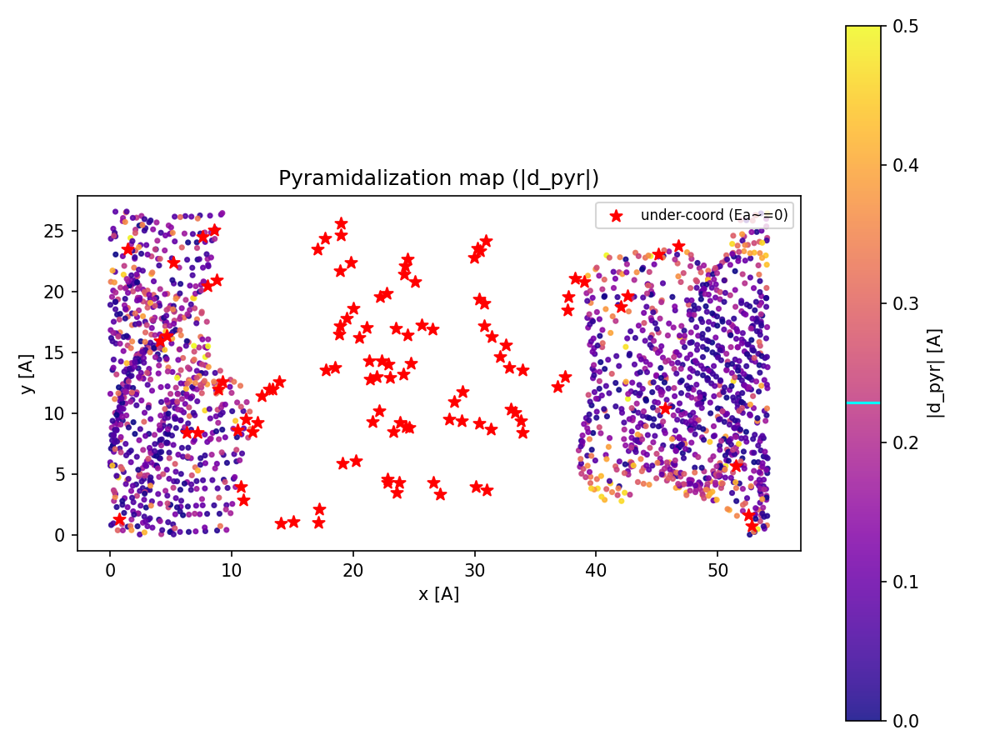
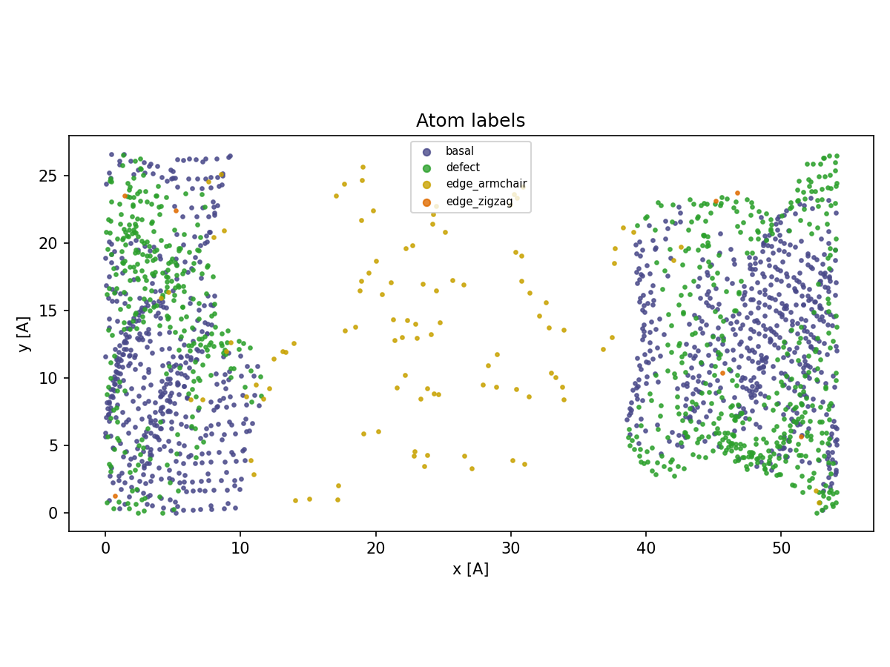
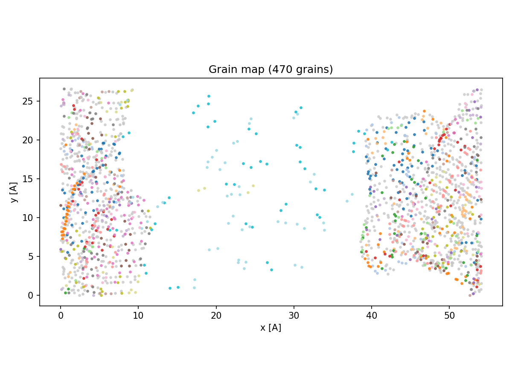
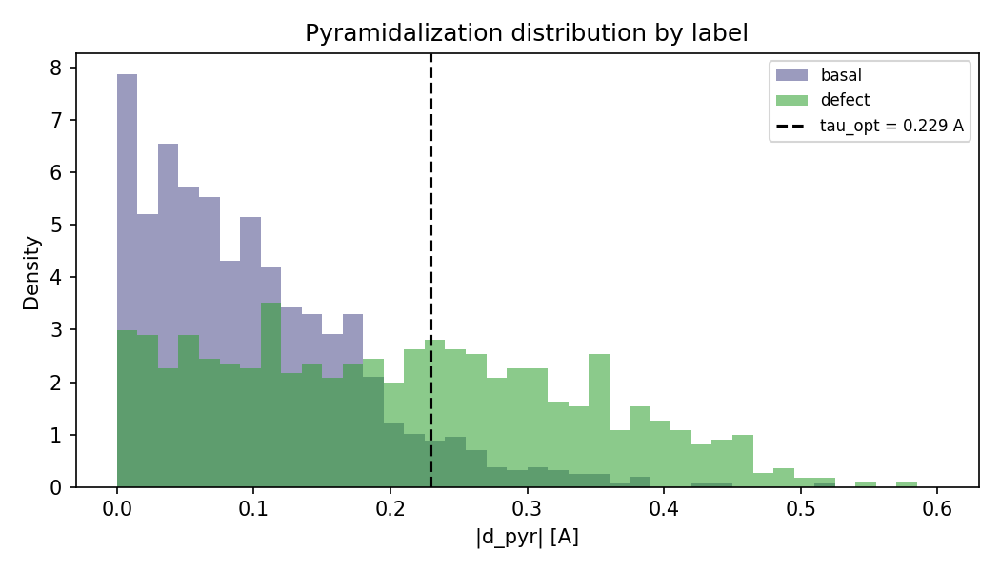

<!-- AUTO-GENERATED by docs/scripts/generate_workflow_cli_docs.py -->
# Active Site Workflow

::: reaxkit.workflows.active_site_workflow
    options:
      show_root_heading: false
      show_root_full_path: false
      members: []

## Command: `get_active_site_structural`

<div class="analysis-section-indent" markdown="1">

Compute per-atom active-site structural descriptors on a selected frame.
Use this command when you need atom-resolved structural labels and geometry metrics
around active sites from connectivity trajectory data.
This command analyzes prepared analysis inputs and does not run a simulation.

### Examples
-----

```text
  1. Baseline structural analysis on frame 0:
   reaxkit get_active_site_structural --frame 0 --bo-threshold 0.3

  2. Strict carbon-focused analysis on a later frame:
   reaxkit get_active_site_structural --frame 100 --no-include-noncarbon --strict-tract

  3. Render and save a structural plot:
   reaxkit get_active_site_structural --plot single --save active_site_structural.png
```

### Arguments

#### Scientific choices

| Flag | Required | Default | Help | Choices |
|---|---|---|---|---|
| `--frame` | No | 0 | Frame index used for structural analysis. Example: --frame 100, which runs the descriptor extraction on frame 100. |  |
| `--bo-threshold` | No | 0.3 | Bond-order threshold used to build connectivity. Example: --bo-threshold 0.4, which requires stronger bonds to count as connected. |  |
| `--bond-mode` | No | bo | Bond graph source: bo (from ConnectivityData.bond_orders) or distance (TRACT geometric cutoffs). Example: --bond-mode distance, which builds connectivity from geometric cutoffs. | bo, distance |
| `--bond-scale` | No | 1.2 | Scale factor on covalent radii for distance mode. Example: --bond-scale 1.2, which allows distances up to 1.2 times the covalent-radius sum. |  |
| `--alpha-radius` | No | 0.0 | Alpha-shape radius for non-periodic boundary detection. Example: --alpha-radius 2.0, which uses a 2-angstrom alpha-shape radius. |  |
| `--gap-deg` | No | 220.0 | Angular-gap threshold for boundary fallback. Example: --gap-deg 220, which requires a 220-degree angular gap for boundary detection. |  |
| `--carbon-element` | No | C | Element symbol used for carbon network analysis. Example: --carbon-element C, which identifies carbon by the C symbol. |  |
| `--include-noncarbon, --no-include-noncarbon` | No | True | Include non-carbon atoms in output table. Example: --include-noncarbon, which retains non-carbon atoms in the output. |  |
| `--strict-tract, --no-strict-tract` | No | False | Raise if canonical structural output cannot satisfy strict TRACT compatibility. Example: --strict-tract, which raises an error when strict TRACT compatibility cannot be satisfied. |  |
| `--soap, --no-soap` | No | False | Compute optional SOAP descriptors (soap_pc1/2/3 and optional soap_score). Example: --soap, which adds SOAP descriptors to the structural analysis. |  |
| `--soap-ref-path` | No |  | Optional .npy reference SOAP vectors for soap_score. Example: --soap-ref-path reference_soap.npy, which reads reference vectors for SOAP similarity scores. |  |
| `--soap-r-cut` | No | 5.0 | SOAP cutoff radius in angstrom. Example: --soap-r-cut 5, which includes neighbors within 5 angstrom. |  |
| `--soap-n-max` | No | 9 | SOAP radial basis size. Example: --soap-n-max 9, which uses nine radial basis functions. |  |
| `--soap-l-max` | No | 9 | SOAP angular basis size. Example: --soap-l-max 9, which sets the maximum angular basis order to nine. |  |
| `--soap-zeta` | No | 2 | SOAP kernel exponent for reference similarity. Example: --soap-zeta 2, which squares the SOAP similarity kernel. |  |

#### Input and file selection

| Flag | Required | Default | Help | Choices |
|---|---|---|---|---|
| `--engine` | No |  | Engine used to load simulation inputs. Example: --engine reaxff, which selects ReaxFF input readers. | reaxff, ams, lammps |
| `--input` | No | . | Input file or directory for engine resolution. Example: --input runs/heating, which detects the engine from that run. |  |
| `--run-dir, --dir` | No | . | Run directory fallback for engine detection. Example: --run-dir runs/heating, which uses that directory for fallback discovery. |  |
| `--fort7` | No | fort.7 | Path to fort.7. Example: --fort7 runs/heating/fort.7, which reads atomic charges and connectivity from that file. |  |
| `--xmolout` | No | xmolout | Path to xmolout. Example: --xmolout runs/heating/xmolout, which reads trajectory coordinates from that file. |  |
| `--summary` | No |  | Optional summary.txt path. Example: --summary runs/heating/summary.txt, which reads simulation summary values from that file. |  |

#### Outputs and plots

| Flag | Required | Default | Help | Choices |
|---|---|---|---|---|
| `--plot` | No |  | Render a plot. Example: --plot single, which combines selected series in one figure. | single, subplot |
| `--show` | No | False | Show the generated plot window. Example: --show, which opens generated figures interactively. |  |
| `--save` | No |  | Save the generated plot to a file path. Example: --save analysis.png, which writes the generated figure to that image. |  |
| `--export` | No |  | Write the result table to CSV. Example: --export analysis.csv, which writes the result table for further analysis. |  |
| `--grid` | No |  | Subplot grid like 2x2 or 2*2. Example: --grid 2x2, which arranges subplot panels in two rows and two columns. |  |
| `--report, --no-report` | No | False | Generate a report under reports/<command>/<analysis_id>/. Example: --report, which generates the analysis report. |  |
| `--report-format` | No | both | Report format when --report is enabled. Example: --report-format pdf, which writes the report as a PDF. | both, pdf, docx |
| `--plot-style` | No | default | Plot appearance: default preserves existing styling; publication uses clear fonts and an accessible palette; publication-bold uses larger bold text and heavier lines. Example: --plot-style publication-bold, which improves readability when figures are reduced in a manuscript. | default, publication, publication-bold |
| `--detail-format` | No |  | Optional detail format (default: Parquet; legacy: CSV). Example: --detail-format csv, which writes requested detail tables as CSV. | parquet, csv |

#### Execution

| Flag | Required | Default | Help | Choices |
|---|---|---|---|---|
| `--execution` | No | auto | Execution backend; unsupported backends fall back to serial with a logged reason. Example: --execution serial, which processes work sequentially. | auto, serial, threads, processes |
| `--workers` | No | 0 | Frame workers: auto or N (default: auto). Example: --workers 4, which requests four frame workers. |  |
| `--chunk-size` | No | 0 | Maximum in-flight frames: auto or N. Example: --chunk-size 8, which limits concurrent frame processing to eight frames. |  |

#### Storage and cache

| Flag | Required | Default | Help | Choices |
|---|---|---|---|---|
| `--run-id` | No |  | Run identifier for run-scoped layout. Example: --run-id run_91ac0e, which reuses that run identifier. |  |
| `--project-root` | No | reaxkit_workspace | Project root that contains inputs/, data/, analysis/, etc. Example: --project-root ./workspace, which stores run artifacts there. |  |
| `--analysis-id` | No |  | Optional analysis artifact id; defaults to run id. Example: --analysis-id comparison-a, which names the analysis artifact explicitly. |  |
| `--input-cache, --no-input-cache` | No | True | Reuse parsed input frames across commands (default: enabled; use --no-input-cache to force source reads for reproducibility checks or benchmarks). Example: --no-input-cache, which reloads frames from their source files. |  |
| `--frame-cache-max-gb` | No | 10.0 | Maximum workspace frame-cache size in GiB (default: 10; use 0 for unlimited). Example: --frame-cache-max-gb 20, which caps cached frames at 20 GiB. |  |
| `--output-profile` | No | standard | Select the shared artifact policy. Standard writes declared default outputs; minimal keeps core tables; full and legacy include optional details. Default: standard. Example: --output-profile full, which includes declared optional detail tables. | minimal, standard, full, legacy |
| `--checkpoint, --no-checkpoint` | No |  | Enable durable result batches for audited commands. Example: --no-checkpoint, disables recovery storage. |  |
| `--resume` | No |  | Resume a compatible result checkpoint; repeat the original scientific options. Example: --resume ./checkpoint, skips committed calculations. |  |
| `--checkpoint-buffer-mb` | No | 32 | Result buffer in MiB, plus one oversized frame. Example: --checkpoint-buffer-mb 32, bounds pending result payloads to approximately 32 MiB. |  |
| `--checkpoint-interval-seconds` | No | 30 | Flush at the next completed frame after this interval. Example: --checkpoint-interval-seconds 30, commits roughly every 30 seconds. |  |

#### Diagnostics and compatibility

| Flag | Required | Default | Help | Choices |
|---|---|---|---|---|
| `-h, --help` | No |  | show this help message and exit |  |
| `--help-all, --all-flags` | No |  | Show every option, grouped by purpose. Example: --help-all, which includes advanced flags in the help output. |  |
| `--log` | No |  | Logging level. Example: --log verbose, which prints detailed execution messages. | verbose, quiet |


<a id="Spatial_map_of_dpyr_with_undercoordinated_atoms_highlighted"></a>

1. A spatial x-y active-site map where atoms are colored by absolute pyramidalization |d_pyr|, with under-coordinated atoms highlighted as red stars.

<div style="text-align:center;" markdown="1">
{ style="width:90%; max-width:800px;" }

*Figure: Spatial map of pyramidalization with under-coordinated atoms highlighted.*
</div>

<a id="Spatial_map_of_site_labels"></a>

2. A spatial x-y map from active_site_structural showing each atom colored by its assigned active-site label, such as basal, defect, edge_armchair, or edge_zigzag.

<div style="text-align:center;" markdown="1">
{ style="width:90%; max-width:800px;" }

*Figure: Spatial map of active-site labels.*
</div>

<a id="Spatial_map_of_grain_IDs_from_psi6_region-growing"></a>

3. A spatial x-y map from active_site_structural showing atoms colored by detected grain_id regions from psi6 orientation-based region growing.

<div style="text-align:center;" markdown="1">
{ style="width:90%; max-width:800px;" }

*Figure: Spatial map of grain IDs from psi6 region-growing.*
</div>

<a id="Distribution_of_d_pyr_by_label_tau_opt_marker_included"></a>

4. A histogram from active_site_structural comparing the |d_pyr| pyramidalization distribution by site label, with the tau_opt = 0.229 Å threshold marked.

<div style="text-align:center;" markdown="1">
{ style="width:90%; max-width:800px;" }

*Figure: Distribution of pyramidalization by site label.*
</div>

</div>

## Command: `get_active_site_events`

<div class="analysis-section-indent" markdown="1">

Extract persistent active-site C-O and C-Si events across trajectory frames.
Use this command to detect bond-forming or bond-breaking event patterns over time
from connectivity-aware data.
Use --diagnose first to sample C-X distance distributions and choose distance cutoffs.
This command analyzes existing data and does not generate force-field input templates.

### Examples
-----

```text
  0. Diagnose distance cutoffs before full extraction:
   reaxkit get_active_site_events --diagnose --r-probe 2.5 --max-diag-frames 500

  1. Automatic mode for persistent events:
   reaxkit get_active_site_events --mode auto --persist 5

  2. Bond-order mode on a sampled frame range:
   reaxkit get_active_site_events --frames 0:500:5 --mode bo --bo-threshold 0.8

  3. Distance mode with custom cutoffs:
     reaxkit get_active_site_events --input 30_1073_ams.rkf --r-co 1.65 --persist 50 --every 10     reaxkit get_active_site_events --mode dist --r-co 1.65 --r-csi 2.10 --strict-tract
```

### Arguments

#### Scientific choices

| Flag | Required | Default | Help | Choices |
|---|---|---|---|---|
| `--frames` | No |  | Frames: "0,10,20", "0 10 20", "0:20", "0-20", or "0:20:2". Example: --frames 0:20:2, which includes source frames 0, 2, ..., 18. |  |
| `--every, --stride` | No | 10 | Use every Nth selected frame (TRACT alias: --stride; default: 10). Example: --every 5, which keeps every fifth selected frame. |  |
| `--mode` | No | auto | Event detection mode. Example: --mode bo, which detects events from bond orders. | auto, bo, dist |
| `--bo-threshold, --bo_threshold` | No | 0.8 | Bond-order threshold for bo mode. Example: --bo-threshold 0.4, which requires a bond order of at least 0.4 for retained connectivity. |  |
| `--r-co, --r_CO` | No | 1.65 | C-O distance cutoff in angstrom for dist mode. Example: --r-co 1.65, which uses a 1.65-angstrom C-O cutoff in distance mode. |  |
| `--r-csi, --r_CSi` | No | 2.1 | C-Si distance cutoff in angstrom for dist mode. Example: --r-csi 2.1, which uses a 2.1-angstrom C-Si cutoff in distance mode. |  |
| `--r-probe` | No | 2.5 | Generous C-X cutoff in angstrom used for diagnostic close-approach episodes. Example: --r-probe 2.5, which includes diagnostic close approaches within 2.5 angstrom. |  |
| `--timestep-fs` | No | 10.0 | Raw trajectory timestep in fs used to report diagnostic episode durations. Example: --timestep-fs 10, which uses 10 fs per raw trajectory step for episode durations. |  |
| `--carbon-element` | No | C | Carbon element symbol. Example: --carbon-element C, which identifies carbon by the C symbol. |  |
| `--oxygen-element` | No | O | Oxygen element symbol. Example: --oxygen-element O, which identifies oxygen by the O symbol. |  |
| `--silicon-element` | No | Si | Silicon element symbol. Example: --silicon-element Si, which identifies silicon by the Si symbol. |  |
| `--strict-tract, --no-strict-tract` | No | False | Raise if canonical events output cannot satisfy strict TRACT compatibility. Example: --strict-tract, which raises an error when strict TRACT compatibility cannot be satisfied. |  |

#### Input and file selection

| Flag | Required | Default | Help | Choices |
|---|---|---|---|---|
| `--engine` | No |  | Engine used to load simulation inputs. Example: --engine reaxff, which selects ReaxFF input readers. | reaxff, ams, lammps |
| `--input` | No | . | Input file or directory for engine resolution. Example: --input runs/heating, which detects the engine from that run. |  |
| `--run-dir, --dir` | No | . | Run directory fallback for engine detection. Example: --run-dir runs/heating, which uses that directory for fallback discovery. |  |
| `--fort7` | No | fort.7 | Path to fort.7. Example: --fort7 runs/heating/fort.7, which reads atomic charges and connectivity from that file. |  |
| `--xmolout` | No | xmolout | Path to xmolout. Example: --xmolout runs/heating/xmolout, which reads trajectory coordinates from that file. |  |
| `--summary` | No |  | Optional summary.txt path. Example: --summary runs/heating/summary.txt, which reads simulation summary values from that file. |  |

#### Outputs and plots

| Flag | Required | Default | Help | Choices |
|---|---|---|---|---|
| `--plot` | No |  | Render a plot. Example: --plot single, which combines selected series in one figure. | single, subplot |
| `--show` | No | False | Show the generated plot window. Example: --show, which opens generated figures interactively. |  |
| `--save` | No |  | Save the generated plot to a file path. Example: --save analysis.png, which writes the generated figure to that image. |  |
| `--export` | No |  | Write the result table to CSV. Example: --export analysis.csv, which writes the result table for further analysis. |  |
| `--grid` | No |  | Subplot grid like 2x2 or 2*2. Example: --grid 2x2, which arranges subplot panels in two rows and two columns. |  |
| `--report, --no-report` | No | False | Generate a report under reports/<command>/<analysis_id>/. Example: --report, which generates the analysis report. |  |
| `--report-format` | No | both | Report format when --report is enabled. Example: --report-format pdf, which writes the report as a PDF. | both, pdf, docx |
| `--persist` | No | 50 | Required consecutive analyzed frames for confirmed binding. Example: --persist 50, which requires binding to persist for 50 analyzed frames. |  |
| `--plot-style` | No | default | Plot appearance: default preserves existing styling; publication uses clear fonts and an accessible palette; publication-bold uses larger bold text and heavier lines. Example: --plot-style publication-bold, which improves readability when figures are reduced in a manuscript. | default, publication, publication-bold |
| `--detail-format` | No |  | Optional detail format (default: Parquet; legacy: CSV). Example: --detail-format csv, which writes requested detail tables as CSV. | parquet, csv |

#### Execution

| Flag | Required | Default | Help | Choices |
|---|---|---|---|---|
| `--execution` | No | auto | Execution backend; unsupported backends fall back to serial with a logged reason. Example: --execution serial, which processes work sequentially. | auto, serial, threads, processes |
| `--workers` | No | 0 | Frame workers: auto or N (default: auto). Example: --workers 4, which requests four frame workers. |  |
| `--chunk-size` | No | 0 | Maximum in-flight frames: auto or N. Example: --chunk-size 8, which limits concurrent frame processing to eight frames. |  |

#### Storage and cache

| Flag | Required | Default | Help | Choices |
|---|---|---|---|---|
| `--run-id` | No |  | Run identifier for run-scoped layout. Example: --run-id run_91ac0e, which reuses that run identifier. |  |
| `--project-root` | No | reaxkit_workspace | Project root that contains inputs/, data/, analysis/, etc. Example: --project-root ./workspace, which stores run artifacts there. |  |
| `--analysis-id` | No |  | Optional analysis artifact id; defaults to run id. Example: --analysis-id comparison-a, which names the analysis artifact explicitly. |  |
| `--input-cache, --no-input-cache` | No | True | Reuse parsed input frames across commands (default: enabled; use --no-input-cache to force source reads for reproducibility checks or benchmarks). Example: --no-input-cache, which reloads frames from their source files. |  |
| `--frame-cache-max-gb` | No | 10.0 | Maximum workspace frame-cache size in GiB (default: 10; use 0 for unlimited). Example: --frame-cache-max-gb 20, which caps cached frames at 20 GiB. |  |
| `--output-profile` | No | standard | Select the shared artifact policy. Standard writes declared default outputs; minimal keeps core tables; full and legacy include optional details. Default: standard. Example: --output-profile full, which includes declared optional detail tables. | minimal, standard, full, legacy |
| `--checkpoint, --no-checkpoint` | No |  | Enable durable result batches for audited commands. Example: --no-checkpoint, disables recovery storage. |  |
| `--resume` | No |  | Resume a compatible result checkpoint; repeat the original scientific options. Example: --resume ./checkpoint, skips committed calculations. |  |
| `--checkpoint-buffer-mb` | No | 32 | Result buffer in MiB, plus one oversized frame. Example: --checkpoint-buffer-mb 32, bounds pending result payloads to approximately 32 MiB. |  |
| `--checkpoint-interval-seconds` | No | 30 | Flush at the next completed frame after this interval. Example: --checkpoint-interval-seconds 30, commits roughly every 30 seconds. |  |

#### Diagnostics and compatibility

| Flag | Required | Default | Help | Choices |
|---|---|---|---|---|
| `-h, --help` | No |  | show this help message and exit |  |
| `--help-all, --all-flags` | No |  | Show every option, grouped by purpose. Example: --help-all, which includes advanced flags in the help output. |  |
| `--log` | No |  | Logging level. Example: --log verbose, which prints detailed execution messages. | verbose, quiet |
| `--diagnose` | No | False | Sample C-X distance and episode distributions to choose --r-co/--r-csi and --persist before full extraction. Example: --diagnose, which samples distances and episodes before full event extraction. |  |
| `--max-diag-frames` | No | 500 | Maximum sampled frames for --diagnose. Example: --max-diag-frames 500, which limits diagnostics to 500 sampled frames. |  |


</div>

## Common Runtime and Presentation Arguments

<div class="analysis-section-indent" markdown="1">

These are shared workflow-level CLI flags added before command-specific options, covering runtime context (engine/input/storage) and output presentation/export behavior.

Each command table above includes its shared and inherited options.

</div>
