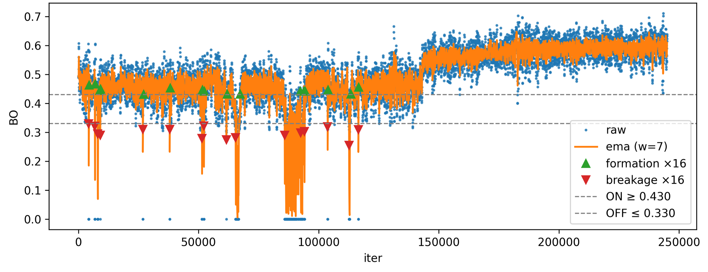
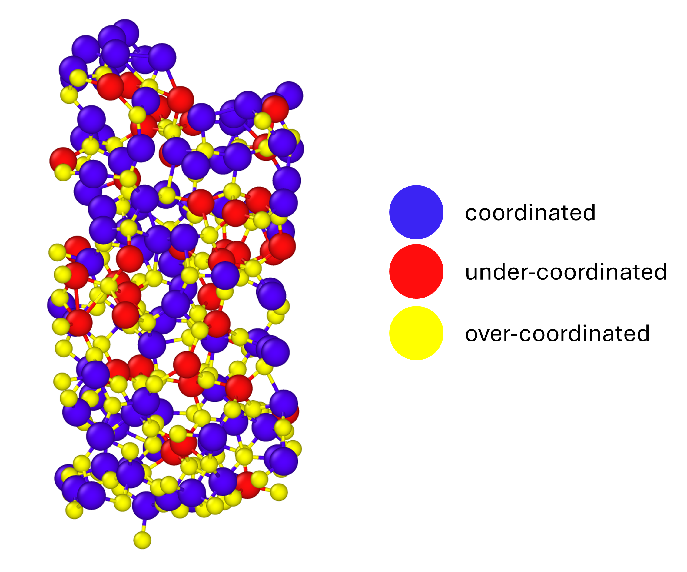

<!-- AUTO-GENERATED by docs/scripts/generate_workflow_cli_docs.py -->
# Connectivity Workflow

::: reaxkit.workflows.connectivity_workflow
    options:
      show_root_heading: false
      show_root_full_path: false
      members: []

## Command: `get_connection_list`

<div class="analysis-section-indent" markdown="1">

List atom-to-atom connections extracted from bond-order frames.
Use this command to inspect which atom pairs are connected at selected frames,
with optional bond-order thresholding and direction collapsing.

### Examples
-----

```text
  1. Export connections for selected frames:
   reaxkit get_connection_list --fort7 fort.7 --frames 0 1 2 --export connections.csv

  2. Keep only edges above a BO threshold and collapse i-j/j-i duplicates:
   reaxkit get_connection_list --fort7 fort.7 --min-bo 0.3 --undirected

  3. Include self-connections in output:
   reaxkit get_connection_list --fort7 fort.7 --include-self
```

### Arguments

| Flag | Required | Default | Help | Choices |
|---|---|---|---|---|
| `--frames` | No |  | Frames selection syntax. Example: --frames 0:20:2, which selects frames 0,2,4,...,20. |  |
| `--every` | No | 1 | Use every Nth selected frame. Example: --every 5, which subsamples selected frames by a factor of 5. |  |
| `--min-bo` | No | 0.0 | Minimum bond order. Example: --min-bo 0.3, which filters out weaker bonds below 0.3. |  |
| `--undirected` | No | True | Collapse i-j and j-i. Example: --no-undirected, which keeps directed pair ordering. |  |
| `--include-self` | No |  | Include self connections. Example: --include-self, which keeps i->i entries when present. |  |

</div>

## Command: `get_connection_table`

<div class="analysis-section-indent" markdown="1">

Build frame-wise connectivity matrices from bond-order data.
For one frame, the command returns a single matrix. For multiple frames, export mode
writes one CSV per frame.

### Examples
-----

```text
  1. Export a single-frame connectivity table:
   reaxkit get_connection_table --fort7 fort.7 --frames 0 --export connection_table.csv

  2. Export connectivity tables for multiple frames:
   reaxkit get_connection_table --fort7 fort.7 --frames 0 10 20 --export connection_table.csv

  3. Apply bond-order threshold and custom fill value:
   reaxkit get_connection_table --fort7 fort.7 --frames 5 --min-bo 0.3 --fill-value -1
```

### Arguments

| Flag | Required | Default | Help | Choices |
|---|---|---|---|---|
| `--frames` | No |  | Frames selection syntax. Example: --frames 0:20:2, which selects frames 0,2,4,...,20. |  |
| `--every` | No | 1 | Use every Nth selected frame. Example: --every 5, which subsamples selected frames by a factor of 5. |  |
| `--min-bo` | No | 0.0 | Minimum bond order. Example: --min-bo 0.3, which keeps only stronger connections. |  |
| `--undirected` | No | True | Collapse i-j and j-i. Example: --no-undirected, which keeps direction-specific matrix entries. |  |
| `--fill-value` | No | 0.0 | Fill value for missing entries. Example: --fill-value -1, which marks absent entries explicitly as -1. |  |

</div>

## Command: `get_connection_stats`

<div class="analysis-section-indent" markdown="1">

Aggregate connectivity statistics across selected frames.
Use this command to summarize connectivity behavior with mean/max/count aggregations.

### Examples
-----

```text
  1. Export mean connectivity statistics:
   reaxkit get_connection_stats --fort7 fort.7 --how mean --export connection_stats.csv

  2. Compute edge counts on specific frames:
   reaxkit get_connection_stats --fort7 fort.7 --frames 0 10 20 --how count

  3. Use thresholded max aggregation:
   reaxkit get_connection_stats --fort7 fort.7 --min-bo 0.3 --how max
```

### Arguments

| Flag | Required | Default | Help | Choices |
|---|---|---|---|---|
| `--frames` | No |  | Frames selection syntax. Example: --frames 0:20:2, which selects frames 0,2,4,...,20. |  |
| `--every` | No | 1 | Use every Nth selected frame. Example: --every 5, which subsamples selected frames by a factor of 5. |  |
| `--min-bo` | No | 0.0 | Minimum bond order. Example: --min-bo 0.3, which removes weak edges before statistics. |  |
| `--undirected` | No | True | Collapse i-j and j-i. Example: --no-undirected, which treats reverse directions separately. |  |
| `--how` | No | mean | Statistic to compute. Example: --how count, which reports occurrence counts instead of mean/max BO. | mean, max, count |

</div>

## Command: `get_bond_events`

<div class="analysis-section-indent" markdown="1">

Detect bond formation and breakage events over time.
The command applies threshold/hysteresis logic and optional smoothing to bond-order
signals, then reports event points.

### Examples
-----

```text
  1. Detect events for one atom pair and export:
   reaxkit get_bond_events --fort7 fort.7 --src 1 --dst 2 --export bond_events.csv

  2. Tune threshold/hysteresis and plot events:
   reaxkit get_bond_events --fort7 fort.7 --threshold 0.35 --hysteresis 0.05 --plot single

  3. Use EMA smoothing and frame axis for plotting:
   reaxkit get_bond_events --fort7 fort.7 --smooth ema --window 9 --xaxis frame
```

### Arguments

| Flag | Required | Default | Help | Choices |
|---|---|---|---|---|
| `--frames` | No |  | Frames selection syntax. Example: --frames 0:20:2, which selects frames 0,2,4,...,20. |  |
| `--every` | No | 1 | Use every Nth selected frame. Example: --every 5, which subsamples selected frames by a factor of 5. |  |
| `--src` | No |  | Source atom-id filter. Example: --src 1, which keeps events where source atom id is 1. |  |
| `--dst` | No |  | Destination atom-id filter. Example: --dst 2, which keeps events where destination atom id is 2. |  |
| `--threshold` | No | 0.35 | Schmitt threshold. Example: --threshold 0.4, which raises event trigger level. |  |
| `--hysteresis` | No | 0.05 | Schmitt hysteresis width. Example: --hysteresis 0.05, which adds separation between open/close transitions. |  |
| `--smooth` | No | ma | Smoothing method. Example: --smooth ema, which applies exponential moving average. | ma, ema |
| `--window` | No | 7 | Smoothing window. Example: --window 9, which increases smoothing span. |  |
| `--ema-alpha` | No |  | Optional EMA alpha. Example: --ema-alpha 0.3, which controls EMA responsiveness. |  |
| `--min-run` | No | 3 | Minimum run length after flicker cleanup. Example: --min-run 5, which suppresses short-lived toggles. |  |
| `--undirected` | No | True | Collapse i-j and j-i. Example: --no-undirected, which keeps direction-specific events. |  |

<a id="bond_events_with_smoothing_and_thresholds"></a>

The figure below shows an example output plot where the raw bond-order time series between two atoms is shown, with the EMA-smoothed signal overlaid. With the current settings, multiple bond formation and breakage events are detected. Users should tune these parameters for their own systems so formation/breakage is detected correctly.

<div style="text-align:center;" markdown="1">
{ style="width:85%; max-width:800px;" }

*Figure: Sample bond events plot with detected bond breakage/formation iterations.*
</div>

</div>

## Command: `get_coordination`

<div class="analysis-section-indent" markdown="1">

Classify atoms as under-, coordinated-, or over-coordinated.
Classification compares bond-order totals against target valences from explicit maps
or inferred values.
For example, if an atom's valence is 3 and the threshold is 0.5, then:
 - sum_BOs < 2.5 -> under-coordinated
 - 2.5 <= sum_BOs <= 3.5 -> coordinated
 - sum_BOs > 3.5 -> over-coordinated

### Examples
-----

```text
  1. Classify using explicit valence map and export:
   reaxkit get_coordination --fort7 fort.7 --xmolout xmolout --valences Mg=2,O=2 --export coordination.csv

  2. Classify using valences inferred from force field:
   reaxkit get_coordination --fort7 fort.7 --xmolout xmolout --ffield ffield --frames 0 10 20

  3. Adjust tolerance and plot results:
   reaxkit get_coordination --fort7 fort.7 --xmolout xmolout --threshold 0.2 --plot single
```

### Arguments

| Flag | Required | Default | Help | Choices |
|---|---|---|---|---|
| `--frames` | No |  | Frames selection syntax. Example: --frames 0:20:2, which selects frames 0,2,4,...,20. |  |
| `--every` | No | 1 | Use every Nth selected frame. Example: --every 5, which subsamples selected frames by a factor of 5. |  |
| `--valences` | No |  | Explicit valence map like Mg=2,O=2. Example: --valences Mg=2,O=2, which sets target valences directly. |  |
| `--ffield` | No |  | Optional force-field file to infer valences. Example: --ffield ffield, which derives valence targets from that force field. |  |
| `--threshold` | No | 0.9 | Tolerance around target valence. Example: --threshold 0.2, which tightens classification around target BO sums. |  |
| `--allow-missing-valences` | No |  | Do not fail on missing valences. Example: --allow-missing-valences, which skips strict failure when some mappings are absent. |  |

</div>

## Command: `relabel_traj_using_coordination`

<div class="analysis-section-indent" markdown="1">

Relabel trajectory atom labels based on coordination status.
This command computes coordination classes and writes a relabeled trajectory using
engine-specific output formatting.

### Examples
-----

```text
  1. Relabel using defaults and write output trajectory:
   reaxkit relabel_traj_using_coordination --fort7 fort.7 --xmolout xmolout --output xmolout_relabeled

  2. Use explicit valences and type-aware relabeling:
   reaxkit relabel_traj_using_coordination --valences Mg=2,O=2 --mode by_type --keep-coord-original --output relabeled.xyz

  3. Use inferred valences, custom status labels, and export status table:
   reaxkit relabel_traj_using_coordination --ffield ffield --frames 0 10 20 --labels=-1=U,0=C,1=O --export coordination.csv --output relabeled.xmolout
```

### Arguments

| Flag | Required | Default | Help | Choices |
|---|---|---|---|---|
| `--frames` | No |  | Frames selection syntax. Example: --frames 0:20:2, which selects frames 0,2,4,...,20. |  |
| `--every` | No | 1 | Use every Nth selected frame. Example: --every 5, which subsamples selected frames by a factor of 5. |  |
| `--valences` | No |  | Explicit valence map like Mg=2,O=2. Example: --valences Mg=2,O=2, which sets coordination targets directly. |  |
| `--ffield` | No |  | Optional force-field file to infer valences. Example: --ffield ffield, which derives target valences automatically. |  |
| `--threshold` | No | 0.9 | Tolerance around target valence. Example: --threshold 0.2, which makes status classification stricter. |  |
| `--allow-missing-valences` | No |  | Do not fail on missing valences. Example: --allow-missing-valences, which permits partial valence definitions. |  |
| `--output` | Yes |  | Output trajectory path. Example: --output relabeled.xmolout, which writes relabeled trajectory to that file. |  |
| `--mode` | No | global | Relabeling mode. Example: --mode by_type, which applies status labels per atom type context. | global, by_type |
| `--labels` | No |  | Status tag map like -1=U,0=C,1=O. Example: --labels=-1=U,0=C,1=O, which customizes output status tokens. |  |
| `--keep-coord-original` | No |  | Keep original label when status is coordinated in by_type mode. Example: --keep-coord-original, which preserves original labels for coordinated atoms. |  |
| `--precision` | No | 6 | Writer precision when supported by the engine. Example: --precision 8, which writes numeric coordinates with higher decimal precision. |  |
| `--simulation` | No |  | Optional trajectory writer simulation label. Example: --simulation run_01, which tags output with that simulation name when supported. |  |

<a id="relabel_traj_using_coordination"></a>

The figure below shows an example relabeling output where atoms labels are changed according to their coordination status, and then plotted using OVITO.

<div style="text-align:center;" markdown="1">
{ style="width:85%; max-width:800px;" }

*Figure: Sample relabeling output plot based on their coordination status.*
</div>

</div>

## Command: `get_hybridization`

<div class="analysis-section-indent" markdown="1">

Classify atoms against target hybridization bond-order sums.
You can define global hybridization targets or per-element target maps, then restrict
classification to specific elements or atom ids.

### Examples
-----

```text
  1. Use global hybridization targets and export:
   reaxkit get_hybridization --fort7 fort.7 --xmolout xmolout --hybridizations sp=1,sp2=2,sp3=3 --export hyb.csv

  2. Use element-specific hybridization targets:
   reaxkit get_hybridization --fort7 fort.7 --xmolout xmolout --element-hybridizations "C:sp=1,sp2=2,sp3=3;N:sp2=2,sp3=3"

  3. Restrict to selected elements and tighten tolerance:
   reaxkit get_hybridization --fort7 fort.7 --xmolout xmolout --target-elements C O --threshold 0.2
```

### Arguments

| Flag | Required | Default | Help | Choices |
|---|---|---|---|---|
| `--frames` | No |  | Frames selection syntax. Example: --frames 0:20:2, which selects frames 0,2,4,...,20. |  |
| `--every` | No | 1 | Use every Nth selected frame. Example: --every 5, which subsamples selected frames by a factor of 5. |  |
| `--hybridizations` | No |  | Global map like sp=1,sp2=2,sp3=3. Example: --hybridizations sp=1,sp2=2,sp3=3, which applies one map to all elements. |  |
| `--element-hybridizations` | No |  | Per-element map like C:sp=1,sp2=2;N:sp2=2,sp3=3. Example: --element-hybridizations "C:sp=1,sp2=2,sp3=3", which customizes targets for specific elements. |  |
| `--target-elements` | No |  | Restrict to selected elements. Example: --target-elements C O, which evaluates only carbon and oxygen atoms. |  |
| `--target-atom-ids` | No |  | Restrict to selected atom ids. Example: --target-atom-ids 1 2 5, which evaluates only those atom indices. |  |
| `--threshold` | No | 0.3 | Tolerance around target BO sum. Example: --threshold 0.2, which tightens hybridization matching tolerance. |  |
| `--allow-undefined-hybridization` | No |  | Do not fail on missing mappings. Example: --allow-undefined-hybridization, which allows output even when some atoms have no configured target. |  |

</div>

## Common Runtime and Presentation Arguments

<div class="analysis-section-indent" markdown="1">

These are shared workflow-level CLI flags added before command-specific options, covering runtime context (engine/input/storage) and output presentation/export behavior.

| Flag | Required | Default | Help | Choices |
|---|---|---|---|---|
| `--engine` | No |  | Engine override. Example: --engine reaxff, which forces ReaxFF file parsing rules. | reaxff, ams, lammps |
| `--input` | No | . | Input file or directory for engine resolution. Example: --input runs/job1, which points loader context to that run. |  |
| `--run-dir, --dir` | No | . | Run directory fallback for engine detection. Example: --run-dir runs/job1, which acts as backup search location. |  |
| `--fort7` | No | fort.7 | Path to fort.7. Example: --fort7 runs/job1/fort.7, which uses that bond-order trajectory file. |  |
| `--xmolout` | No | xmolout | Path to xmolout. Example: --xmolout runs/job1/xmolout, which supplies atom/trajectory metadata. |  |
| `--summary` | No |  | Optional summary.txt path. Example: --summary runs/job1/summary.txt, which provides auxiliary timeline data when needed. |  |
| `--log` | No |  | Logging level. Example: --log verbose, which prints more processing details. | verbose, quiet |
| `--run-id` | No |  | Run identifier for run-scoped layout (e.g., run_91ac0e). |  |
| `--project-root` | No |  | Project root that contains inputs/, data/, analysis/, etc. |  |
| `--analysis-id` | No |  | Optional analysis artifact id; defaults to run id. |  |
| `--plot` | No |  | Render a plot. Example: --plot single, which generates a single-panel figure. | single, subplot |
| `--show` | No |  | Show the generated plot window. Example: --show, which opens the figure interactively. |  |
| `--save` | No |  | Save the generated plot to a file path. Example: --save figures/conn.png, which writes the plot image to that path. |  |
| `--export` | No |  | Write the result table to CSV. Example: --export connectivity.csv, which saves tabular results for post-processing. |  |
| `--grid` | No |  | Subplot grid like 2x2 or 2*2. Example: --grid 2x2, which arranges subplot panels in a 2-by-2 layout. |  |
| `--xaxis` | No | iter | Quantity on x-axis. Example: --xaxis time, which converts iteration axis to physical time when possible. | iter, frame, time |
| `--control` | No | control | Control file for time-axis conversion. Example: --control control, which supplies timestep settings for time conversion. |  |

</div>
