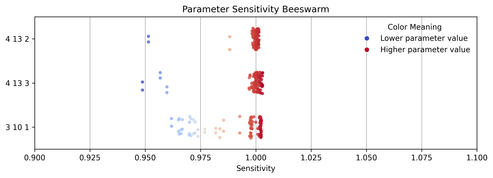
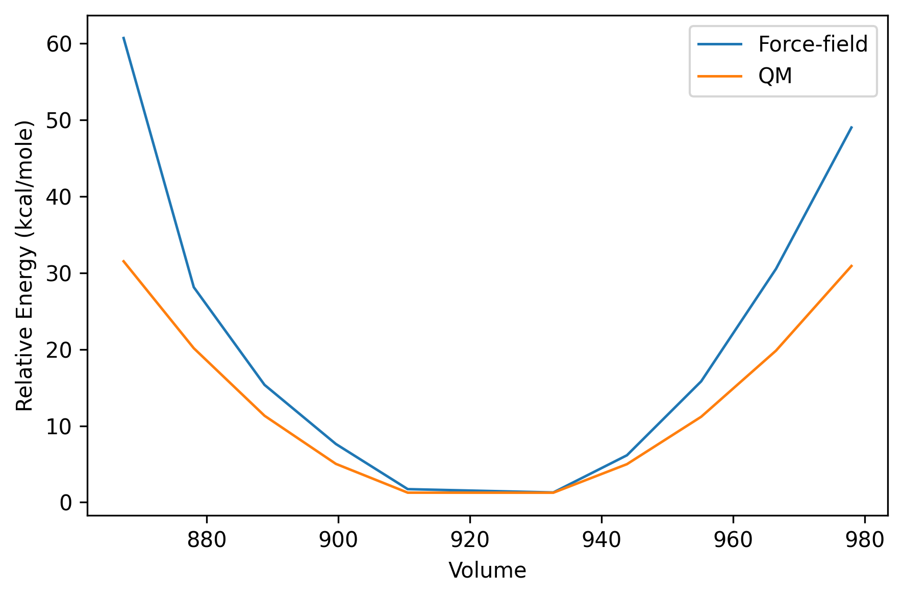

<!-- AUTO-GENERATED by docs/scripts/generate_workflow_cli_docs.py -->
# Ffield Workflow

::: reaxkit.workflows.file_tools.ffield_workflow
    options:
      show_root_heading: false
      show_root_full_path: false
      members: []

## Command: `merge-ffield`

### Arguments

_No command-specific arguments found._

## Command: `add-element-to-ffield`

### Arguments

_No command-specific arguments found._

## Command: `add_element_to_ffield`

### Arguments

_No command-specific arguments found._

## Command: `add-term-to-ffield`

### Arguments

_No command-specific arguments found._

## Command: `add_term_to_ffield`

### Arguments

_No command-specific arguments found._

## Command: `get_ffield_data`

### Arguments

_No command-specific arguments found._

## Command: `get_ffield_opt_progress_data`

### Arguments

_No command-specific arguments found._

## Command: `get_energy_min_summary_data`

### Arguments

_No command-specific arguments found._

## Command: `get_ffield_diagnostic_data`

### Arguments

_No command-specific arguments found._

The figure below shows an example tornado plot for the sensitivity of force field optimization error to each parameter. Bars show 3 values: min, max, and mean of sensitivities per parameter.

{ style="width:85%; max-width:800px;" }

*Figure: Sample tornado plot for the sensitivity of force field optimization error to each parameter*

An example beeswarm plot for the sensitivity is as follows:

{ style="width:85%; max-width:800px;" }

*Figure: Sample beeswarm plot for the sensitivity of force field optimization error to each parameter*

## Command: `get_ffield_opt_results`

### Arguments

_No command-specific arguments found._

## Command: `get_ffield_opt_eos`

### Arguments

_No command-specific arguments found._

The figure below shows an example plot for the equation of state obtained using QM and ReaxFF optimized ffield data.

{ style="width:85%; max-width:800px;" }

*Figure: Sample plot for the equation of state obtained using QM and ReaxFF optimized ffield data.*

## Command: `ffield_opt_bulk_modulus`

### Arguments

_No command-specific arguments found._

## Common Runtime and Presentation Arguments

These are shared workflow-level CLI flags added before command-specific options, covering runtime context (engine/input/storage) and output presentation/export behavior.

_No common arguments found._

