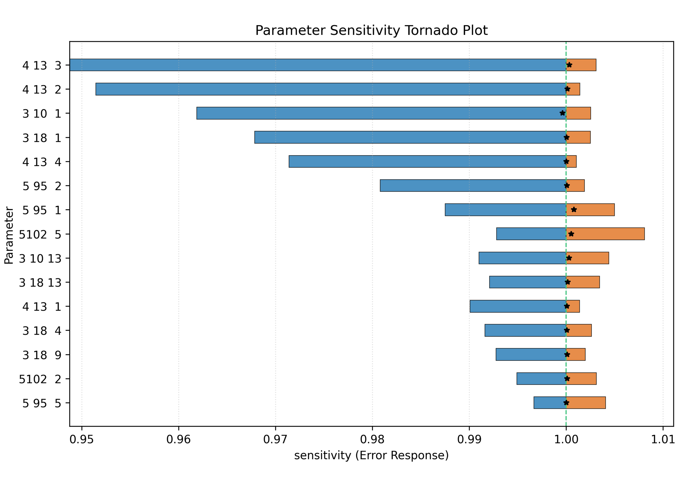
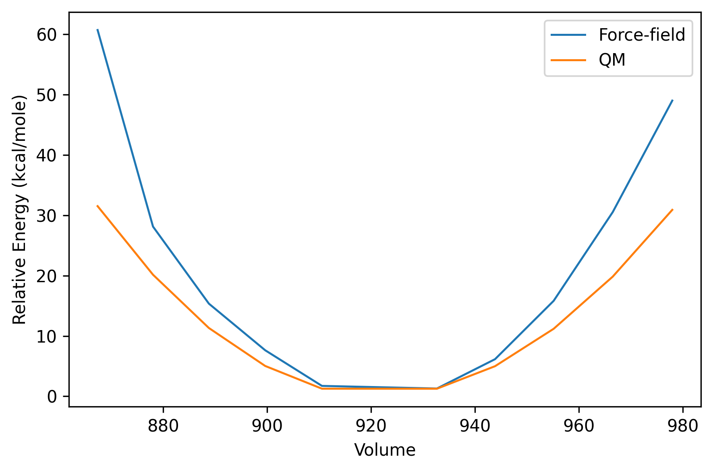

<!-- AUTO-GENERATED by docs/scripts/generate_workflow_cli_docs.py -->
# Ffield Workflow

::: reaxkit.workflows.file_tools.ffield_workflow
    options:
      show_root_heading: false
      show_root_full_path: false
      members: []

## Command: `merge-ffield`

<div class="analysis-section-indent" markdown="1">

Build energy curves from force-field optimization report data. In `single` mode,
one figure is created per EOS identifier. If physical volumes are unavailable,
the numeric scan coordinate encoded in each point identifier is used.

### Examples

```text
reaxkit get_ffield_opt_eos --iden all --plot single --save eos_plots
reaxkit get_ffield_opt_eos --iden all --plot subplot --save eos.png
```

### Arguments

| Flag | Required | Default | Help |
|---|---|---|---|
| `--iden` | No | all | Identifier to keep; use `all` for every EOS group. |
| `--flip-sign` | No | false | Flip the energy sign before plotting or export. |
| `--plot` | No |  | Use `single` for one figure per identifier or `subplot` for one combined figure. |
| `--save` | No |  | In `single` mode, an output directory; in `subplot` mode, a figure path. |

</div>

## Command: `add-element-to-ffield`

<div class="analysis-section-indent" markdown="1">

### Arguments

_No command-specific arguments found._

</div>

## Command: `add_element_to_ffield`

<div class="analysis-section-indent" markdown="1">

### Arguments

_No command-specific arguments found._

</div>

## Command: `add-term-to-ffield`

<div class="analysis-section-indent" markdown="1">

### Arguments

_No command-specific arguments found._

</div>

## Command: `add_term_to_ffield`

<div class="analysis-section-indent" markdown="1">

### Arguments

_No command-specific arguments found._

</div>

## Command: `get_ffield_data`

<div class="analysis-section-indent" markdown="1">

### Arguments

_No command-specific arguments found._

</div>

## Command: `get_ffield_opt_progress_data`

<div class="analysis-section-indent" markdown="1">

### Arguments

_No command-specific arguments found._

</div>

## Command: `get_energy_min_summary_data`

<div class="analysis-section-indent" markdown="1">

### Arguments

_No command-specific arguments found._

</div>

## Command: `get_ffield_diagnostic_data`

<div class="analysis-section-indent" markdown="1">

### Arguments

_No command-specific arguments found._

<a id="get_ffield_diagnostic_data_plot_tornado"></a>

The figure below shows an example tornado plot for the sensitivity of force field optimization error to each parameter. Bars show 3 values: min, max, and mean of sensitivities per parameter.

<div style="text-align:center;" markdown="1">
{ style="width:85%; max-width:800px;" }

*Figure: Sample tornado plot for the sensitivity of force field optimization error to each parameter*
</div>

<a id="get_ffield_diagnostic_data_plot_beeswarm"></a>

The diagnostic beeswarm normalizes every sampled parameter value with the lower
and upper bounds declared in `params`. Marker color represents the objective
function, from blue for lower values to red for higher values. By default each
parameter uses its own objective range; `--global-objective-scale` applies one
range across the full plot. Use `--sort parameter`, `--sort final`, or
`--sort starting` to order the rows.

```text
reaxkit get_ffield_diagnostic_data --plot beeswarm --params params \
  --sort parameter --save diagnostic_beeswarm.png
```

The rendered plot places the normalized samples on the left, the stored bounds
and final/starting values in a separate annotation region, and the objective
color scale on the far right. Interactive plot windows show the interpreted
force-field parameter name when hovering over a marker.

</div>

## Command: `get_ffield_opt_results`

<div class="analysis-section-indent" markdown="1">

### Arguments

_No command-specific arguments found._

</div>

## Command: `get_ffield_opt_eos`

<div class="analysis-section-indent" markdown="1">

### Arguments

_No command-specific arguments found._

<a id="FFieldOptimizationReportEOSTask"></a>

The figure below shows an example plot for the equation of state obtained using QM and ReaxFF optimized ffield data.

<div style="text-align:center;" markdown="1">
{ style="width:85%; max-width:800px;" }

*Figure: Sample plot for the equation of state obtained using QM and ReaxFF optimized ffield data.*
</div>

</div>

## Command: `ffield_opt_bulk_modulus`

<div class="analysis-section-indent" markdown="1">

### Arguments

_No command-specific arguments found._

</div>

## Common Runtime and Presentation Arguments

<div class="analysis-section-indent" markdown="1">

These are shared workflow-level CLI flags added before command-specific options, covering runtime context (engine/input/storage) and output presentation/export behavior.

_No common arguments found._

</div>
