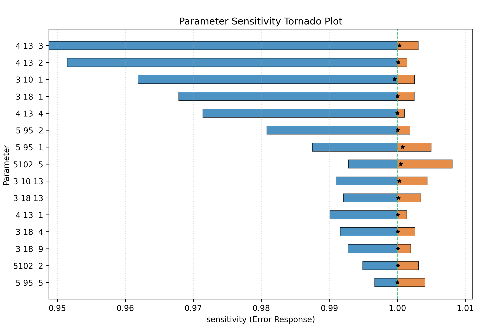
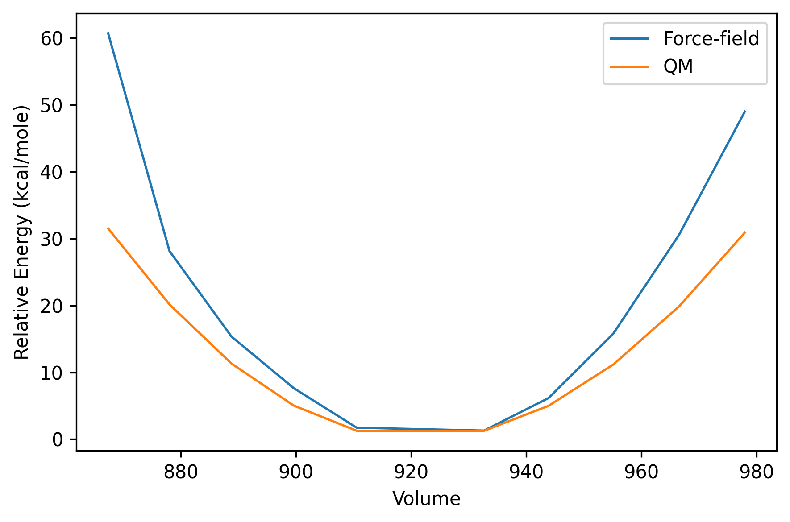

<!-- AUTO-GENERATED by docs/scripts/generate_workflow_cli_docs.py -->
# Ffield Workflow

::: reaxkit.workflows.file_tools.ffield_workflow
    options:
      show_root_heading: false
      show_root_full_path: false
      members: []

## Command: `get_ffield_data`

<div class="analysis-section-indent" markdown="1">

Load, filter, and export raw or interpreted ffield sections.
Interpreted means converting numeric values of atom types into Atom types. For example, 1 will be interepreted as C if carbon is the first element in the ffield.

### Examples
-----

```text
 1. Reading bond section of the ffield, obtaining the C-H bond parameters in interpreted format, and exporting to CSV:
    reaxkit get_ffield_data --field bond --term C-H --format interpreted --export CH_bond.csv

 2. Reading angle section of the ffield, obtaining the C-C-H angle parameters in interpreted format, and exporting to CSV:
    reaxkit get_ffield_data --field angle --term CCH --any-order --format interpreted --export CCH_angles.csv

 3. Reading all sections of the ffield, obtaining all parameters in interpreted format, and exporting to them as individual CSV files (one per section):
    reaxkit get_ffield_data --format interpreted --outdir ffield_export
```

### Arguments

#### Scientific choices

| Flag | Required | Default | Help | Choices |
|---|---|---|---|---|
| `--field` | No |  | Single section to query: general, atom, bond, off_diagonal, angle, torsion, hbond. Example: --field bond, which selects the bond-parameter section. |  |
| `--term` | No |  | Optional term filter, for example C-H, CCH, C-C-H, or 1-2. Example: --term C-H, which selects the carbon-hydrogen term. |  |
| `--ordered-2body` | No | False | For bond/off_diagonal terms, treat i-j and j-i as distinct. Example: --ordered-2body, which keeps C-H and H-C as distinct terms. |  |
| `--any-order` | No | False | For angle/torsion/hbond terms, match any atom-order permutation. Example: --any-order, which matches terms regardless of atom ordering. |  |

#### Input and file selection

| Flag | Required | Default | Help | Choices |
|---|---|---|---|---|
| `--engine` | No |  | Engine used to load simulation inputs. Example: --engine reaxff, which selects ReaxFF input readers. | reaxff, ams, lammps |
| `--input` | No | . | Input file or directory for engine resolution. Example: --input runs/heating, which detects the engine from that run. |  |
| `--run-dir, --dir` | No | . | Run directory fallback for engine detection. Example: --run-dir runs/heating, which uses that directory for fallback discovery. |  |
| `--ffield` | No | ffield | Path to ffield. Example: --ffield runs/heating/ffield, which reads force-field parameters from that file. |  |
| `--params` | No | params | Path to optimization parameter bounds. Example: --params runs/heating/params, which reads optimization parameter bounds from that file. |  |
| `--fort13` | No | fort.13 | Path to fort.13. Example: --fort13 runs/heating/fort.13, which reads optimization diagnostics from that file. |  |
| `--fort79` | No | fort.79 | Path to fort.79. Example: --fort79 runs/heating/fort.79, which reads optimization diagnostics from that file. |  |
| `--fort99` | No | fort.99 | Path to fort.99. Example: --fort99 runs/heating/fort.99, which reads training-set comparison data from that file. |  |
| `--fort74` | No | fort.74 | Path to fort.74. Example: --fort74 runs/heating/fort.74, which reads optimization data from that file. |  |
| `--trainset` | No | trainset.in | Path to trainset file. Example: --trainset runs/heating/trainset.in, which reads training targets from that file. |  |

#### Outputs and plots

| Flag | Required | Default | Help | Choices |
|---|---|---|---|---|
| `--plot` | No |  | Plot selected force-field data or optimization diagnostics. Example: --plot single, which combines selected series in one figure. | single, subplot, tornado, beeswarm |
| `--show` | No | False | Show the generated plot window. Example: --show, which opens generated figures interactively. |  |
| `--save` | No |  | Save the generated plot to a file path. Example: --save optimization.png, which writes the optimization figure to that image. |  |
| `--export` | No |  | Write the result table to CSV. Example: --export analysis.csv, which writes the result table for further analysis. |  |
| `--grid` | No |  | Subplot grid like 2x2 or 2*2. Example: --grid 2x2, which arranges subplot panels in two rows and two columns. |  |
| `--xaxis` | No |  | Optional x-axis column override. Example: --xaxis iteration, which uses the iteration column as the horizontal coordinate. |  |
| `--format` | No | interpreted | Output format: raw/indices atom ids or interpreted atom symbols. Example: --format interpreted, which displays element symbols instead of numeric atom indices. | raw, indices, interpreted |
| `--outdir` | No |  | Write per-section CSV exports into this output directory. Example: --outdir analysis/ffield, which writes per-section CSV tables under that directory. |  |
| `--plot-style` | No | default | Plot appearance: default preserves existing styling; publication uses clear fonts and an accessible palette; publication-bold uses larger bold text and heavier lines. Example: --plot-style publication-bold, which improves readability when figures are reduced in a manuscript. | default, publication, publication-bold |
| `--detail-format` | No |  | Optional detail format (default: Parquet; legacy: CSV). Example: --detail-format csv, which writes requested detail tables as CSV. | parquet, csv |

#### Execution

| Flag | Required | Default | Help | Choices |
|---|---|---|---|---|
| `--execution` | No | auto | Execution backend; unsupported backends fall back to serial with a logged reason. Example: --execution serial, which processes work sequentially. | auto, serial, threads, processes |
| `--workers` | No | 0 | Frame workers: auto or N (default: auto). Example: --workers 4, which requests four frame workers. |  |
| `--chunk-size` | No | 0 | Maximum in-flight frames: auto or N. Example: --chunk-size 8, which limits concurrent frame processing to eight frames. |  |

#### Storage and cache

| Flag | Required | Default | Help | Choices |
|---|---|---|---|---|
| `--run-id` | No |  | Run identifier for run-scoped layout. Example: --run-id run_91ac0e, which reuses that run identifier. |  |
| `--project-root` | No | reaxkit_workspace | Project root that contains inputs/, data/, analysis/, etc. Example: --project-root ./workspace, which stores run artifacts there. |  |
| `--analysis-id` | No |  | Optional analysis artifact id; defaults to run id. Example: --analysis-id comparison-a, which names the analysis artifact explicitly. |  |
| `--input-cache, --no-input-cache` | No | True | Reuse parsed input frames across commands (default: enabled; use --no-input-cache to force source reads for reproducibility checks or benchmarks). Example: --no-input-cache, which reloads frames from their source files. |  |
| `--frame-cache-max-gb` | No | 10.0 | Maximum workspace frame-cache size in GiB (default: 10; use 0 for unlimited). Example: --frame-cache-max-gb 20, which caps cached frames at 20 GiB. |  |
| `--output-profile` | No | standard | Select the shared artifact policy. Standard writes declared default outputs; minimal keeps core tables; full and legacy include optional details. Default: standard. Example: --output-profile full, which includes declared optional detail tables. | minimal, standard, full, legacy |
| `--checkpoint, --no-checkpoint` | No |  | Enable durable result batches for audited commands. Example: --no-checkpoint, disables recovery storage. |  |
| `--resume` | No |  | Resume a compatible result checkpoint; repeat the original scientific options. Example: --resume ./checkpoint, skips committed calculations. |  |
| `--checkpoint-buffer-mb` | No | 32 | Result buffer in MiB, plus one oversized frame. Example: --checkpoint-buffer-mb 32, bounds pending result payloads to approximately 32 MiB. |  |
| `--checkpoint-interval-seconds` | No | 30 | Flush at the next completed frame after this interval. Example: --checkpoint-interval-seconds 30, commits roughly every 30 seconds. |  |

#### Diagnostics and compatibility

| Flag | Required | Default | Help | Choices |
|---|---|---|---|---|
| `-h, --help` | No |  | show this help message and exit |  |
| `--help-all, --all-flags` | No |  | Show every option, grouped by purpose. Example: --help-all, which includes advanced flags in the help output. |  |
| `--log` | No |  | Logging level. Example: --log verbose, which prints detailed execution messages. | verbose, quiet |


</div>

## Command: `get_ffield_opt_progress_data`

<div class="analysis-section-indent" markdown="1">

Return total force-field optimization error versus epoch.
If you do the ffield optimization using ReaxFF's Successive One-Parameter Parabolic Interpolation (SOPPI) method, this will simply be the total force field error vs epoch.

### Examples
-----

```text
 1. Reading optimization output from ReaxFF fort.13 file, plotting error vs epoch, and saving the plot:
   reaxkit get_ffield_opt_progress_data --fort13 fort.13 --plot single --save ffield_opt.png

 2. Reading optimization output, exporting error vs epoch data to CSV for epochs 1 5 10 as CSV:
  reaxkit get_ffield_opt_progress_data --epochs 1 5 10 --export ffield_opt.csv
```

### Arguments

#### Scientific choices

| Flag | Required | Default | Help | Choices |
|---|---|---|---|---|
| `--epochs` | No |  | Optional epoch numbers to keep; default uses all available epochs. Example: --epochs 1 5, which includes only optimization epochs 1 and 5. |  |

#### Input and file selection

| Flag | Required | Default | Help | Choices |
|---|---|---|---|---|
| `--engine` | No |  | Engine used to load simulation inputs. Example: --engine reaxff, which selects ReaxFF input readers. | reaxff, ams, lammps |
| `--input` | No | . | Input file or directory for engine resolution. Example: --input runs/heating, which detects the engine from that run. |  |
| `--run-dir, --dir` | No | . | Run directory fallback for engine detection. Example: --run-dir runs/heating, which uses that directory for fallback discovery. |  |
| `--ffield` | No | ffield | Path to ffield. Example: --ffield runs/heating/ffield, which reads force-field parameters from that file. |  |
| `--params` | No | params | Path to optimization parameter bounds. Example: --params runs/heating/params, which reads optimization parameter bounds from that file. |  |
| `--fort13` | No | fort.13 | Path to fort.13. Example: --fort13 runs/heating/fort.13, which reads optimization diagnostics from that file. |  |
| `--fort79` | No | fort.79 | Path to fort.79. Example: --fort79 runs/heating/fort.79, which reads optimization diagnostics from that file. |  |
| `--fort99` | No | fort.99 | Path to fort.99. Example: --fort99 runs/heating/fort.99, which reads training-set comparison data from that file. |  |
| `--fort74` | No | fort.74 | Path to fort.74. Example: --fort74 runs/heating/fort.74, which reads optimization data from that file. |  |
| `--trainset` | No | trainset.in | Path to trainset file. Example: --trainset runs/heating/trainset.in, which reads training targets from that file. |  |

#### Outputs and plots

| Flag | Required | Default | Help | Choices |
|---|---|---|---|---|
| `--plot` | No |  | Plot selected force-field data or optimization diagnostics. Example: --plot single, which combines selected series in one figure. | single, subplot, tornado, beeswarm |
| `--show` | No | False | Show the generated plot window. Example: --show, which opens generated figures interactively. |  |
| `--save` | No |  | Save the generated plot to a file path. Example: --save optimization.png, which writes the optimization figure to that image. |  |
| `--export` | No |  | Write the result table to CSV. Example: --export analysis.csv, which writes the result table for further analysis. |  |
| `--grid` | No |  | Subplot grid like 2x2 or 2*2. Example: --grid 2x2, which arranges subplot panels in two rows and two columns. |  |
| `--xaxis` | No |  | Optional x-axis column override. Example: --xaxis iteration, which uses the iteration column as the horizontal coordinate. |  |
| `--plot-style` | No | default | Plot appearance: default preserves existing styling; publication uses clear fonts and an accessible palette; publication-bold uses larger bold text and heavier lines. Example: --plot-style publication-bold, which improves readability when figures are reduced in a manuscript. | default, publication, publication-bold |
| `--detail-format` | No |  | Optional detail format (default: Parquet; legacy: CSV). Example: --detail-format csv, which writes requested detail tables as CSV. | parquet, csv |

#### Execution

| Flag | Required | Default | Help | Choices |
|---|---|---|---|---|
| `--execution` | No | auto | Execution backend; unsupported backends fall back to serial with a logged reason. Example: --execution serial, which processes work sequentially. | auto, serial, threads, processes |
| `--workers` | No | 0 | Frame workers: auto or N (default: auto). Example: --workers 4, which requests four frame workers. |  |
| `--chunk-size` | No | 0 | Maximum in-flight frames: auto or N. Example: --chunk-size 8, which limits concurrent frame processing to eight frames. |  |

#### Storage and cache

| Flag | Required | Default | Help | Choices |
|---|---|---|---|---|
| `--run-id` | No |  | Run identifier for run-scoped layout. Example: --run-id run_91ac0e, which reuses that run identifier. |  |
| `--project-root` | No | reaxkit_workspace | Project root that contains inputs/, data/, analysis/, etc. Example: --project-root ./workspace, which stores run artifacts there. |  |
| `--analysis-id` | No |  | Optional analysis artifact id; defaults to run id. Example: --analysis-id comparison-a, which names the analysis artifact explicitly. |  |
| `--input-cache, --no-input-cache` | No | True | Reuse parsed input frames across commands (default: enabled; use --no-input-cache to force source reads for reproducibility checks or benchmarks). Example: --no-input-cache, which reloads frames from their source files. |  |
| `--frame-cache-max-gb` | No | 10.0 | Maximum workspace frame-cache size in GiB (default: 10; use 0 for unlimited). Example: --frame-cache-max-gb 20, which caps cached frames at 20 GiB. |  |
| `--output-profile` | No | standard | Select the shared artifact policy. Standard writes declared default outputs; minimal keeps core tables; full and legacy include optional details. Default: standard. Example: --output-profile full, which includes declared optional detail tables. | minimal, standard, full, legacy |
| `--checkpoint, --no-checkpoint` | No |  | Enable durable result batches for audited commands. Example: --no-checkpoint, disables recovery storage. |  |
| `--resume` | No |  | Resume a compatible result checkpoint; repeat the original scientific options. Example: --resume ./checkpoint, skips committed calculations. |  |
| `--checkpoint-buffer-mb` | No | 32 | Result buffer in MiB, plus one oversized frame. Example: --checkpoint-buffer-mb 32, bounds pending result payloads to approximately 32 MiB. |  |
| `--checkpoint-interval-seconds` | No | 30 | Flush at the next completed frame after this interval. Example: --checkpoint-interval-seconds 30, commits roughly every 30 seconds. |  |

#### Diagnostics and compatibility

| Flag | Required | Default | Help | Choices |
|---|---|---|---|---|
| `-h, --help` | No |  | show this help message and exit |  |
| `--help-all, --all-flags` | No |  | Show every option, grouped by purpose. Example: --help-all, which includes advanced flags in the help output. |  |
| `--log` | No |  | Logging level. Example: --log verbose, which prints detailed execution messages. | verbose, quiet |


</div>

## Command: `get_energy_min_summary_data`

<div class="analysis-section-indent" markdown="1">

Get energy minimization summary data (energy, heat of formation, volume, density, etc.) per geo file, which can be obtained from fort.74 file if using ReaxFF standalone code for ffield optimization.

### Examples
-----

```text
 1. Getting the data and exporting all columns to CSV:
   reaxkit get_energy_min_summary_data --export fort74.csv

 2. Getting only density data, and exporting to CSV:
  reaxkit get_energy_min_summary_data --col density --export fort74_density.csv
```

### Arguments

#### Input and file selection

| Flag | Required | Default | Help | Choices |
|---|---|---|---|---|
| `--engine` | No |  | Engine used to load simulation inputs. Example: --engine reaxff, which selects ReaxFF input readers. | reaxff, ams, lammps |
| `--input` | No | . | Input file or directory for engine resolution. Example: --input runs/heating, which detects the engine from that run. |  |
| `--run-dir, --dir` | No | . | Run directory fallback for engine detection. Example: --run-dir runs/heating, which uses that directory for fallback discovery. |  |
| `--ffield` | No | ffield | Path to ffield. Example: --ffield runs/heating/ffield, which reads force-field parameters from that file. |  |
| `--params` | No | params | Path to optimization parameter bounds. Example: --params runs/heating/params, which reads optimization parameter bounds from that file. |  |
| `--fort13` | No | fort.13 | Path to fort.13. Example: --fort13 runs/heating/fort.13, which reads optimization diagnostics from that file. |  |
| `--fort79` | No | fort.79 | Path to fort.79. Example: --fort79 runs/heating/fort.79, which reads optimization diagnostics from that file. |  |
| `--fort99` | No | fort.99 | Path to fort.99. Example: --fort99 runs/heating/fort.99, which reads training-set comparison data from that file. |  |
| `--fort74` | No | fort.74 | Path to fort.74. Example: --fort74 runs/heating/fort.74, which reads optimization data from that file. |  |
| `--trainset` | No | trainset.in | Path to trainset file. Example: --trainset runs/heating/trainset.in, which reads training targets from that file. |  |

#### Outputs and plots

| Flag | Required | Default | Help | Choices |
|---|---|---|---|---|
| `--plot` | No |  | Plot selected force-field data or optimization diagnostics. Example: --plot single, which combines selected series in one figure. | single, subplot, tornado, beeswarm |
| `--show` | No | False | Show the generated plot window. Example: --show, which opens generated figures interactively. |  |
| `--save` | No |  | Save the generated plot to a file path. Example: --save optimization.png, which writes the optimization figure to that image. |  |
| `--export` | No |  | Write the result table to CSV. Example: --export analysis.csv, which writes the result table for further analysis. |  |
| `--grid` | No |  | Subplot grid like 2x2 or 2*2. Example: --grid 2x2, which arranges subplot panels in two rows and two columns. |  |
| `--xaxis` | No |  | Optional x-axis column override. Example: --xaxis iteration, which uses the iteration column as the horizontal coordinate. |  |
| `--col` | No | all | Single column to keep (identifier is retained when present), or 'all'. Example: --col all, which retains every diagnostic column. |  |
| `--plot-style` | No | default | Plot appearance: default preserves existing styling; publication uses clear fonts and an accessible palette; publication-bold uses larger bold text and heavier lines. Example: --plot-style publication-bold, which improves readability when figures are reduced in a manuscript. | default, publication, publication-bold |
| `--detail-format` | No |  | Optional detail format (default: Parquet; legacy: CSV). Example: --detail-format csv, which writes requested detail tables as CSV. | parquet, csv |

#### Execution

| Flag | Required | Default | Help | Choices |
|---|---|---|---|---|
| `--execution` | No | auto | Execution backend; unsupported backends fall back to serial with a logged reason. Example: --execution serial, which processes work sequentially. | auto, serial, threads, processes |
| `--workers` | No | 0 | Frame workers: auto or N (default: auto). Example: --workers 4, which requests four frame workers. |  |
| `--chunk-size` | No | 0 | Maximum in-flight frames: auto or N. Example: --chunk-size 8, which limits concurrent frame processing to eight frames. |  |

#### Storage and cache

| Flag | Required | Default | Help | Choices |
|---|---|---|---|---|
| `--run-id` | No |  | Run identifier for run-scoped layout. Example: --run-id run_91ac0e, which reuses that run identifier. |  |
| `--project-root` | No | reaxkit_workspace | Project root that contains inputs/, data/, analysis/, etc. Example: --project-root ./workspace, which stores run artifacts there. |  |
| `--analysis-id` | No |  | Optional analysis artifact id; defaults to run id. Example: --analysis-id comparison-a, which names the analysis artifact explicitly. |  |
| `--input-cache, --no-input-cache` | No | True | Reuse parsed input frames across commands (default: enabled; use --no-input-cache to force source reads for reproducibility checks or benchmarks). Example: --no-input-cache, which reloads frames from their source files. |  |
| `--frame-cache-max-gb` | No | 10.0 | Maximum workspace frame-cache size in GiB (default: 10; use 0 for unlimited). Example: --frame-cache-max-gb 20, which caps cached frames at 20 GiB. |  |
| `--output-profile` | No | standard | Select the shared artifact policy. Standard writes declared default outputs; minimal keeps core tables; full and legacy include optional details. Default: standard. Example: --output-profile full, which includes declared optional detail tables. | minimal, standard, full, legacy |
| `--checkpoint, --no-checkpoint` | No |  | Enable durable result batches for audited commands. Example: --no-checkpoint, disables recovery storage. |  |
| `--resume` | No |  | Resume a compatible result checkpoint; repeat the original scientific options. Example: --resume ./checkpoint, skips committed calculations. |  |
| `--checkpoint-buffer-mb` | No | 32 | Result buffer in MiB, plus one oversized frame. Example: --checkpoint-buffer-mb 32, bounds pending result payloads to approximately 32 MiB. |  |
| `--checkpoint-interval-seconds` | No | 30 | Flush at the next completed frame after this interval. Example: --checkpoint-interval-seconds 30, commits roughly every 30 seconds. |  |

#### Diagnostics and compatibility

| Flag | Required | Default | Help | Choices |
|---|---|---|---|---|
| `-h, --help` | No |  | show this help message and exit |  |
| `--help-all, --all-flags` | No |  | Show every option, grouped by purpose. Example: --help-all, which includes advanced flags in the help output. |  |
| `--log` | No |  | Logging level. Example: --log verbose, which prints detailed execution messages. | verbose, quiet |


</div>

## Command: `get_ffield_diagnostic_data`

<div class="analysis-section-indent" markdown="1">

Get per-parameter optimization diagnostics from force-field optimization diagnostic output. Diagnostics data is simply the data in fort.79 which shows how the optimizer (i.e., Successive One-Parameter Parabolic Interpolation (SOPPI) method) has gone through the parameter space during optimization, and how the error has changed when each parameter was perturbed.

### Examples
-----

```text
  1. Getting all diagnostic data and exporting to CSV:
   reaxkit get_ffield_diagnostic_data --export fort79_diag.csv

  2. Getting the diagnostics data along with the data related to the most sensitive parameter during ffield optimization:
   reaxkit get_ffield_diagnostic_data --report-most-sensitive --export most_sensitive.csv --export-all fort79_all.csv

 3. Getting the diagnostics data, plotting a tornado plot for the top 10 most sensitive parameters, and adding a vertical guide line at x=1.0:
  This plot shows the relative sensitivity of the parameters in a tornado format, where the bars represent the span between the error at the current parameter value and the error at the perturbed parameter value.   This is helpful for understanding the marginal effect of each parameter on the total error, and for identifying which parameters are the most sensitive ones during optimization.
   reaxkit get_ffield_diagnostic_data --plot tornado --top 3 --vline 1.0 --save tornado.png
  4. Getting the diagnostics data, plotting a beeswarm plot for all parameters, and saving the plot:
   This plot is very similar to the tornado plot, but instead of showing the span between the current and perturbed error as a bar, it normalizes sampled parameter values with their declared params bounds and colors them by objective value.
   reaxkit get_ffield_diagnostic_data --plot beeswarm --sort parameter --save diagnostic_beeswarm.png
```

### Arguments

#### Scientific choices

| Flag | Required | Default | Help | Choices |
|---|---|---|---|---|
| `--interpret` | No | False | Interpret identifier triplets with ffield symbol mapping when possible. Example: --interpret, which replaces recognized parameter pointers with atom-symbol labels. |  |
| `--report-most-sensitive` | No | False | Return only the minimum-sensitivity parameter view. Example: --report-most-sensitive, which returns the minimum-sensitivity parameter view. |  |
| `--top` | No | 0 | For tornado or beeswarm views, keep top-N widest response spans; 0 keeps all. Example: --top 20, which limits the view to 20 widest response spans. |  |
| `--sort` | No | parameter | For beeswarm view, sort rows by numeric parameter pointer, final value, or starting value. Example: --sort parameter, which orders diagnostic rows by parameter pointer. | parameter, final, starting |
| `--global-objective-scale` | No | False | For beeswarm view, use one objective-function color range across all parameters. Example: --global-objective-scale, which uses one objective color scale across parameters. |  |

#### Input and file selection

| Flag | Required | Default | Help | Choices |
|---|---|---|---|---|
| `--engine` | No |  | Engine used to load simulation inputs. Example: --engine reaxff, which selects ReaxFF input readers. | reaxff, ams, lammps |
| `--input` | No | . | Input file or directory for engine resolution. Example: --input runs/heating, which detects the engine from that run. |  |
| `--run-dir, --dir` | No | . | Run directory fallback for engine detection. Example: --run-dir runs/heating, which uses that directory for fallback discovery. |  |
| `--ffield` | No | ffield | Path to ffield. Example: --ffield runs/heating/ffield, which reads force-field parameters from that file. |  |
| `--params` | No | params | Path to optimization parameter bounds. Example: --params runs/heating/params, which reads optimization parameter bounds from that file. |  |
| `--fort13` | No | fort.13 | Path to fort.13. Example: --fort13 runs/heating/fort.13, which reads optimization diagnostics from that file. |  |
| `--fort79` | No | fort.79 | Path to fort.79. Example: --fort79 runs/heating/fort.79, which reads optimization diagnostics from that file. |  |
| `--fort99` | No | fort.99 | Path to fort.99. Example: --fort99 runs/heating/fort.99, which reads training-set comparison data from that file. |  |
| `--fort74` | No | fort.74 | Path to fort.74. Example: --fort74 runs/heating/fort.74, which reads optimization data from that file. |  |
| `--trainset` | No | trainset.in | Path to trainset file. Example: --trainset runs/heating/trainset.in, which reads training targets from that file. |  |

#### Outputs and plots

| Flag | Required | Default | Help | Choices |
|---|---|---|---|---|
| `--plot` | No |  | Plot selected force-field data or optimization diagnostics. Example: --plot single, which combines selected series in one figure. | single, subplot, tornado, beeswarm |
| `--show` | No | False | Show the generated plot window. Example: --show, which opens generated figures interactively. |  |
| `--save` | No |  | Save the generated plot to a file path. Example: --save optimization.png, which writes the optimization figure to that image. |  |
| `--export` | No |  | Write the result table to CSV. Example: --export analysis.csv, which writes the result table for further analysis. |  |
| `--grid` | No |  | Subplot grid like 2x2 or 2*2. Example: --grid 2x2, which arranges subplot panels in two rows and two columns. |  |
| `--xaxis` | No |  | Optional x-axis column override. Example: --xaxis iteration, which uses the iteration column as the horizontal coordinate. |  |
| `--export-all` | No |  | Optional CSV path to export the full diagnostic table (useful with --report-most-sensitive). Example: --export-all diagnostics.csv, which writes the full diagnostic table even when the displayed view is filtered. |  |
| `--vline` | No | 1.0 | For tornado view, reference x-value for the guide line. Example: --vline 1, which draws the tornado reference line at x = 1. |  |
| `--plot-style` | No | default | Plot appearance: default preserves existing styling; publication uses clear fonts and an accessible palette; publication-bold uses larger bold text and heavier lines. Example: --plot-style publication-bold, which improves readability when figures are reduced in a manuscript. | default, publication, publication-bold |
| `--detail-format` | No |  | Optional detail format (default: Parquet; legacy: CSV). Example: --detail-format csv, which writes requested detail tables as CSV. | parquet, csv |

#### Execution

| Flag | Required | Default | Help | Choices |
|---|---|---|---|---|
| `--execution` | No | auto | Execution backend; unsupported backends fall back to serial with a logged reason. Example: --execution serial, which processes work sequentially. | auto, serial, threads, processes |
| `--workers` | No | 0 | Frame workers: auto or N (default: auto). Example: --workers 4, which requests four frame workers. |  |
| `--chunk-size` | No | 0 | Maximum in-flight frames: auto or N. Example: --chunk-size 8, which limits concurrent frame processing to eight frames. |  |

#### Storage and cache

| Flag | Required | Default | Help | Choices |
|---|---|---|---|---|
| `--run-id` | No |  | Run identifier for run-scoped layout. Example: --run-id run_91ac0e, which reuses that run identifier. |  |
| `--project-root` | No | reaxkit_workspace | Project root that contains inputs/, data/, analysis/, etc. Example: --project-root ./workspace, which stores run artifacts there. |  |
| `--analysis-id` | No |  | Optional analysis artifact id; defaults to run id. Example: --analysis-id comparison-a, which names the analysis artifact explicitly. |  |
| `--input-cache, --no-input-cache` | No | True | Reuse parsed input frames across commands (default: enabled; use --no-input-cache to force source reads for reproducibility checks or benchmarks). Example: --no-input-cache, which reloads frames from their source files. |  |
| `--frame-cache-max-gb` | No | 10.0 | Maximum workspace frame-cache size in GiB (default: 10; use 0 for unlimited). Example: --frame-cache-max-gb 20, which caps cached frames at 20 GiB. |  |
| `--output-profile` | No | standard | Select the shared artifact policy. Standard writes declared default outputs; minimal keeps core tables; full and legacy include optional details. Default: standard. Example: --output-profile full, which includes declared optional detail tables. | minimal, standard, full, legacy |
| `--checkpoint, --no-checkpoint` | No |  | Enable durable result batches for audited commands. Example: --no-checkpoint, disables recovery storage. |  |
| `--resume` | No |  | Resume a compatible result checkpoint; repeat the original scientific options. Example: --resume ./checkpoint, skips committed calculations. |  |
| `--checkpoint-buffer-mb` | No | 32 | Result buffer in MiB, plus one oversized frame. Example: --checkpoint-buffer-mb 32, bounds pending result payloads to approximately 32 MiB. |  |
| `--checkpoint-interval-seconds` | No | 30 | Flush at the next completed frame after this interval. Example: --checkpoint-interval-seconds 30, commits roughly every 30 seconds. |  |

#### Diagnostics and compatibility

| Flag | Required | Default | Help | Choices |
|---|---|---|---|---|
| `-h, --help` | No |  | show this help message and exit |  |
| `--help-all, --all-flags` | No |  | Show every option, grouped by purpose. Example: --help-all, which includes advanced flags in the help output. |  |
| `--log` | No |  | Logging level. Example: --log verbose, which prints detailed execution messages. | verbose, quiet |


<a id="get_ffield_diagnostic_data_plot_tornado"></a>

The figure below shows an example tornado plot for the sensitivity of force field optimization error to each parameter. Bars show 3 values: min, max, and mean of sensitivities per parameter.

<div style="text-align:center;" markdown="1">
{ style="width:85%; max-width:800px;" }

*Figure: Sample tornado plot for the sensitivity of force field optimization error to each parameter*
</div>

<a id="get_ffield_diagnostic_data_plot_beeswarm"></a>

The diagnostic beeswarm normalizes every sampled parameter value with the lower
and upper bounds declared in `params`. Marker color represents the objective
function, from blue for lower values to red for higher values. By default each
parameter uses its own objective range; `--global-objective-scale` applies one
range across the full plot. Use `--sort parameter`, `--sort final`, or
`--sort starting` to order the rows.

```text
reaxkit get_ffield_diagnostic_data --plot beeswarm --params params \
  --sort parameter --save diagnostic_beeswarm.png
```

The rendered plot places the normalized samples on the left, the stored bounds
and final/starting values in a separate annotation region, and the objective
color scale on the far right. Interactive plot windows show the interpreted
force-field parameter name when hovering over a marker.

</div>

## Command: `get_ffield_diagnostics_sensitivity`

<div class="analysis-section-indent" markdown="1">

Plot force-field optimization sensitivity diagnostics derived from fort.79.
Sensitivity values are the relative objective responses diff1/diff3, diff2/diff3, and diff4/diff3 for each force-field parameter.

### Examples
-----

```text
 1. Plot the widest sensitivity ranges as a tornado plot:
   reaxkit get_ffield_diagnostics_sensitivity --plot tornado --top 10 --save sensitivity_tornado.png

 2. Plot all sensitivity observations as a parameter-colored beeswarm:
   reaxkit get_ffield_diagnostics_sensitivity --plot beeswarm --save sensitivity_beeswarm.png
```

### Arguments

#### Scientific choices

| Flag | Required | Default | Help | Choices |
|---|---|---|---|---|
| `--interpret` | No | False | Use interpreted force-field section, term, and component labels when possible. Example: --interpret, which replaces recognized parameter pointers with atom-symbol labels. |  |
| `--top` | No | 0 | Keep the top-N parameters with the widest sensitivity spans; 0 keeps all. Example: --top 20, which limits the view to 20 widest response spans. |  |

#### Input and file selection

| Flag | Required | Default | Help | Choices |
|---|---|---|---|---|
| `--engine` | No |  | Engine used to load simulation inputs. Example: --engine reaxff, which selects ReaxFF input readers. | reaxff, ams, lammps |
| `--input` | No | . | Input file or directory for engine resolution. Example: --input runs/heating, which detects the engine from that run. |  |
| `--run-dir, --dir` | No | . | Run directory fallback for engine detection. Example: --run-dir runs/heating, which uses that directory for fallback discovery. |  |
| `--ffield` | No | ffield | Path to ffield. Example: --ffield runs/heating/ffield, which reads force-field parameters from that file. |  |
| `--params` | No | params | Path to optimization parameter bounds. Example: --params runs/heating/params, which reads optimization parameter bounds from that file. |  |
| `--fort13` | No | fort.13 | Path to fort.13. Example: --fort13 runs/heating/fort.13, which reads optimization diagnostics from that file. |  |
| `--fort79` | No | fort.79 | Path to fort.79. Example: --fort79 runs/heating/fort.79, which reads optimization diagnostics from that file. |  |
| `--fort99` | No | fort.99 | Path to fort.99. Example: --fort99 runs/heating/fort.99, which reads training-set comparison data from that file. |  |
| `--fort74` | No | fort.74 | Path to fort.74. Example: --fort74 runs/heating/fort.74, which reads optimization data from that file. |  |
| `--trainset` | No | trainset.in | Path to trainset file. Example: --trainset runs/heating/trainset.in, which reads training targets from that file. |  |

#### Outputs and plots

| Flag | Required | Default | Help | Choices |
|---|---|---|---|---|
| `--plot` | No | tornado | Plot selected force-field data or optimization diagnostics. Example: --plot tornado, which compares parameter response spans as horizontal bars. | tornado, beeswarm |
| `--show` | No | False | Show the generated plot window. Example: --show, which opens generated figures interactively. |  |
| `--save` | No |  | Save the generated plot to a file path. Example: --save optimization.png, which writes the optimization figure to that image. |  |
| `--export` | No |  | Write the result table to CSV. Example: --export analysis.csv, which writes the result table for further analysis. |  |
| `--grid` | No |  | Subplot grid like 2x2 or 2*2. Example: --grid 2x2, which arranges subplot panels in two rows and two columns. |  |
| `--xaxis` | No |  | Optional x-axis column override. Example: --xaxis iteration, which uses the iteration column as the horizontal coordinate. |  |
| `--vline` | No | 1.0 | Reference sensitivity value drawn on tornado and beeswarm plots. Example: --vline 1, which draws the tornado reference line at x = 1. |  |
| `--plot-style` | No | default | Plot appearance: default preserves existing styling; publication uses clear fonts and an accessible palette; publication-bold uses larger bold text and heavier lines. Example: --plot-style publication-bold, which improves readability when figures are reduced in a manuscript. | default, publication, publication-bold |
| `--detail-format` | No |  | Optional detail format (default: Parquet; legacy: CSV). Example: --detail-format csv, which writes requested detail tables as CSV. | parquet, csv |

#### Execution

| Flag | Required | Default | Help | Choices |
|---|---|---|---|---|
| `--execution` | No | auto | Execution backend; unsupported backends fall back to serial with a logged reason. Example: --execution serial, which processes work sequentially. | auto, serial, threads, processes |
| `--workers` | No | 0 | Frame workers: auto or N (default: auto). Example: --workers 4, which requests four frame workers. |  |
| `--chunk-size` | No | 0 | Maximum in-flight frames: auto or N. Example: --chunk-size 8, which limits concurrent frame processing to eight frames. |  |

#### Storage and cache

| Flag | Required | Default | Help | Choices |
|---|---|---|---|---|
| `--run-id` | No |  | Run identifier for run-scoped layout. Example: --run-id run_91ac0e, which reuses that run identifier. |  |
| `--project-root` | No | reaxkit_workspace | Project root that contains inputs/, data/, analysis/, etc. Example: --project-root ./workspace, which stores run artifacts there. |  |
| `--analysis-id` | No |  | Optional analysis artifact id; defaults to run id. Example: --analysis-id comparison-a, which names the analysis artifact explicitly. |  |
| `--input-cache, --no-input-cache` | No | True | Reuse parsed input frames across commands (default: enabled; use --no-input-cache to force source reads for reproducibility checks or benchmarks). Example: --no-input-cache, which reloads frames from their source files. |  |
| `--frame-cache-max-gb` | No | 10.0 | Maximum workspace frame-cache size in GiB (default: 10; use 0 for unlimited). Example: --frame-cache-max-gb 20, which caps cached frames at 20 GiB. |  |
| `--output-profile` | No | standard | Select the shared artifact policy. Standard writes declared default outputs; minimal keeps core tables; full and legacy include optional details. Default: standard. Example: --output-profile full, which includes declared optional detail tables. | minimal, standard, full, legacy |
| `--checkpoint, --no-checkpoint` | No |  | Enable durable result batches for audited commands. Example: --no-checkpoint, disables recovery storage. |  |
| `--resume` | No |  | Resume a compatible result checkpoint; repeat the original scientific options. Example: --resume ./checkpoint, skips committed calculations. |  |
| `--checkpoint-buffer-mb` | No | 32 | Result buffer in MiB, plus one oversized frame. Example: --checkpoint-buffer-mb 32, bounds pending result payloads to approximately 32 MiB. |  |
| `--checkpoint-interval-seconds` | No | 30 | Flush at the next completed frame after this interval. Example: --checkpoint-interval-seconds 30, commits roughly every 30 seconds. |  |

#### Diagnostics and compatibility

| Flag | Required | Default | Help | Choices |
|---|---|---|---|---|
| `-h, --help` | No |  | show this help message and exit |  |
| `--help-all, --all-flags` | No |  | Show every option, grouped by purpose. Example: --help-all, which includes advanced flags in the help output. |  |
| `--log` | No |  | Logging level. Example: --log verbose, which prints detailed execution messages. | verbose, quiet |


</div>

## Command: `get_ffield_diagnostics_evolution`

<div class="analysis-section-indent" markdown="1">

Plot force-field parameter evolution from fort.79 diagnostic samples.
The beeswarm view normalizes all diagnostic samples with their params bounds. The scatter view follows each parameter's final value by epoch, connects the values with a line, and colors the markers by objective-function value.

### Examples
-----

```text
 1. Plot the bounded diagnostic beeswarm in numeric pointer order:
   reaxkit get_ffield_diagnostics_evolution --plot beeswarm --save diagnostic_evolution.png

 2. Plot epoch-wise evolution relative to each parameter's first value:
   reaxkit get_ffield_diagnostics_evolution --plot scatter --normalization first --save diagnostic_evolution_scatter.png

 3. Plot the top 10 widest objective-response ranges using one shared color scale:
   reaxkit get_ffield_diagnostics_evolution --top 10 --global-objective-scale --save diagnostic_evolution_top10.png
```

### Arguments

#### Scientific choices

| Flag | Required | Default | Help | Choices |
|---|---|---|---|---|
| `--normalization` | No | bound_min | Scatter normalization origin. bound_min uses (value-lower)/(upper-lower); first uses (value-first)/(upper-lower). Example: --normalization bound_min, which measures parameter changes from the lower bound in units of the bounds span. | bound_min, first |
| `--top` | No | 0 | Keep the top-N parameters with the widest objective ranges; 0 keeps all. Example: --top 20, which limits the view to 20 widest response spans. |  |
| `--sort` | No | parameter | Sort parameter rows by numeric pointer, final value, or starting value. Example: --sort parameter, which orders diagnostic rows by parameter pointer. | parameter, final, starting |
| `--global-objective-scale` | No | False | Use one objective-function color range across all parameters. Example: --global-objective-scale, which uses one objective color scale across parameters. |  |

#### Input and file selection

| Flag | Required | Default | Help | Choices |
|---|---|---|---|---|
| `--engine` | No |  | Engine used to load simulation inputs. Example: --engine reaxff, which selects ReaxFF input readers. | reaxff, ams, lammps |
| `--input` | No | . | Input file or directory for engine resolution. Example: --input runs/heating, which detects the engine from that run. |  |
| `--run-dir, --dir` | No | . | Run directory fallback for engine detection. Example: --run-dir runs/heating, which uses that directory for fallback discovery. |  |
| `--ffield` | No | ffield | Path to ffield. Example: --ffield runs/heating/ffield, which reads force-field parameters from that file. |  |
| `--params` | No | params | Path to optimization parameter bounds. Example: --params runs/heating/params, which reads optimization parameter bounds from that file. |  |
| `--fort13` | No | fort.13 | Path to fort.13. Example: --fort13 runs/heating/fort.13, which reads optimization diagnostics from that file. |  |
| `--fort79` | No | fort.79 | Path to fort.79. Example: --fort79 runs/heating/fort.79, which reads optimization diagnostics from that file. |  |
| `--fort99` | No | fort.99 | Path to fort.99. Example: --fort99 runs/heating/fort.99, which reads training-set comparison data from that file. |  |
| `--fort74` | No | fort.74 | Path to fort.74. Example: --fort74 runs/heating/fort.74, which reads optimization data from that file. |  |
| `--trainset` | No | trainset.in | Path to trainset file. Example: --trainset runs/heating/trainset.in, which reads training targets from that file. |  |

#### Outputs and plots

| Flag | Required | Default | Help | Choices |
|---|---|---|---|---|
| `--plot` | No | beeswarm | Plot selected force-field data or optimization diagnostics. Example: --plot beeswarm, which compares parameter samples and their objective values. | beeswarm, scatter |
| `--show` | No | False | Show the generated plot window. Example: --show, which opens generated figures interactively. |  |
| `--save` | No |  | Save the generated plot to a file path. Example: --save optimization.png, which writes the optimization figure to that image. |  |
| `--export` | No |  | Write the result table to CSV. Example: --export analysis.csv, which writes the result table for further analysis. |  |
| `--grid` | No |  | Subplot grid like 2x2 or 2*2. Example: --grid 2x2, which arranges subplot panels in two rows and two columns. |  |
| `--xaxis` | No |  | Optional x-axis column override. Example: --xaxis iteration, which uses the iteration column as the horizontal coordinate. |  |
| `--plot-style` | No | default | Plot appearance: default preserves existing styling; publication uses clear fonts and an accessible palette; publication-bold uses larger bold text and heavier lines. Example: --plot-style publication-bold, which improves readability when figures are reduced in a manuscript. | default, publication, publication-bold |
| `--detail-format` | No |  | Optional detail format (default: Parquet; legacy: CSV). Example: --detail-format csv, which writes requested detail tables as CSV. | parquet, csv |

#### Execution

| Flag | Required | Default | Help | Choices |
|---|---|---|---|---|
| `--execution` | No | auto | Execution backend; unsupported backends fall back to serial with a logged reason. Example: --execution serial, which processes work sequentially. | auto, serial, threads, processes |
| `--workers` | No | 0 | Frame workers: auto or N (default: auto). Example: --workers 4, which requests four frame workers. |  |
| `--chunk-size` | No | 0 | Maximum in-flight frames: auto or N. Example: --chunk-size 8, which limits concurrent frame processing to eight frames. |  |

#### Storage and cache

| Flag | Required | Default | Help | Choices |
|---|---|---|---|---|
| `--run-id` | No |  | Run identifier for run-scoped layout. Example: --run-id run_91ac0e, which reuses that run identifier. |  |
| `--project-root` | No | reaxkit_workspace | Project root that contains inputs/, data/, analysis/, etc. Example: --project-root ./workspace, which stores run artifacts there. |  |
| `--analysis-id` | No |  | Optional analysis artifact id; defaults to run id. Example: --analysis-id comparison-a, which names the analysis artifact explicitly. |  |
| `--input-cache, --no-input-cache` | No | True | Reuse parsed input frames across commands (default: enabled; use --no-input-cache to force source reads for reproducibility checks or benchmarks). Example: --no-input-cache, which reloads frames from their source files. |  |
| `--frame-cache-max-gb` | No | 10.0 | Maximum workspace frame-cache size in GiB (default: 10; use 0 for unlimited). Example: --frame-cache-max-gb 20, which caps cached frames at 20 GiB. |  |
| `--output-profile` | No | standard | Select the shared artifact policy. Standard writes declared default outputs; minimal keeps core tables; full and legacy include optional details. Default: standard. Example: --output-profile full, which includes declared optional detail tables. | minimal, standard, full, legacy |
| `--checkpoint, --no-checkpoint` | No |  | Enable durable result batches for audited commands. Example: --no-checkpoint, disables recovery storage. |  |
| `--resume` | No |  | Resume a compatible result checkpoint; repeat the original scientific options. Example: --resume ./checkpoint, skips committed calculations. |  |
| `--checkpoint-buffer-mb` | No | 32 | Result buffer in MiB, plus one oversized frame. Example: --checkpoint-buffer-mb 32, bounds pending result payloads to approximately 32 MiB. |  |
| `--checkpoint-interval-seconds` | No | 30 | Flush at the next completed frame after this interval. Example: --checkpoint-interval-seconds 30, commits roughly every 30 seconds. |  |

#### Diagnostics and compatibility

| Flag | Required | Default | Help | Choices |
|---|---|---|---|---|
| `-h, --help` | No |  | show this help message and exit |  |
| `--help-all, --all-flags` | No |  | Show every option, grouped by purpose. Example: --help-all, which includes advanced flags in the help output. |  |
| `--log` | No |  | Logging level. Example: --log verbose, which prints detailed execution messages. | verbose, quiet |


</div>

## Command: `parameter_optimization_most_sensitive`

<div class="analysis-section-indent" markdown="1">

Get per-parameter optimization diagnostics from force-field optimization diagnostic output. Diagnostics data is simply the data in fort.79 which shows how the optimizer (i.e., Successive One-Parameter Parabolic Interpolation (SOPPI) method) has gone through the parameter space during optimization, and how the error has changed when each parameter was perturbed.

### Examples
-----

```text
  1. Getting all diagnostic data and exporting to CSV:
   reaxkit get_ffield_diagnostic_data --export fort79_diag.csv

  2. Getting the diagnostics data along with the data related to the most sensitive parameter during ffield optimization:
   reaxkit get_ffield_diagnostic_data --report-most-sensitive --export most_sensitive.csv --export-all fort79_all.csv

 3. Getting the diagnostics data, plotting a tornado plot for the top 10 most sensitive parameters, and adding a vertical guide line at x=1.0:
  This plot shows the relative sensitivity of the parameters in a tornado format, where the bars represent the span between the error at the current parameter value and the error at the perturbed parameter value.   This is helpful for understanding the marginal effect of each parameter on the total error, and for identifying which parameters are the most sensitive ones during optimization.
   reaxkit get_ffield_diagnostic_data --plot tornado --top 3 --vline 1.0 --save tornado.png
  4. Getting the diagnostics data, plotting a beeswarm plot for all parameters, and saving the plot:
   This plot is very similar to the tornado plot, but instead of showing the span between the current and perturbed error as a bar, it normalizes sampled parameter values with their declared params bounds and colors them by objective value.
   reaxkit get_ffield_diagnostic_data --plot beeswarm --sort parameter --save diagnostic_beeswarm.png
```

### Arguments

#### Scientific choices

| Flag | Required | Default | Help | Choices |
|---|---|---|---|---|
| `--interpret` | No | False | Interpret identifier triplets with ffield symbol mapping when possible. Example: --interpret, which replaces recognized parameter pointers with atom-symbol labels. |  |
| `--report-most-sensitive` | No | False | Return only the minimum-sensitivity parameter view. Example: --report-most-sensitive, which returns the minimum-sensitivity parameter view. |  |
| `--top` | No | 0 | For tornado or beeswarm views, keep top-N widest response spans; 0 keeps all. Example: --top 20, which limits the view to 20 widest response spans. |  |
| `--sort` | No | parameter | For beeswarm view, sort rows by numeric parameter pointer, final value, or starting value. Example: --sort parameter, which orders diagnostic rows by parameter pointer. | parameter, final, starting |
| `--global-objective-scale` | No | False | For beeswarm view, use one objective-function color range across all parameters. Example: --global-objective-scale, which uses one objective color scale across parameters. |  |

#### Input and file selection

| Flag | Required | Default | Help | Choices |
|---|---|---|---|---|
| `--engine` | No |  | Engine used to load simulation inputs. Example: --engine reaxff, which selects ReaxFF input readers. | reaxff, ams, lammps |
| `--input` | No | . | Input file or directory for engine resolution. Example: --input runs/heating, which detects the engine from that run. |  |
| `--run-dir, --dir` | No | . | Run directory fallback for engine detection. Example: --run-dir runs/heating, which uses that directory for fallback discovery. |  |
| `--ffield` | No | ffield | Path to ffield. Example: --ffield runs/heating/ffield, which reads force-field parameters from that file. |  |
| `--params` | No | params | Path to optimization parameter bounds. Example: --params runs/heating/params, which reads optimization parameter bounds from that file. |  |
| `--fort13` | No | fort.13 | Path to fort.13. Example: --fort13 runs/heating/fort.13, which reads optimization diagnostics from that file. |  |
| `--fort79` | No | fort.79 | Path to fort.79. Example: --fort79 runs/heating/fort.79, which reads optimization diagnostics from that file. |  |
| `--fort99` | No | fort.99 | Path to fort.99. Example: --fort99 runs/heating/fort.99, which reads training-set comparison data from that file. |  |
| `--fort74` | No | fort.74 | Path to fort.74. Example: --fort74 runs/heating/fort.74, which reads optimization data from that file. |  |
| `--trainset` | No | trainset.in | Path to trainset file. Example: --trainset runs/heating/trainset.in, which reads training targets from that file. |  |

#### Outputs and plots

| Flag | Required | Default | Help | Choices |
|---|---|---|---|---|
| `--plot` | No |  | Plot selected force-field data or optimization diagnostics. Example: --plot single, which combines selected series in one figure. | single, subplot, tornado, beeswarm |
| `--show` | No | False | Show the generated plot window. Example: --show, which opens generated figures interactively. |  |
| `--save` | No |  | Save the generated plot to a file path. Example: --save optimization.png, which writes the optimization figure to that image. |  |
| `--export` | No |  | Write the result table to CSV. Example: --export analysis.csv, which writes the result table for further analysis. |  |
| `--grid` | No |  | Subplot grid like 2x2 or 2*2. Example: --grid 2x2, which arranges subplot panels in two rows and two columns. |  |
| `--xaxis` | No |  | Optional x-axis column override. Example: --xaxis iteration, which uses the iteration column as the horizontal coordinate. |  |
| `--export-all` | No |  | Optional CSV path to export the full diagnostic table (useful with --report-most-sensitive). Example: --export-all diagnostics.csv, which writes the full diagnostic table even when the displayed view is filtered. |  |
| `--vline` | No | 1.0 | For tornado view, reference x-value for the guide line. Example: --vline 1, which draws the tornado reference line at x = 1. |  |
| `--plot-style` | No | default | Plot appearance: default preserves existing styling; publication uses clear fonts and an accessible palette; publication-bold uses larger bold text and heavier lines. Example: --plot-style publication-bold, which improves readability when figures are reduced in a manuscript. | default, publication, publication-bold |
| `--detail-format` | No |  | Optional detail format (default: Parquet; legacy: CSV). Example: --detail-format csv, which writes requested detail tables as CSV. | parquet, csv |

#### Execution

| Flag | Required | Default | Help | Choices |
|---|---|---|---|---|
| `--execution` | No | auto | Execution backend; unsupported backends fall back to serial with a logged reason. Example: --execution serial, which processes work sequentially. | auto, serial, threads, processes |
| `--workers` | No | 0 | Frame workers: auto or N (default: auto). Example: --workers 4, which requests four frame workers. |  |
| `--chunk-size` | No | 0 | Maximum in-flight frames: auto or N. Example: --chunk-size 8, which limits concurrent frame processing to eight frames. |  |

#### Storage and cache

| Flag | Required | Default | Help | Choices |
|---|---|---|---|---|
| `--run-id` | No |  | Run identifier for run-scoped layout. Example: --run-id run_91ac0e, which reuses that run identifier. |  |
| `--project-root` | No | reaxkit_workspace | Project root that contains inputs/, data/, analysis/, etc. Example: --project-root ./workspace, which stores run artifacts there. |  |
| `--analysis-id` | No |  | Optional analysis artifact id; defaults to run id. Example: --analysis-id comparison-a, which names the analysis artifact explicitly. |  |
| `--input-cache, --no-input-cache` | No | True | Reuse parsed input frames across commands (default: enabled; use --no-input-cache to force source reads for reproducibility checks or benchmarks). Example: --no-input-cache, which reloads frames from their source files. |  |
| `--frame-cache-max-gb` | No | 10.0 | Maximum workspace frame-cache size in GiB (default: 10; use 0 for unlimited). Example: --frame-cache-max-gb 20, which caps cached frames at 20 GiB. |  |
| `--output-profile` | No | standard | Select the shared artifact policy. Standard writes declared default outputs; minimal keeps core tables; full and legacy include optional details. Default: standard. Example: --output-profile full, which includes declared optional detail tables. | minimal, standard, full, legacy |
| `--checkpoint, --no-checkpoint` | No |  | Enable durable result batches for audited commands. Example: --no-checkpoint, disables recovery storage. |  |
| `--resume` | No |  | Resume a compatible result checkpoint; repeat the original scientific options. Example: --resume ./checkpoint, skips committed calculations. |  |
| `--checkpoint-buffer-mb` | No | 32 | Result buffer in MiB, plus one oversized frame. Example: --checkpoint-buffer-mb 32, bounds pending result payloads to approximately 32 MiB. |  |
| `--checkpoint-interval-seconds` | No | 30 | Flush at the next completed frame after this interval. Example: --checkpoint-interval-seconds 30, commits roughly every 30 seconds. |  |

#### Diagnostics and compatibility

| Flag | Required | Default | Help | Choices |
|---|---|---|---|---|
| `-h, --help` | No |  | show this help message and exit |  |
| `--help-all, --all-flags` | No |  | Show every option, grouped by purpose. Example: --help-all, which includes advanced flags in the help output. |  |
| `--log` | No |  | Logging level. Example: --log verbose, which prints detailed execution messages. | verbose, quiet |


</div>

## Command: `parameter_optimization_tornado`

<div class="analysis-section-indent" markdown="1">

Plot force-field optimization sensitivity diagnostics derived from fort.79.
Sensitivity values are the relative objective responses diff1/diff3, diff2/diff3, and diff4/diff3 for each force-field parameter.

### Examples
-----

```text
 1. Plot the widest sensitivity ranges as a tornado plot:
   reaxkit get_ffield_diagnostics_sensitivity --plot tornado --top 10 --save sensitivity_tornado.png

 2. Plot all sensitivity observations as a parameter-colored beeswarm:
   reaxkit get_ffield_diagnostics_sensitivity --plot beeswarm --save sensitivity_beeswarm.png
```

### Arguments

#### Scientific choices

| Flag | Required | Default | Help | Choices |
|---|---|---|---|---|
| `--interpret` | No | False | Use interpreted force-field section, term, and component labels when possible. Example: --interpret, which replaces recognized parameter pointers with atom-symbol labels. |  |
| `--top` | No | 0 | Keep the top-N parameters with the widest sensitivity spans; 0 keeps all. Example: --top 20, which limits the view to 20 widest response spans. |  |

#### Input and file selection

| Flag | Required | Default | Help | Choices |
|---|---|---|---|---|
| `--engine` | No |  | Engine used to load simulation inputs. Example: --engine reaxff, which selects ReaxFF input readers. | reaxff, ams, lammps |
| `--input` | No | . | Input file or directory for engine resolution. Example: --input runs/heating, which detects the engine from that run. |  |
| `--run-dir, --dir` | No | . | Run directory fallback for engine detection. Example: --run-dir runs/heating, which uses that directory for fallback discovery. |  |
| `--ffield` | No | ffield | Path to ffield. Example: --ffield runs/heating/ffield, which reads force-field parameters from that file. |  |
| `--params` | No | params | Path to optimization parameter bounds. Example: --params runs/heating/params, which reads optimization parameter bounds from that file. |  |
| `--fort13` | No | fort.13 | Path to fort.13. Example: --fort13 runs/heating/fort.13, which reads optimization diagnostics from that file. |  |
| `--fort79` | No | fort.79 | Path to fort.79. Example: --fort79 runs/heating/fort.79, which reads optimization diagnostics from that file. |  |
| `--fort99` | No | fort.99 | Path to fort.99. Example: --fort99 runs/heating/fort.99, which reads training-set comparison data from that file. |  |
| `--fort74` | No | fort.74 | Path to fort.74. Example: --fort74 runs/heating/fort.74, which reads optimization data from that file. |  |
| `--trainset` | No | trainset.in | Path to trainset file. Example: --trainset runs/heating/trainset.in, which reads training targets from that file. |  |

#### Outputs and plots

| Flag | Required | Default | Help | Choices |
|---|---|---|---|---|
| `--plot` | No | tornado | Plot selected force-field data or optimization diagnostics. Example: --plot tornado, which compares parameter response spans as horizontal bars. | tornado, beeswarm |
| `--show` | No | False | Show the generated plot window. Example: --show, which opens generated figures interactively. |  |
| `--save` | No |  | Save the generated plot to a file path. Example: --save optimization.png, which writes the optimization figure to that image. |  |
| `--export` | No |  | Write the result table to CSV. Example: --export analysis.csv, which writes the result table for further analysis. |  |
| `--grid` | No |  | Subplot grid like 2x2 or 2*2. Example: --grid 2x2, which arranges subplot panels in two rows and two columns. |  |
| `--xaxis` | No |  | Optional x-axis column override. Example: --xaxis iteration, which uses the iteration column as the horizontal coordinate. |  |
| `--vline` | No | 1.0 | Reference sensitivity value drawn on tornado and beeswarm plots. Example: --vline 1, which draws the tornado reference line at x = 1. |  |
| `--plot-style` | No | default | Plot appearance: default preserves existing styling; publication uses clear fonts and an accessible palette; publication-bold uses larger bold text and heavier lines. Example: --plot-style publication-bold, which improves readability when figures are reduced in a manuscript. | default, publication, publication-bold |
| `--detail-format` | No |  | Optional detail format (default: Parquet; legacy: CSV). Example: --detail-format csv, which writes requested detail tables as CSV. | parquet, csv |

#### Execution

| Flag | Required | Default | Help | Choices |
|---|---|---|---|---|
| `--execution` | No | auto | Execution backend; unsupported backends fall back to serial with a logged reason. Example: --execution serial, which processes work sequentially. | auto, serial, threads, processes |
| `--workers` | No | 0 | Frame workers: auto or N (default: auto). Example: --workers 4, which requests four frame workers. |  |
| `--chunk-size` | No | 0 | Maximum in-flight frames: auto or N. Example: --chunk-size 8, which limits concurrent frame processing to eight frames. |  |

#### Storage and cache

| Flag | Required | Default | Help | Choices |
|---|---|---|---|---|
| `--run-id` | No |  | Run identifier for run-scoped layout. Example: --run-id run_91ac0e, which reuses that run identifier. |  |
| `--project-root` | No | reaxkit_workspace | Project root that contains inputs/, data/, analysis/, etc. Example: --project-root ./workspace, which stores run artifacts there. |  |
| `--analysis-id` | No |  | Optional analysis artifact id; defaults to run id. Example: --analysis-id comparison-a, which names the analysis artifact explicitly. |  |
| `--input-cache, --no-input-cache` | No | True | Reuse parsed input frames across commands (default: enabled; use --no-input-cache to force source reads for reproducibility checks or benchmarks). Example: --no-input-cache, which reloads frames from their source files. |  |
| `--frame-cache-max-gb` | No | 10.0 | Maximum workspace frame-cache size in GiB (default: 10; use 0 for unlimited). Example: --frame-cache-max-gb 20, which caps cached frames at 20 GiB. |  |
| `--output-profile` | No | standard | Select the shared artifact policy. Standard writes declared default outputs; minimal keeps core tables; full and legacy include optional details. Default: standard. Example: --output-profile full, which includes declared optional detail tables. | minimal, standard, full, legacy |
| `--checkpoint, --no-checkpoint` | No |  | Enable durable result batches for audited commands. Example: --no-checkpoint, disables recovery storage. |  |
| `--resume` | No |  | Resume a compatible result checkpoint; repeat the original scientific options. Example: --resume ./checkpoint, skips committed calculations. |  |
| `--checkpoint-buffer-mb` | No | 32 | Result buffer in MiB, plus one oversized frame. Example: --checkpoint-buffer-mb 32, bounds pending result payloads to approximately 32 MiB. |  |
| `--checkpoint-interval-seconds` | No | 30 | Flush at the next completed frame after this interval. Example: --checkpoint-interval-seconds 30, commits roughly every 30 seconds. |  |

#### Diagnostics and compatibility

| Flag | Required | Default | Help | Choices |
|---|---|---|---|---|
| `-h, --help` | No |  | show this help message and exit |  |
| `--help-all, --all-flags` | No |  | Show every option, grouped by purpose. Example: --help-all, which includes advanced flags in the help output. |  |
| `--log` | No |  | Logging level. Example: --log verbose, which prints detailed execution messages. | verbose, quiet |


</div>

## Command: `get_ffield_opt_results`

<div class="analysis-section-indent" markdown="1">

Get force-field optimization report data, which can be obtained from fort.99 file if using ReaxFF standalone code for ffield optimization.
This includes the values in training set and the values generated by the optimized ffield. Each report row is linked to its matching trainset line, group comment, and inline comment.

### Examples
-----

```text
  1. Getting all optimization report data and exporting to CSV:
    reaxkit get_ffield_opt_results --export fort99.csv
```

### Arguments

#### Input and file selection

| Flag | Required | Default | Help | Choices |
|---|---|---|---|---|
| `--engine` | No |  | Engine used to load simulation inputs. Example: --engine reaxff, which selects ReaxFF input readers. | reaxff, ams, lammps |
| `--input` | No | . | Input file or directory for engine resolution. Example: --input runs/heating, which detects the engine from that run. |  |
| `--run-dir, --dir` | No | . | Run directory fallback for engine detection. Example: --run-dir runs/heating, which uses that directory for fallback discovery. |  |
| `--ffield` | No | ffield | Path to ffield. Example: --ffield runs/heating/ffield, which reads force-field parameters from that file. |  |
| `--params` | No | params | Path to optimization parameter bounds. Example: --params runs/heating/params, which reads optimization parameter bounds from that file. |  |
| `--fort13` | No | fort.13 | Path to fort.13. Example: --fort13 runs/heating/fort.13, which reads optimization diagnostics from that file. |  |
| `--fort79` | No | fort.79 | Path to fort.79. Example: --fort79 runs/heating/fort.79, which reads optimization diagnostics from that file. |  |
| `--fort99` | No | fort.99 | Path to fort.99. Example: --fort99 runs/heating/fort.99, which reads training-set comparison data from that file. |  |
| `--fort74` | No | fort.74 | Path to fort.74. Example: --fort74 runs/heating/fort.74, which reads optimization data from that file. |  |
| `--trainset` | No | trainset.in | Path to trainset file. Example: --trainset runs/heating/trainset.in, which reads training targets from that file. |  |

#### Outputs and plots

| Flag | Required | Default | Help | Choices |
|---|---|---|---|---|
| `--plot` | No |  | Plot selected force-field data or optimization diagnostics. Example: --plot single, which combines selected series in one figure. | single, subplot, tornado, beeswarm |
| `--show` | No | False | Show the generated plot window. Example: --show, which opens generated figures interactively. |  |
| `--save` | No |  | Save the generated plot to a file path. Example: --save optimization.png, which writes the optimization figure to that image. |  |
| `--export` | No |  | Write the result table to CSV. Example: --export analysis.csv, which writes the result table for further analysis. |  |
| `--grid` | No |  | Subplot grid like 2x2 or 2*2. Example: --grid 2x2, which arranges subplot panels in two rows and two columns. |  |
| `--xaxis` | No |  | Optional x-axis column override. Example: --xaxis iteration, which uses the iteration column as the horizontal coordinate. |  |
| `--plot-style` | No | default | Plot appearance: default preserves existing styling; publication uses clear fonts and an accessible palette; publication-bold uses larger bold text and heavier lines. Example: --plot-style publication-bold, which improves readability when figures are reduced in a manuscript. | default, publication, publication-bold |
| `--detail-format` | No |  | Optional detail format (default: Parquet; legacy: CSV). Example: --detail-format csv, which writes requested detail tables as CSV. | parquet, csv |

#### Execution

| Flag | Required | Default | Help | Choices |
|---|---|---|---|---|
| `--execution` | No | auto | Execution backend; unsupported backends fall back to serial with a logged reason. Example: --execution serial, which processes work sequentially. | auto, serial, threads, processes |
| `--workers` | No | 0 | Frame workers: auto or N (default: auto). Example: --workers 4, which requests four frame workers. |  |
| `--chunk-size` | No | 0 | Maximum in-flight frames: auto or N. Example: --chunk-size 8, which limits concurrent frame processing to eight frames. |  |

#### Storage and cache

| Flag | Required | Default | Help | Choices |
|---|---|---|---|---|
| `--run-id` | No |  | Run identifier for run-scoped layout. Example: --run-id run_91ac0e, which reuses that run identifier. |  |
| `--project-root` | No | reaxkit_workspace | Project root that contains inputs/, data/, analysis/, etc. Example: --project-root ./workspace, which stores run artifacts there. |  |
| `--analysis-id` | No |  | Optional analysis artifact id; defaults to run id. Example: --analysis-id comparison-a, which names the analysis artifact explicitly. |  |
| `--input-cache, --no-input-cache` | No | True | Reuse parsed input frames across commands (default: enabled; use --no-input-cache to force source reads for reproducibility checks or benchmarks). Example: --no-input-cache, which reloads frames from their source files. |  |
| `--frame-cache-max-gb` | No | 10.0 | Maximum workspace frame-cache size in GiB (default: 10; use 0 for unlimited). Example: --frame-cache-max-gb 20, which caps cached frames at 20 GiB. |  |
| `--output-profile` | No | standard | Select the shared artifact policy. Standard writes declared default outputs; minimal keeps core tables; full and legacy include optional details. Default: standard. Example: --output-profile full, which includes declared optional detail tables. | minimal, standard, full, legacy |
| `--checkpoint, --no-checkpoint` | No |  | Enable durable result batches for audited commands. Example: --no-checkpoint, disables recovery storage. |  |
| `--resume` | No |  | Resume a compatible result checkpoint; repeat the original scientific options. Example: --resume ./checkpoint, skips committed calculations. |  |
| `--checkpoint-buffer-mb` | No | 32 | Result buffer in MiB, plus one oversized frame. Example: --checkpoint-buffer-mb 32, bounds pending result payloads to approximately 32 MiB. |  |
| `--checkpoint-interval-seconds` | No | 30 | Flush at the next completed frame after this interval. Example: --checkpoint-interval-seconds 30, commits roughly every 30 seconds. |  |

#### Diagnostics and compatibility

| Flag | Required | Default | Help | Choices |
|---|---|---|---|---|
| `-h, --help` | No |  | show this help message and exit |  |
| `--help-all, --all-flags` | No |  | Show every option, grouped by purpose. Example: --help-all, which includes advanced flags in the help output. |  |
| `--log` | No |  | Logging level. Example: --log verbose, which prints detailed execution messages. | verbose, quiet |


</div>

## Command: `get_ffield_opt_eos`

<div class="analysis-section-indent" markdown="1">

Build paired ReaxFF-vs-QM/literature EOS data from optimization outputs.
EOS families are classified from trainset group/inline comments (EOS, Volume, or Bulk) and identifier families such as bulk_* and c11_*. Restraint-comment groups are excluded.
Exports include ffield_value, qm_value, group_comment, and inline_comment; plots show both curves.

In single-plot mode, figures are grouped into material subfolders, for example eos_plots/mp_1008557/.

### Examples
-----

```text
  1. Getting the EOS data for a specific identifier (for example, MgO) and plotting energy vs volume curve:
    reaxkit get_ffield_opt_eos --iden MgO --plot single

  2. Getting the EOS data for all available identifiers and exporting it to CSV:
    reaxkit get_ffield_opt_eos --iden all --export eos.csv

  3. Getting the EOS data for all available identifiers, plotting one figure per identifier, and saving them to a directory:
    reaxkit get_ffield_opt_eos --iden all --plot single --save eos_plots

  4. Plotting all EOS curves as subplots in one figure:
    reaxkit get_ffield_opt_eos --iden all --plot subplot --save eos.png
```

### Arguments

#### Scientific choices

| Flag | Required | Default | Help | Choices |
|---|---|---|---|---|
| `--iden` | No |  | Identifier (or base identifier) to keep; use 'all' for all rows. Example: --iden all, which includes all structure identifiers. |  |
| `--flip-sign` | No | False | Flip sign of energy values before plotting/export. Example: --flip-sign, which negates energies before plotting and export. |  |

#### Input and file selection

| Flag | Required | Default | Help | Choices |
|---|---|---|---|---|
| `--engine` | No |  | Engine used to load simulation inputs. Example: --engine reaxff, which selects ReaxFF input readers. | reaxff, ams, lammps |
| `--input` | No | . | Input file or directory for engine resolution. Example: --input runs/heating, which detects the engine from that run. |  |
| `--run-dir, --dir` | No | . | Run directory fallback for engine detection. Example: --run-dir runs/heating, which uses that directory for fallback discovery. |  |
| `--ffield` | No | ffield | Path to ffield. Example: --ffield runs/heating/ffield, which reads force-field parameters from that file. |  |
| `--params` | No | params | Path to optimization parameter bounds. Example: --params runs/heating/params, which reads optimization parameter bounds from that file. |  |
| `--fort13` | No | fort.13 | Path to fort.13. Example: --fort13 runs/heating/fort.13, which reads optimization diagnostics from that file. |  |
| `--fort79` | No | fort.79 | Path to fort.79. Example: --fort79 runs/heating/fort.79, which reads optimization diagnostics from that file. |  |
| `--fort99` | No | fort.99 | Path to fort.99. Example: --fort99 runs/heating/fort.99, which reads training-set comparison data from that file. |  |
| `--fort74` | No | fort.74 | Path to fort.74. Example: --fort74 runs/heating/fort.74, which reads optimization data from that file. |  |
| `--trainset` | No | trainset.in | Path to trainset file. Example: --trainset runs/heating/trainset.in, which reads training targets from that file. |  |

#### Outputs and plots

| Flag | Required | Default | Help | Choices |
|---|---|---|---|---|
| `--plot` | No |  | Plot selected force-field data or optimization diagnostics. Example: --plot single, which combines selected series in one figure. | single, subplot, tornado, beeswarm |
| `--show` | No | False | Show the generated plot window. Example: --show, which opens generated figures interactively. |  |
| `--save` | No |  | Save plots. With --plot single, provide an output directory; with --plot subplot, provide one figure path. Example: --plot single --save eos_plots, which writes individual EOS figures under eos_plots. |  |
| `--export` | No |  | Write the result table to CSV. Example: --export analysis.csv, which writes the result table for further analysis. |  |
| `--grid` | No |  | Subplot grid like 2x2 or 2*2. Example: --grid 2x2, which arranges subplot panels in two rows and two columns. |  |
| `--xaxis` | No |  | Optional x-axis column override. Example: --xaxis iteration, which uses the iteration column as the horizontal coordinate. |  |
| `--plot-style` | No | default | Plot appearance: default preserves existing styling; publication uses clear fonts and an accessible palette; publication-bold uses larger bold text and heavier lines. Example: --plot-style publication-bold, which improves readability when figures are reduced in a manuscript. | default, publication, publication-bold |
| `--detail-format` | No |  | Optional detail format (default: Parquet; legacy: CSV). Example: --detail-format csv, which writes requested detail tables as CSV. | parquet, csv |

#### Execution

| Flag | Required | Default | Help | Choices |
|---|---|---|---|---|
| `--execution` | No | auto | Execution backend; unsupported backends fall back to serial with a logged reason. Example: --execution serial, which processes work sequentially. | auto, serial, threads, processes |
| `--workers` | No | 0 | Frame workers: auto or N (default: auto). Example: --workers 4, which requests four frame workers. |  |
| `--chunk-size` | No | 0 | Maximum in-flight frames: auto or N. Example: --chunk-size 8, which limits concurrent frame processing to eight frames. |  |

#### Storage and cache

| Flag | Required | Default | Help | Choices |
|---|---|---|---|---|
| `--run-id` | No |  | Run identifier for run-scoped layout. Example: --run-id run_91ac0e, which reuses that run identifier. |  |
| `--project-root` | No | reaxkit_workspace | Project root that contains inputs/, data/, analysis/, etc. Example: --project-root ./workspace, which stores run artifacts there. |  |
| `--analysis-id` | No |  | Optional analysis artifact id; defaults to run id. Example: --analysis-id comparison-a, which names the analysis artifact explicitly. |  |
| `--input-cache, --no-input-cache` | No | True | Reuse parsed input frames across commands (default: enabled; use --no-input-cache to force source reads for reproducibility checks or benchmarks). Example: --no-input-cache, which reloads frames from their source files. |  |
| `--frame-cache-max-gb` | No | 10.0 | Maximum workspace frame-cache size in GiB (default: 10; use 0 for unlimited). Example: --frame-cache-max-gb 20, which caps cached frames at 20 GiB. |  |
| `--output-profile` | No | standard | Select the shared artifact policy. Standard writes declared default outputs; minimal keeps core tables; full and legacy include optional details. Default: standard. Example: --output-profile full, which includes declared optional detail tables. | minimal, standard, full, legacy |
| `--checkpoint, --no-checkpoint` | No |  | Enable durable result batches for audited commands. Example: --no-checkpoint, disables recovery storage. |  |
| `--resume` | No |  | Resume a compatible result checkpoint; repeat the original scientific options. Example: --resume ./checkpoint, skips committed calculations. |  |
| `--checkpoint-buffer-mb` | No | 32 | Result buffer in MiB, plus one oversized frame. Example: --checkpoint-buffer-mb 32, bounds pending result payloads to approximately 32 MiB. |  |
| `--checkpoint-interval-seconds` | No | 30 | Flush at the next completed frame after this interval. Example: --checkpoint-interval-seconds 30, commits roughly every 30 seconds. |  |

#### Diagnostics and compatibility

| Flag | Required | Default | Help | Choices |
|---|---|---|---|---|
| `-h, --help` | No |  | show this help message and exit |  |
| `--help-all, --all-flags` | No |  | Show every option, grouped by purpose. Example: --help-all, which includes advanced flags in the help output. |  |
| `--log` | No |  | Logging level. Example: --log verbose, which prints detailed execution messages. | verbose, quiet |


<a id="FFieldOptimizationReportEOSTask"></a>

The figure below shows an example plot for the equation of state obtained using QM and ReaxFF optimized ffield data.

<div style="text-align:center;" markdown="1">
{ style="width:85%; max-width:800px;" }

*Figure: Sample plot for the equation of state obtained using QM and ReaxFF optimized ffield data.*
</div>

</div>

## Command: `get_ffield_opt_bulk_modulus`

<div class="analysis-section-indent" markdown="1">

Fit a Vinet bulk modulus from optimization report energy-volume data.

### Examples
-----

```text
  1. Fitting bulk modulus for a specific identifier (for example, MgO) and plotting the fitted curve:
  reaxkit get_ffield_opt_bulk_modulus --iden bulk_0

  2. Fitting bulk modulus for all available identifiers, exporting the fitted parameters to CSV:
  reaxkit get_ffield_opt_bulk_modulus --iden all --export bulk_modulus.csv

  3. Fitting bulk modulus for all available identifiers, plotting the fitted curves, and saving the plot.
Here we have used --flip-sign flag since some values where negative (sign convention) and we couldn't get the bulk modulus from them:
  reaxkit get_ffield_opt_bulk_modulus --flip-sign --iden all --plot subplot --save bulk_modulus.png
```

### Arguments

#### Scientific choices

| Flag | Required | Default | Help | Choices |
|---|---|---|---|---|
| `--iden` | No |  | Optional base identifier to fit; use 'all' for all eligible bases. Example: --iden all, which includes all structure identifiers. |  |
| `--no-shift-min-to-zero` | No | False | Do not shift minimum energy to zero before fitting. Example: --no-shift-min-to-zero, which preserves the original energy offset during fitting. |  |
| `--flip-sign` | No | False | Flip sign of energy values before fitting. Example: --flip-sign, which negates energies before plotting and export. |  |
| `--min-points` | No | 6 | Minimum number of finite points required per base identifier. Example: --min-points 6, which requires six finite points per fitted structure group. |  |

#### Input and file selection

| Flag | Required | Default | Help | Choices |
|---|---|---|---|---|
| `--engine` | No |  | Engine used to load simulation inputs. Example: --engine reaxff, which selects ReaxFF input readers. | reaxff, ams, lammps |
| `--input` | No | . | Input file or directory for engine resolution. Example: --input runs/heating, which detects the engine from that run. |  |
| `--run-dir, --dir` | No | . | Run directory fallback for engine detection. Example: --run-dir runs/heating, which uses that directory for fallback discovery. |  |
| `--ffield` | No | ffield | Path to ffield. Example: --ffield runs/heating/ffield, which reads force-field parameters from that file. |  |
| `--params` | No | params | Path to optimization parameter bounds. Example: --params runs/heating/params, which reads optimization parameter bounds from that file. |  |
| `--fort13` | No | fort.13 | Path to fort.13. Example: --fort13 runs/heating/fort.13, which reads optimization diagnostics from that file. |  |
| `--fort79` | No | fort.79 | Path to fort.79. Example: --fort79 runs/heating/fort.79, which reads optimization diagnostics from that file. |  |
| `--fort99` | No | fort.99 | Path to fort.99. Example: --fort99 runs/heating/fort.99, which reads training-set comparison data from that file. |  |
| `--fort74` | No | fort.74 | Path to fort.74. Example: --fort74 runs/heating/fort.74, which reads optimization data from that file. |  |
| `--trainset` | No | trainset.in | Path to trainset file. Example: --trainset runs/heating/trainset.in, which reads training targets from that file. |  |

#### Outputs and plots

| Flag | Required | Default | Help | Choices |
|---|---|---|---|---|
| `--plot` | No |  | Plot selected force-field data or optimization diagnostics. Example: --plot single, which combines selected series in one figure. | single, subplot, tornado, beeswarm |
| `--show` | No | False | Show the generated plot window. Example: --show, which opens generated figures interactively. |  |
| `--save` | No |  | Save the generated plot to a file path. Example: --save optimization.png, which writes the optimization figure to that image. |  |
| `--export` | No |  | Write the result table to CSV. Example: --export analysis.csv, which writes the result table for further analysis. |  |
| `--grid` | No |  | Subplot grid like 2x2 or 2*2. Example: --grid 2x2, which arranges subplot panels in two rows and two columns. |  |
| `--xaxis` | No |  | Optional x-axis column override. Example: --xaxis iteration, which uses the iteration column as the horizontal coordinate. |  |
| `--plot-style` | No | default | Plot appearance: default preserves existing styling; publication uses clear fonts and an accessible palette; publication-bold uses larger bold text and heavier lines. Example: --plot-style publication-bold, which improves readability when figures are reduced in a manuscript. | default, publication, publication-bold |
| `--detail-format` | No |  | Optional detail format (default: Parquet; legacy: CSV). Example: --detail-format csv, which writes requested detail tables as CSV. | parquet, csv |

#### Execution

| Flag | Required | Default | Help | Choices |
|---|---|---|---|---|
| `--execution` | No | auto | Execution backend; unsupported backends fall back to serial with a logged reason. Example: --execution serial, which processes work sequentially. | auto, serial, threads, processes |
| `--workers` | No | 0 | Frame workers: auto or N (default: auto). Example: --workers 4, which requests four frame workers. |  |
| `--chunk-size` | No | 0 | Maximum in-flight frames: auto or N. Example: --chunk-size 8, which limits concurrent frame processing to eight frames. |  |

#### Storage and cache

| Flag | Required | Default | Help | Choices |
|---|---|---|---|---|
| `--run-id` | No |  | Run identifier for run-scoped layout. Example: --run-id run_91ac0e, which reuses that run identifier. |  |
| `--project-root` | No | reaxkit_workspace | Project root that contains inputs/, data/, analysis/, etc. Example: --project-root ./workspace, which stores run artifacts there. |  |
| `--analysis-id` | No |  | Optional analysis artifact id; defaults to run id. Example: --analysis-id comparison-a, which names the analysis artifact explicitly. |  |
| `--input-cache, --no-input-cache` | No | True | Reuse parsed input frames across commands (default: enabled; use --no-input-cache to force source reads for reproducibility checks or benchmarks). Example: --no-input-cache, which reloads frames from their source files. |  |
| `--frame-cache-max-gb` | No | 10.0 | Maximum workspace frame-cache size in GiB (default: 10; use 0 for unlimited). Example: --frame-cache-max-gb 20, which caps cached frames at 20 GiB. |  |
| `--output-profile` | No | standard | Select the shared artifact policy. Standard writes declared default outputs; minimal keeps core tables; full and legacy include optional details. Default: standard. Example: --output-profile full, which includes declared optional detail tables. | minimal, standard, full, legacy |
| `--checkpoint, --no-checkpoint` | No |  | Enable durable result batches for audited commands. Example: --no-checkpoint, disables recovery storage. |  |
| `--resume` | No |  | Resume a compatible result checkpoint; repeat the original scientific options. Example: --resume ./checkpoint, skips committed calculations. |  |
| `--checkpoint-buffer-mb` | No | 32 | Result buffer in MiB, plus one oversized frame. Example: --checkpoint-buffer-mb 32, bounds pending result payloads to approximately 32 MiB. |  |
| `--checkpoint-interval-seconds` | No | 30 | Flush at the next completed frame after this interval. Example: --checkpoint-interval-seconds 30, commits roughly every 30 seconds. |  |

#### Diagnostics and compatibility

| Flag | Required | Default | Help | Choices |
|---|---|---|---|---|
| `-h, --help` | No |  | show this help message and exit |  |
| `--help-all, --all-flags` | No |  | Show every option, grouped by purpose. Example: --help-all, which includes advanced flags in the help output. |  |
| `--log` | No |  | Logging level. Example: --log verbose, which prints detailed execution messages. | verbose, quiet |


</div>

## Command: `merge-ffield`

<div class="analysis-section-indent" markdown="1">

Merge selected atom-type parameter blocks from one ffield into another.
For eaxmple, if ffield 1 contains 'C,H,O,N,S' elements and ffield 2 contains 'C,H,O,N,Al,He' elements, then merging Al from ffield 2 into ffield 1 leads to adding all C-Al, H-Al, O-Al, N-Al, and Al-Al bond terms (and same for other fields like angle, etc.) but not S-Al by default.

### Examples
-----

```text
 1. Merging all blocks for atom type W from ffield_src into ffield_dst:
   reaxkit merge-ffield --src ffield_src --dest ffield_dst --output ffield_merged --atom-types W

 2. Merging all blocks for atom types W and Mo from ffield_src into ffield_dst, but only for selected fields:
  reaxkit merge-ffield --source f_src --destination f_dst --output merged --atom-types W,Mo --fields atom,bond,angle,torsion

 3. Same as above, but with automatic filling of missing terms for the merged atom types by templating from the most similar atom in destination, where similarity is defined by belonging to the same chemical family (for example, transition metal, halogen, noble gas, etc. See --template-similarity options for more details):
  reaxkit merge-ffield --source f_src --destination f_dst --output ffield_merged --atom-types W,Mo --fields atom,bond,angle,torsion --fill-missing-with-template --template-similarity family
```

### Arguments

#### Scientific choices

| Flag | Required | Default | Help | Choices |
|---|---|---|---|---|
| `--atom-types` | Yes |  | Comma-separated source atom symbols to merge, for example: W or W,Mo. Example: --atom-types W,Mo, which merges tungsten and molybdenum source parameters. |  |
| `--keep-atoms-in-dest` | No |  | Comma-separated destination atom symbols to retain before merging, for example: Al,N. All other destination atoms and parameter rows involving them are removed. Example: --keep-atoms-in-dest Al,N, which retains only aluminum and nitrogen before merging. |  |
| `--fill-missing-with-template` | No | False | After direct merge, fill missing terms for merged atom-types by templating from the most similar atom in destination. Example: --fill-missing-with-template, which fills missing merged terms from similar destination atoms. |  |
| `--template-similarity` | No | group | Similarity rule for template-atom selection: 1. 'family' = chemical family match (transition_metal, lanthanoid, actinoid, alkali_metal, alkaline_earth_metal, halogen, noble_gas, metalloid, post_transition_metal, other), 2. 'group' = same periodic-table group number (column), 3. 'radius' = closest by atomic/covalent-proxy/van-der-Waals radii distance. Priority order for selecting the single template atom is: 1. manual override by --closest-atom, 2. similarity by --similarity mode, where priority is family > group > radius, meaning for example that if --similarity group is selected, the most similar atom will be the one with the same group number, and if multiple candidates have the same group number, then similarity by radius will be used to break ties, and so on. 3. if multiple candidates are tied by similarity, the one with the smallest radius distance (if radius metrics are available) is chosen. Example: --template-similarity group, which prefers same-group destination atoms when filling terms. | family, group, radius |
| `--template-closest-atom` | No |  | Manual destination template atom override for --fill-missing-with-template, for example: B. Example: --template-closest-atom B, which forces boron as the missing-term template. |  |
| `--template-radius-metrics` | No | atomic_radius,covalent_radius,van_der_waals_radius | Radius metrics for template selection when --template-similarity radius. Use 'all' or a CSV subset of: atomic_radius,covalent_radius,van_der_waals_radius,atomic_radius_calculated,average_ionic_radius,average_cationic_radius,average_anionic_radius. Example: --template-radius-metrics atomic_radius, which uses atomic radii to compare missing-term templates. |  |
| `--fields` | No | atom,bond,off_diagonal,angle,torsion,hbond | Comma-separated fields to process: atom,bond,off_diagonal,angle,torsion,hbond. Example: --fields atom,bond, which processes atom and bond sections only. |  |
| `--disallow-torsion-wildcard` | No | False | Reject torsion rows containing atom index 0 wildcard. Example: --disallow-torsion-wildcard, which rejects torsion rows with wildcard atom index zero. |  |

#### Input and file selection

| Flag | Required | Default | Help | Choices |
|---|---|---|---|---|
| `--source, --src` | Yes |  | Source ffield path. Example: --source ffield_BN, which reads parameters from that source force field. |  |

#### Outputs and plots

| Flag | Required | Default | Help | Choices |
|---|---|---|---|---|
| `--destination, --dest` | Yes |  | Destination ffield path. Example: --destination ffield_AlN, which reads that destination force field. |  |
| `--output` | No | ffield_merged | Output merged ffield path. Example: --output ffield_merged, which writes generated output to ffield_merged. |  |
| `--report-format` | No | both | Write merge-detail report files next to output ffield. Example: --report-format both, which writes both text and CSV merge reports. | none, txt, csv, both |
| `--copy-to-dot` | No | False | Also copy generated output to current directory. Example: --copy-to-dot, which adds copies of generated artifacts in the current directory. |  |
| `--plot-style` | No | default | Plot appearance: default preserves existing styling; publication uses clear fonts and an accessible palette; publication-bold uses larger bold text and heavier lines. Example: --plot-style publication-bold, which improves readability when figures are reduced in a manuscript. | default, publication, publication-bold |
| `--detail-format` | No |  | Optional detail format (default: Parquet; legacy: CSV). Example: --detail-format csv, which writes requested detail tables as CSV. | parquet, csv |

#### Execution

| Flag | Required | Default | Help | Choices |
|---|---|---|---|---|
| `--execution` | No | auto | Execution backend; unsupported backends fall back to serial with a logged reason. Example: --execution serial, which processes work sequentially. | auto, serial, threads, processes |
| `--workers` | No | 0 | Frame workers: auto or N (default: auto). Example: --workers 4, which requests four frame workers. |  |
| `--chunk-size` | No | 0 | Maximum in-flight frames: auto or N. Example: --chunk-size 8, which limits concurrent frame processing to eight frames. |  |

#### Storage and cache

| Flag | Required | Default | Help | Choices |
|---|---|---|---|---|
| `--replace-existing` | No | False | Replace destination rows when the same atom tuple already exists. Example: --replace-existing, which replaces matching destination parameter rows. |  |
| `--run-id` | No |  | Run identifier for run-scoped layout. Example: --run-id run_91ac0e, which reuses that run identifier. |  |
| `--project-root` | No | reaxkit_workspace | Project root that contains inputs/, data/, analysis/, etc. Example: --project-root ./workspace, which stores run artifacts there. |  |
| `--analysis-id` | No |  | Optional analysis artifact id; defaults to run id. Example: --analysis-id comparison-a, which names the analysis artifact explicitly. |  |
| `--input-cache, --no-input-cache` | No | True | Reuse parsed input frames across commands (default: enabled; use --no-input-cache to force source reads for reproducibility checks or benchmarks). Example: --no-input-cache, which reloads frames from their source files. |  |
| `--frame-cache-max-gb` | No | 10.0 | Maximum workspace frame-cache size in GiB (default: 10; use 0 for unlimited). Example: --frame-cache-max-gb 20, which caps cached frames at 20 GiB. |  |
| `--output-profile` | No | standard | Select the shared artifact policy. Standard writes declared default outputs; minimal keeps core tables; full and legacy include optional details. Default: standard. Example: --output-profile full, which includes declared optional detail tables. | minimal, standard, full, legacy |
| `--checkpoint, --no-checkpoint` | No |  | Enable durable result batches for audited commands. Example: --no-checkpoint, disables recovery storage. |  |
| `--resume` | No |  | Resume a compatible result checkpoint; repeat the original scientific options. Example: --resume ./checkpoint, skips committed calculations. |  |
| `--checkpoint-buffer-mb` | No | 32 | Result buffer in MiB, plus one oversized frame. Example: --checkpoint-buffer-mb 32, bounds pending result payloads to approximately 32 MiB. |  |
| `--checkpoint-interval-seconds` | No | 30 | Flush at the next completed frame after this interval. Example: --checkpoint-interval-seconds 30, commits roughly every 30 seconds. |  |

#### Diagnostics and compatibility

| Flag | Required | Default | Help | Choices |
|---|---|---|---|---|
| `-h, --help` | No |  | show this help message and exit |  |
| `--help-all, --all-flags` | No |  | Show every option, grouped by purpose. Example: --help-all, which includes advanced flags in the help output. |  |


</div>

## Command: `merge_ffield`

<div class="analysis-section-indent" markdown="1">

Merge selected atom-type parameter blocks from one ffield into another.
For eaxmple, if ffield 1 contains 'C,H,O,N,S' elements and ffield 2 contains 'C,H,O,N,Al,He' elements, then merging Al from ffield 2 into ffield 1 leads to adding all C-Al, H-Al, O-Al, N-Al, and Al-Al bond terms (and same for other fields like angle, etc.) but not S-Al by default.

### Examples
-----

```text
 1. Merging all blocks for atom type W from ffield_src into ffield_dst:
   reaxkit merge-ffield --src ffield_src --dest ffield_dst --output ffield_merged --atom-types W

 2. Merging all blocks for atom types W and Mo from ffield_src into ffield_dst, but only for selected fields:
  reaxkit merge-ffield --source f_src --destination f_dst --output merged --atom-types W,Mo --fields atom,bond,angle,torsion

 3. Same as above, but with automatic filling of missing terms for the merged atom types by templating from the most similar atom in destination, where similarity is defined by belonging to the same chemical family (for example, transition metal, halogen, noble gas, etc. See --template-similarity options for more details):
  reaxkit merge-ffield --source f_src --destination f_dst --output ffield_merged --atom-types W,Mo --fields atom,bond,angle,torsion --fill-missing-with-template --template-similarity family
```

### Arguments

#### Scientific choices

| Flag | Required | Default | Help | Choices |
|---|---|---|---|---|
| `--atom-types` | Yes |  | Comma-separated source atom symbols to merge, for example: W or W,Mo. Example: --atom-types W,Mo, which merges tungsten and molybdenum source parameters. |  |
| `--keep-atoms-in-dest` | No |  | Comma-separated destination atom symbols to retain before merging, for example: Al,N. All other destination atoms and parameter rows involving them are removed. Example: --keep-atoms-in-dest Al,N, which retains only aluminum and nitrogen before merging. |  |
| `--fill-missing-with-template` | No | False | After direct merge, fill missing terms for merged atom-types by templating from the most similar atom in destination. Example: --fill-missing-with-template, which fills missing merged terms from similar destination atoms. |  |
| `--template-similarity` | No | group | Similarity rule for template-atom selection: 1. 'family' = chemical family match (transition_metal, lanthanoid, actinoid, alkali_metal, alkaline_earth_metal, halogen, noble_gas, metalloid, post_transition_metal, other), 2. 'group' = same periodic-table group number (column), 3. 'radius' = closest by atomic/covalent-proxy/van-der-Waals radii distance. Priority order for selecting the single template atom is: 1. manual override by --closest-atom, 2. similarity by --similarity mode, where priority is family > group > radius, meaning for example that if --similarity group is selected, the most similar atom will be the one with the same group number, and if multiple candidates have the same group number, then similarity by radius will be used to break ties, and so on. 3. if multiple candidates are tied by similarity, the one with the smallest radius distance (if radius metrics are available) is chosen. Example: --template-similarity group, which prefers same-group destination atoms when filling terms. | family, group, radius |
| `--template-closest-atom` | No |  | Manual destination template atom override for --fill-missing-with-template, for example: B. Example: --template-closest-atom B, which forces boron as the missing-term template. |  |
| `--template-radius-metrics` | No | atomic_radius,covalent_radius,van_der_waals_radius | Radius metrics for template selection when --template-similarity radius. Use 'all' or a CSV subset of: atomic_radius,covalent_radius,van_der_waals_radius,atomic_radius_calculated,average_ionic_radius,average_cationic_radius,average_anionic_radius. Example: --template-radius-metrics atomic_radius, which uses atomic radii to compare missing-term templates. |  |
| `--fields` | No | atom,bond,off_diagonal,angle,torsion,hbond | Comma-separated fields to process: atom,bond,off_diagonal,angle,torsion,hbond. Example: --fields atom,bond, which processes atom and bond sections only. |  |
| `--disallow-torsion-wildcard` | No | False | Reject torsion rows containing atom index 0 wildcard. Example: --disallow-torsion-wildcard, which rejects torsion rows with wildcard atom index zero. |  |

#### Input and file selection

| Flag | Required | Default | Help | Choices |
|---|---|---|---|---|
| `--source, --src` | Yes |  | Source ffield path. Example: --source ffield_BN, which reads parameters from that source force field. |  |

#### Outputs and plots

| Flag | Required | Default | Help | Choices |
|---|---|---|---|---|
| `--destination, --dest` | Yes |  | Destination ffield path. Example: --destination ffield_AlN, which reads that destination force field. |  |
| `--output` | No | ffield_merged | Output merged ffield path. Example: --output ffield_merged, which writes generated output to ffield_merged. |  |
| `--report-format` | No | both | Write merge-detail report files next to output ffield. Example: --report-format both, which writes both text and CSV merge reports. | none, txt, csv, both |
| `--copy-to-dot` | No | False | Also copy generated output to current directory. Example: --copy-to-dot, which adds copies of generated artifacts in the current directory. |  |
| `--plot-style` | No | default | Plot appearance: default preserves existing styling; publication uses clear fonts and an accessible palette; publication-bold uses larger bold text and heavier lines. Example: --plot-style publication-bold, which improves readability when figures are reduced in a manuscript. | default, publication, publication-bold |
| `--detail-format` | No |  | Optional detail format (default: Parquet; legacy: CSV). Example: --detail-format csv, which writes requested detail tables as CSV. | parquet, csv |

#### Execution

| Flag | Required | Default | Help | Choices |
|---|---|---|---|---|
| `--execution` | No | auto | Execution backend; unsupported backends fall back to serial with a logged reason. Example: --execution serial, which processes work sequentially. | auto, serial, threads, processes |
| `--workers` | No | 0 | Frame workers: auto or N (default: auto). Example: --workers 4, which requests four frame workers. |  |
| `--chunk-size` | No | 0 | Maximum in-flight frames: auto or N. Example: --chunk-size 8, which limits concurrent frame processing to eight frames. |  |

#### Storage and cache

| Flag | Required | Default | Help | Choices |
|---|---|---|---|---|
| `--replace-existing` | No | False | Replace destination rows when the same atom tuple already exists. Example: --replace-existing, which replaces matching destination parameter rows. |  |
| `--run-id` | No |  | Run identifier for run-scoped layout. Example: --run-id run_91ac0e, which reuses that run identifier. |  |
| `--project-root` | No | reaxkit_workspace | Project root that contains inputs/, data/, analysis/, etc. Example: --project-root ./workspace, which stores run artifacts there. |  |
| `--analysis-id` | No |  | Optional analysis artifact id; defaults to run id. Example: --analysis-id comparison-a, which names the analysis artifact explicitly. |  |
| `--input-cache, --no-input-cache` | No | True | Reuse parsed input frames across commands (default: enabled; use --no-input-cache to force source reads for reproducibility checks or benchmarks). Example: --no-input-cache, which reloads frames from their source files. |  |
| `--frame-cache-max-gb` | No | 10.0 | Maximum workspace frame-cache size in GiB (default: 10; use 0 for unlimited). Example: --frame-cache-max-gb 20, which caps cached frames at 20 GiB. |  |
| `--output-profile` | No | standard | Select the shared artifact policy. Standard writes declared default outputs; minimal keeps core tables; full and legacy include optional details. Default: standard. Example: --output-profile full, which includes declared optional detail tables. | minimal, standard, full, legacy |
| `--checkpoint, --no-checkpoint` | No |  | Enable durable result batches for audited commands. Example: --no-checkpoint, disables recovery storage. |  |
| `--resume` | No |  | Resume a compatible result checkpoint; repeat the original scientific options. Example: --resume ./checkpoint, skips committed calculations. |  |
| `--checkpoint-buffer-mb` | No | 32 | Result buffer in MiB, plus one oversized frame. Example: --checkpoint-buffer-mb 32, bounds pending result payloads to approximately 32 MiB. |  |
| `--checkpoint-interval-seconds` | No | 30 | Flush at the next completed frame after this interval. Example: --checkpoint-interval-seconds 30, commits roughly every 30 seconds. |  |

#### Diagnostics and compatibility

| Flag | Required | Default | Help | Choices |
|---|---|---|---|---|
| `-h, --help` | No |  | show this help message and exit |  |
| `--help-all, --all-flags` | No |  | Show every option, grouped by purpose. Example: --help-all, which includes advanced flags in the help output. |  |


</div>

## Command: `add-element-to-ffield`

<div class="analysis-section-indent" markdown="1">

Add one atom type to an existing ffield and assign parameters of a very similar atom in the ffield as template parameters. This is intended as a quick way to expand coverage of an existing ffield by cloning the most similar existing atom terms.

### Examples
-----

```text
 1. Adding element 'Al' to a ffield by copying parameters of the most similar existing atom, automatically selected by group/family/radius similarity:
   reaxkit add-element-to-ffield --dest ffield --element Al --output ffield_al

 2. Same as above, but this time the similarity measure is explicitly passed using --similarity flag. Now, the most similar atom is the one with the same periodic-table group (column):
   reaxkit add-element-to-ffield --dest ffield --element Al --similarity group --fields atom,bond,angle

 3. This time, not all fields are selected to get copied for the new element:
   reaxkit add-element-to-ffield --dest ffield --element Al --fields atom,bond,angle

 4. the most similar atom is explicitly selected using --closest-atom flag
   reaxkit add-element-to-ffield --dest ffield --element Al --closest-atom B
```

### Arguments

#### Scientific choices

| Flag | Required | Default | Help | Choices |
|---|---|---|---|---|
| `--element` | Yes |  | Element symbol to add, for example: Al. Example: --element Al, which adds aluminum using a template atom. |  |
| `--similarity` | No | group | Similarity rule for template-atom selection: 1. 'family' = chemical family match (transition_metal, lanthanoid, actinoid, alkali_metal, alkaline_earth_metal, halogen, noble_gas, metalloid, post_transition_metal, other), 2. 'group' = same periodic-table group number (column), 3. 'radius' = closest by atomic/covalent-proxy/van-der-Waals radii distance. Priority order for selecting the single template atom is: 1. manual override by --closest-atom, 2. similarity by --similarity mode, where priority is family > group > radius, meaning for example that if --similarity group is selected, the most similar atom will be the one with the same group number, and if multiple candidates have the same group number, then similarity by radius will be used to break ties, and so on. 3. if multiple candidates are tied by similarity, the one with the smallest radius distance (if radius metrics are available) is chosen. Example: --similarity group, which prefers template atoms in the same periodic-table group. | group, family, radius |
| `--radius-metrics` | No | atomic_radius,covalent_radius,van_der_waals_radius | Comma-separated radius metrics used when --similarity radius is selected. Use 'all' to include every supported metric. Options: 1. atomic_radius (empirical neutral-atom radius), 2. covalent_radius (mapped to pymatgen atomic_radius_calculated proxy), 3. van_der_waals_radius (non-bonded contact radius), 4. atomic_radius_calculated (theoretical neutral-atom radius), 5. average_ionic_radius (mean ionic radius over known oxidation states), 6. average_cationic_radius (mean radius over positive oxidation states), 7. average_anionic_radius (mean radius over negative oxidation states). Example: --radius-metrics atomic_radius, which compares templates using atomic radius only. |  |
| `--closest-atom` | No |  | Override automatic selection and force template atom symbol, for example: B. Example: --closest-atom B, which forces boron as the template atom. |  |
| `--fields` | No | atom,bond,off_diagonal,angle,torsion,hbond | Comma-separated fields to process: atom,bond,off_diagonal,angle,torsion,hbond. Example: --fields atom,bond, which processes atom and bond sections only. |  |
| `--disallow-torsion-wildcard` | No | False | Reject torsion rows containing atom index 0 wildcard. Example: --disallow-torsion-wildcard, which rejects torsion rows with wildcard atom index zero. |  |

#### Outputs and plots

| Flag | Required | Default | Help | Choices |
|---|---|---|---|---|
| `--destination, --dest` | Yes |  | Destination ffield path. Example: --destination ffield_AlN, which reads that destination force field. |  |
| `--output` | No | ffield_with_element | Output expanded ffield path. Example: --output ffield_with_element, which writes generated output to ffield_with_element. |  |
| `--report-format` | No | both | Write merge-detail report files next to output ffield. Example: --report-format both, which writes both text and CSV merge reports. | none, txt, csv, both |
| `--copy-to-dot` | No | False | Also copy generated output to current directory. Example: --copy-to-dot, which adds copies of generated artifacts in the current directory. |  |
| `--plot-style` | No | default | Plot appearance: default preserves existing styling; publication uses clear fonts and an accessible palette; publication-bold uses larger bold text and heavier lines. Example: --plot-style publication-bold, which improves readability when figures are reduced in a manuscript. | default, publication, publication-bold |
| `--detail-format` | No |  | Optional detail format (default: Parquet; legacy: CSV). Example: --detail-format csv, which writes requested detail tables as CSV. | parquet, csv |

#### Execution

| Flag | Required | Default | Help | Choices |
|---|---|---|---|---|
| `--execution` | No | auto | Execution backend; unsupported backends fall back to serial with a logged reason. Example: --execution serial, which processes work sequentially. | auto, serial, threads, processes |
| `--workers` | No | 0 | Frame workers: auto or N (default: auto). Example: --workers 4, which requests four frame workers. |  |
| `--chunk-size` | No | 0 | Maximum in-flight frames: auto or N. Example: --chunk-size 8, which limits concurrent frame processing to eight frames. |  |

#### Storage and cache

| Flag | Required | Default | Help | Choices |
|---|---|---|---|---|
| `--replace-existing` | No | False | Replace destination rows when the same atom tuple already exists. Example: --replace-existing, which replaces matching destination parameter rows. |  |
| `--run-id` | No |  | Run identifier for run-scoped layout. Example: --run-id run_91ac0e, which reuses that run identifier. |  |
| `--project-root` | No | reaxkit_workspace | Project root that contains inputs/, data/, analysis/, etc. Example: --project-root ./workspace, which stores run artifacts there. |  |
| `--analysis-id` | No |  | Optional analysis artifact id; defaults to run id. Example: --analysis-id comparison-a, which names the analysis artifact explicitly. |  |
| `--input-cache, --no-input-cache` | No | True | Reuse parsed input frames across commands (default: enabled; use --no-input-cache to force source reads for reproducibility checks or benchmarks). Example: --no-input-cache, which reloads frames from their source files. |  |
| `--frame-cache-max-gb` | No | 10.0 | Maximum workspace frame-cache size in GiB (default: 10; use 0 for unlimited). Example: --frame-cache-max-gb 20, which caps cached frames at 20 GiB. |  |
| `--output-profile` | No | standard | Select the shared artifact policy. Standard writes declared default outputs; minimal keeps core tables; full and legacy include optional details. Default: standard. Example: --output-profile full, which includes declared optional detail tables. | minimal, standard, full, legacy |
| `--checkpoint, --no-checkpoint` | No |  | Enable durable result batches for audited commands. Example: --no-checkpoint, disables recovery storage. |  |
| `--resume` | No |  | Resume a compatible result checkpoint; repeat the original scientific options. Example: --resume ./checkpoint, skips committed calculations. |  |
| `--checkpoint-buffer-mb` | No | 32 | Result buffer in MiB, plus one oversized frame. Example: --checkpoint-buffer-mb 32, bounds pending result payloads to approximately 32 MiB. |  |
| `--checkpoint-interval-seconds` | No | 30 | Flush at the next completed frame after this interval. Example: --checkpoint-interval-seconds 30, commits roughly every 30 seconds. |  |

#### Diagnostics and compatibility

| Flag | Required | Default | Help | Choices |
|---|---|---|---|---|
| `-h, --help` | No |  | show this help message and exit |  |
| `--help-all, --all-flags` | No |  | Show every option, grouped by purpose. Example: --help-all, which includes advanced flags in the help output. |  |


</div>

## Command: `add_element_to_ffield`

<div class="analysis-section-indent" markdown="1">

Add one atom type to an existing ffield and assign parameters of a very similar atom in the ffield as template parameters. This is intended as a quick way to expand coverage of an existing ffield by cloning the most similar existing atom terms.

### Examples
-----

```text
 1. Adding element 'Al' to a ffield by copying parameters of the most similar existing atom, automatically selected by group/family/radius similarity:
   reaxkit add-element-to-ffield --dest ffield --element Al --output ffield_al

 2. Same as above, but this time the similarity measure is explicitly passed using --similarity flag. Now, the most similar atom is the one with the same periodic-table group (column):
   reaxkit add-element-to-ffield --dest ffield --element Al --similarity group --fields atom,bond,angle

 3. This time, not all fields are selected to get copied for the new element:
   reaxkit add-element-to-ffield --dest ffield --element Al --fields atom,bond,angle

 4. the most similar atom is explicitly selected using --closest-atom flag
   reaxkit add-element-to-ffield --dest ffield --element Al --closest-atom B
```

### Arguments

#### Scientific choices

| Flag | Required | Default | Help | Choices |
|---|---|---|---|---|
| `--element` | Yes |  | Element symbol to add, for example: Al. Example: --element Al, which adds aluminum using a template atom. |  |
| `--similarity` | No | group | Similarity rule for template-atom selection: 1. 'family' = chemical family match (transition_metal, lanthanoid, actinoid, alkali_metal, alkaline_earth_metal, halogen, noble_gas, metalloid, post_transition_metal, other), 2. 'group' = same periodic-table group number (column), 3. 'radius' = closest by atomic/covalent-proxy/van-der-Waals radii distance. Priority order for selecting the single template atom is: 1. manual override by --closest-atom, 2. similarity by --similarity mode, where priority is family > group > radius, meaning for example that if --similarity group is selected, the most similar atom will be the one with the same group number, and if multiple candidates have the same group number, then similarity by radius will be used to break ties, and so on. 3. if multiple candidates are tied by similarity, the one with the smallest radius distance (if radius metrics are available) is chosen. Example: --similarity group, which prefers template atoms in the same periodic-table group. | group, family, radius |
| `--radius-metrics` | No | atomic_radius,covalent_radius,van_der_waals_radius | Comma-separated radius metrics used when --similarity radius is selected. Use 'all' to include every supported metric. Options: 1. atomic_radius (empirical neutral-atom radius), 2. covalent_radius (mapped to pymatgen atomic_radius_calculated proxy), 3. van_der_waals_radius (non-bonded contact radius), 4. atomic_radius_calculated (theoretical neutral-atom radius), 5. average_ionic_radius (mean ionic radius over known oxidation states), 6. average_cationic_radius (mean radius over positive oxidation states), 7. average_anionic_radius (mean radius over negative oxidation states). Example: --radius-metrics atomic_radius, which compares templates using atomic radius only. |  |
| `--closest-atom` | No |  | Override automatic selection and force template atom symbol, for example: B. Example: --closest-atom B, which forces boron as the template atom. |  |
| `--fields` | No | atom,bond,off_diagonal,angle,torsion,hbond | Comma-separated fields to process: atom,bond,off_diagonal,angle,torsion,hbond. Example: --fields atom,bond, which processes atom and bond sections only. |  |
| `--disallow-torsion-wildcard` | No | False | Reject torsion rows containing atom index 0 wildcard. Example: --disallow-torsion-wildcard, which rejects torsion rows with wildcard atom index zero. |  |

#### Outputs and plots

| Flag | Required | Default | Help | Choices |
|---|---|---|---|---|
| `--destination, --dest` | Yes |  | Destination ffield path. Example: --destination ffield_AlN, which reads that destination force field. |  |
| `--output` | No | ffield_with_element | Output expanded ffield path. Example: --output ffield_with_element, which writes generated output to ffield_with_element. |  |
| `--report-format` | No | both | Write merge-detail report files next to output ffield. Example: --report-format both, which writes both text and CSV merge reports. | none, txt, csv, both |
| `--copy-to-dot` | No | False | Also copy generated output to current directory. Example: --copy-to-dot, which adds copies of generated artifacts in the current directory. |  |
| `--plot-style` | No | default | Plot appearance: default preserves existing styling; publication uses clear fonts and an accessible palette; publication-bold uses larger bold text and heavier lines. Example: --plot-style publication-bold, which improves readability when figures are reduced in a manuscript. | default, publication, publication-bold |
| `--detail-format` | No |  | Optional detail format (default: Parquet; legacy: CSV). Example: --detail-format csv, which writes requested detail tables as CSV. | parquet, csv |

#### Execution

| Flag | Required | Default | Help | Choices |
|---|---|---|---|---|
| `--execution` | No | auto | Execution backend; unsupported backends fall back to serial with a logged reason. Example: --execution serial, which processes work sequentially. | auto, serial, threads, processes |
| `--workers` | No | 0 | Frame workers: auto or N (default: auto). Example: --workers 4, which requests four frame workers. |  |
| `--chunk-size` | No | 0 | Maximum in-flight frames: auto or N. Example: --chunk-size 8, which limits concurrent frame processing to eight frames. |  |

#### Storage and cache

| Flag | Required | Default | Help | Choices |
|---|---|---|---|---|
| `--replace-existing` | No | False | Replace destination rows when the same atom tuple already exists. Example: --replace-existing, which replaces matching destination parameter rows. |  |
| `--run-id` | No |  | Run identifier for run-scoped layout. Example: --run-id run_91ac0e, which reuses that run identifier. |  |
| `--project-root` | No | reaxkit_workspace | Project root that contains inputs/, data/, analysis/, etc. Example: --project-root ./workspace, which stores run artifacts there. |  |
| `--analysis-id` | No |  | Optional analysis artifact id; defaults to run id. Example: --analysis-id comparison-a, which names the analysis artifact explicitly. |  |
| `--input-cache, --no-input-cache` | No | True | Reuse parsed input frames across commands (default: enabled; use --no-input-cache to force source reads for reproducibility checks or benchmarks). Example: --no-input-cache, which reloads frames from their source files. |  |
| `--frame-cache-max-gb` | No | 10.0 | Maximum workspace frame-cache size in GiB (default: 10; use 0 for unlimited). Example: --frame-cache-max-gb 20, which caps cached frames at 20 GiB. |  |
| `--output-profile` | No | standard | Select the shared artifact policy. Standard writes declared default outputs; minimal keeps core tables; full and legacy include optional details. Default: standard. Example: --output-profile full, which includes declared optional detail tables. | minimal, standard, full, legacy |
| `--checkpoint, --no-checkpoint` | No |  | Enable durable result batches for audited commands. Example: --no-checkpoint, disables recovery storage. |  |
| `--resume` | No |  | Resume a compatible result checkpoint; repeat the original scientific options. Example: --resume ./checkpoint, skips committed calculations. |  |
| `--checkpoint-buffer-mb` | No | 32 | Result buffer in MiB, plus one oversized frame. Example: --checkpoint-buffer-mb 32, bounds pending result payloads to approximately 32 MiB. |  |
| `--checkpoint-interval-seconds` | No | 30 | Flush at the next completed frame after this interval. Example: --checkpoint-interval-seconds 30, commits roughly every 30 seconds. |  |

#### Diagnostics and compatibility

| Flag | Required | Default | Help | Choices |
|---|---|---|---|---|
| `-h, --help` | No |  | show this help message and exit |  |
| `--help-all, --all-flags` | No |  | Show every option, grouped by purpose. Example: --help-all, which includes advanced flags in the help output. |  |


</div>

## Command: `add-term-to-ffield`

<div class="analysis-section-indent" markdown="1">

Add one specific missing term (bond/off_diagonal/angle/torsion/hbond) to an existing ffield by copying parameters from a similar existing template term.

### Examples
-----

```text
 1. Adding angle term 'Al-N-Al' to a ffield by copying parameters of the most similar existing angle, automatically selected by similarity:
   reaxkit add-term-to-ffield --dest ffield --field angle --term Al-N-Al --output ffield_with_term

 2. Same as above, but this time manual mapping for Al atom is done to B:
   reaxkit add-term-to-ffield --dest ffield --field angle --term Al-N-Al --template-map Al:B

 3. This time, the most similar template term is explicitly selected using --closest-term flag
   reaxkit add-term-to-ffield --dest ffield --field angle --term Al-N-Al --closest-term B-N-B

 4. Restrict candidate template terms to those with the same general order pattern (X-Y-X vs X-Y-Z), which can be important for angle and torsion terms. For example, if --same-general-order is selected, then the template term for Al-N-Al will be restricted to angle terms of the form X-Y-X, and angle terms of the form X-Y-Z will not be considered as templates even if they are similar by other criteria.
   reaxkit add-term-to-ffield --dest ffield --field angle --term Al-N-Al --same-general-order --output ffield_with_term
```

### Arguments

#### Scientific choices

| Flag | Required | Default | Help | Choices |
|---|---|---|---|---|
| `--field` | Yes |  | Target section for the term. Example: --field bond, which selects the bond-parameter section. | bond, off_diagonal, angle, torsion, hbond |
| `--term` | Yes |  | Hyphen-separated atom symbols, for example: Al-N-Al. Example: --term C-H, which selects the carbon-hydrogen term. |  |
| `--closest-term, --closest_term` | No |  | Explicit template term override, for example: B-N-B. Example: --closest-term B-N-B, which uses that term as the explicit parameter template. |  |
| `--similarity` | No | group | Similarity rule for template-atom selection: 1. 'family' = chemical family match (transition_metal, lanthanoid, actinoid, alkali_metal, alkaline_earth_metal, halogen, noble_gas, metalloid, post_transition_metal, other), 2. 'group' = same periodic-table group number (column), 3. 'radius' = closest by atomic/covalent-proxy/van-der-Waals radii distance. Priority order for selecting the single template atom is: 1. manual override by --closest-atom, 2. similarity by --similarity mode, where priority is family > group > radius, meaning for example that if --similarity group is selected, the most similar atom will be the one with the same group number, and if multiple candidates have the same group number, then similarity by radius will be used to break ties, and so on. 3. if multiple candidates are tied by similarity, the one with the smallest radius distance (if radius metrics are available) is chosen. Example: --similarity group, which prefers template atoms in the same periodic-table group. | family, group, radius |
| `--radius-metrics` | No | atomic_radius,covalent_radius,van_der_waals_radius | Comma-separated radius metrics used when --similarity radius is selected. Use 'all' to include every supported metric. Example: --radius-metrics atomic_radius, which compares templates using atomic radius only. |  |
| `--same-general-order` | No | False | Restrict candidate template terms to those with the same equality/order pattern as --term (example for angle: X-Y-X vs X-Y-Y). Example: --same-general-order, which requires template terms to share the target's repeated-atom pattern. |  |
| `--fields` | No | atom,bond,off_diagonal,angle,torsion,hbond | Comma-separated fields to process: atom,bond,off_diagonal,angle,torsion,hbond. Example: --fields atom,bond, which processes atom and bond sections only. |  |
| `--disallow-torsion-wildcard` | No | False | Reject torsion rows containing atom index 0 wildcard. Example: --disallow-torsion-wildcard, which rejects torsion rows with wildcard atom index zero. |  |

#### Input and file selection

| Flag | Required | Default | Help | Choices |
|---|---|---|---|---|
| `--template-map` | No |  | Optional per-atom manual template mapping CSV, for example: Al:B,N:N. Example: --template-map Al:B,N:N, which maps aluminum to boron and nitrogen to itself. |  |

#### Outputs and plots

| Flag | Required | Default | Help | Choices |
|---|---|---|---|---|
| `--destination, --dest` | Yes |  | Destination ffield path. Example: --destination ffield_AlN, which reads that destination force field. |  |
| `--output` | No | ffield_with_term | Output expanded ffield path. Example: --output ffield_with_term, which writes generated output to ffield_with_term. |  |
| `--report-format` | No | both | Write merge-detail report files next to output ffield. Example: --report-format both, which writes both text and CSV merge reports. | none, txt, csv, both |
| `--copy-to-dot` | No | False | Also copy generated output to current directory. Example: --copy-to-dot, which adds copies of generated artifacts in the current directory. |  |
| `--plot-style` | No | default | Plot appearance: default preserves existing styling; publication uses clear fonts and an accessible palette; publication-bold uses larger bold text and heavier lines. Example: --plot-style publication-bold, which improves readability when figures are reduced in a manuscript. | default, publication, publication-bold |
| `--detail-format` | No |  | Optional detail format (default: Parquet; legacy: CSV). Example: --detail-format csv, which writes requested detail tables as CSV. | parquet, csv |

#### Execution

| Flag | Required | Default | Help | Choices |
|---|---|---|---|---|
| `--execution` | No | auto | Execution backend; unsupported backends fall back to serial with a logged reason. Example: --execution serial, which processes work sequentially. | auto, serial, threads, processes |
| `--workers` | No | 0 | Frame workers: auto or N (default: auto). Example: --workers 4, which requests four frame workers. |  |
| `--chunk-size` | No | 0 | Maximum in-flight frames: auto or N. Example: --chunk-size 8, which limits concurrent frame processing to eight frames. |  |

#### Storage and cache

| Flag | Required | Default | Help | Choices |
|---|---|---|---|---|
| `--replace-existing` | No | False | Replace destination row when the same atom tuple already exists. Example: --replace-existing, which replaces matching destination parameter rows. |  |
| `--run-id` | No |  | Run identifier for run-scoped layout. Example: --run-id run_91ac0e, which reuses that run identifier. |  |
| `--project-root` | No | reaxkit_workspace | Project root that contains inputs/, data/, analysis/, etc. Example: --project-root ./workspace, which stores run artifacts there. |  |
| `--analysis-id` | No |  | Optional analysis artifact id; defaults to run id. Example: --analysis-id comparison-a, which names the analysis artifact explicitly. |  |
| `--input-cache, --no-input-cache` | No | True | Reuse parsed input frames across commands (default: enabled; use --no-input-cache to force source reads for reproducibility checks or benchmarks). Example: --no-input-cache, which reloads frames from their source files. |  |
| `--frame-cache-max-gb` | No | 10.0 | Maximum workspace frame-cache size in GiB (default: 10; use 0 for unlimited). Example: --frame-cache-max-gb 20, which caps cached frames at 20 GiB. |  |
| `--output-profile` | No | standard | Select the shared artifact policy. Standard writes declared default outputs; minimal keeps core tables; full and legacy include optional details. Default: standard. Example: --output-profile full, which includes declared optional detail tables. | minimal, standard, full, legacy |
| `--checkpoint, --no-checkpoint` | No |  | Enable durable result batches for audited commands. Example: --no-checkpoint, disables recovery storage. |  |
| `--resume` | No |  | Resume a compatible result checkpoint; repeat the original scientific options. Example: --resume ./checkpoint, skips committed calculations. |  |
| `--checkpoint-buffer-mb` | No | 32 | Result buffer in MiB, plus one oversized frame. Example: --checkpoint-buffer-mb 32, bounds pending result payloads to approximately 32 MiB. |  |
| `--checkpoint-interval-seconds` | No | 30 | Flush at the next completed frame after this interval. Example: --checkpoint-interval-seconds 30, commits roughly every 30 seconds. |  |

#### Diagnostics and compatibility

| Flag | Required | Default | Help | Choices |
|---|---|---|---|---|
| `-h, --help` | No |  | show this help message and exit |  |
| `--help-all, --all-flags` | No |  | Show every option, grouped by purpose. Example: --help-all, which includes advanced flags in the help output. |  |


</div>

## Command: `add_term_to_ffield`

<div class="analysis-section-indent" markdown="1">

Add one specific missing term (bond/off_diagonal/angle/torsion/hbond) to an existing ffield by copying parameters from a similar existing template term.

### Examples
-----

```text
 1. Adding angle term 'Al-N-Al' to a ffield by copying parameters of the most similar existing angle, automatically selected by similarity:
   reaxkit add-term-to-ffield --dest ffield --field angle --term Al-N-Al --output ffield_with_term

 2. Same as above, but this time manual mapping for Al atom is done to B:
   reaxkit add-term-to-ffield --dest ffield --field angle --term Al-N-Al --template-map Al:B

 3. This time, the most similar template term is explicitly selected using --closest-term flag
   reaxkit add-term-to-ffield --dest ffield --field angle --term Al-N-Al --closest-term B-N-B

 4. Restrict candidate template terms to those with the same general order pattern (X-Y-X vs X-Y-Z), which can be important for angle and torsion terms. For example, if --same-general-order is selected, then the template term for Al-N-Al will be restricted to angle terms of the form X-Y-X, and angle terms of the form X-Y-Z will not be considered as templates even if they are similar by other criteria.
   reaxkit add-term-to-ffield --dest ffield --field angle --term Al-N-Al --same-general-order --output ffield_with_term
```

### Arguments

#### Scientific choices

| Flag | Required | Default | Help | Choices |
|---|---|---|---|---|
| `--field` | Yes |  | Target section for the term. Example: --field bond, which selects the bond-parameter section. | bond, off_diagonal, angle, torsion, hbond |
| `--term` | Yes |  | Hyphen-separated atom symbols, for example: Al-N-Al. Example: --term C-H, which selects the carbon-hydrogen term. |  |
| `--closest-term, --closest_term` | No |  | Explicit template term override, for example: B-N-B. Example: --closest-term B-N-B, which uses that term as the explicit parameter template. |  |
| `--similarity` | No | group | Similarity rule for template-atom selection: 1. 'family' = chemical family match (transition_metal, lanthanoid, actinoid, alkali_metal, alkaline_earth_metal, halogen, noble_gas, metalloid, post_transition_metal, other), 2. 'group' = same periodic-table group number (column), 3. 'radius' = closest by atomic/covalent-proxy/van-der-Waals radii distance. Priority order for selecting the single template atom is: 1. manual override by --closest-atom, 2. similarity by --similarity mode, where priority is family > group > radius, meaning for example that if --similarity group is selected, the most similar atom will be the one with the same group number, and if multiple candidates have the same group number, then similarity by radius will be used to break ties, and so on. 3. if multiple candidates are tied by similarity, the one with the smallest radius distance (if radius metrics are available) is chosen. Example: --similarity group, which prefers template atoms in the same periodic-table group. | family, group, radius |
| `--radius-metrics` | No | atomic_radius,covalent_radius,van_der_waals_radius | Comma-separated radius metrics used when --similarity radius is selected. Use 'all' to include every supported metric. Example: --radius-metrics atomic_radius, which compares templates using atomic radius only. |  |
| `--same-general-order` | No | False | Restrict candidate template terms to those with the same equality/order pattern as --term (example for angle: X-Y-X vs X-Y-Y). Example: --same-general-order, which requires template terms to share the target's repeated-atom pattern. |  |
| `--fields` | No | atom,bond,off_diagonal,angle,torsion,hbond | Comma-separated fields to process: atom,bond,off_diagonal,angle,torsion,hbond. Example: --fields atom,bond, which processes atom and bond sections only. |  |
| `--disallow-torsion-wildcard` | No | False | Reject torsion rows containing atom index 0 wildcard. Example: --disallow-torsion-wildcard, which rejects torsion rows with wildcard atom index zero. |  |

#### Input and file selection

| Flag | Required | Default | Help | Choices |
|---|---|---|---|---|
| `--template-map` | No |  | Optional per-atom manual template mapping CSV, for example: Al:B,N:N. Example: --template-map Al:B,N:N, which maps aluminum to boron and nitrogen to itself. |  |

#### Outputs and plots

| Flag | Required | Default | Help | Choices |
|---|---|---|---|---|
| `--destination, --dest` | Yes |  | Destination ffield path. Example: --destination ffield_AlN, which reads that destination force field. |  |
| `--output` | No | ffield_with_term | Output expanded ffield path. Example: --output ffield_with_term, which writes generated output to ffield_with_term. |  |
| `--report-format` | No | both | Write merge-detail report files next to output ffield. Example: --report-format both, which writes both text and CSV merge reports. | none, txt, csv, both |
| `--copy-to-dot` | No | False | Also copy generated output to current directory. Example: --copy-to-dot, which adds copies of generated artifacts in the current directory. |  |
| `--plot-style` | No | default | Plot appearance: default preserves existing styling; publication uses clear fonts and an accessible palette; publication-bold uses larger bold text and heavier lines. Example: --plot-style publication-bold, which improves readability when figures are reduced in a manuscript. | default, publication, publication-bold |
| `--detail-format` | No |  | Optional detail format (default: Parquet; legacy: CSV). Example: --detail-format csv, which writes requested detail tables as CSV. | parquet, csv |

#### Execution

| Flag | Required | Default | Help | Choices |
|---|---|---|---|---|
| `--execution` | No | auto | Execution backend; unsupported backends fall back to serial with a logged reason. Example: --execution serial, which processes work sequentially. | auto, serial, threads, processes |
| `--workers` | No | 0 | Frame workers: auto or N (default: auto). Example: --workers 4, which requests four frame workers. |  |
| `--chunk-size` | No | 0 | Maximum in-flight frames: auto or N. Example: --chunk-size 8, which limits concurrent frame processing to eight frames. |  |

#### Storage and cache

| Flag | Required | Default | Help | Choices |
|---|---|---|---|---|
| `--replace-existing` | No | False | Replace destination row when the same atom tuple already exists. Example: --replace-existing, which replaces matching destination parameter rows. |  |
| `--run-id` | No |  | Run identifier for run-scoped layout. Example: --run-id run_91ac0e, which reuses that run identifier. |  |
| `--project-root` | No | reaxkit_workspace | Project root that contains inputs/, data/, analysis/, etc. Example: --project-root ./workspace, which stores run artifacts there. |  |
| `--analysis-id` | No |  | Optional analysis artifact id; defaults to run id. Example: --analysis-id comparison-a, which names the analysis artifact explicitly. |  |
| `--input-cache, --no-input-cache` | No | True | Reuse parsed input frames across commands (default: enabled; use --no-input-cache to force source reads for reproducibility checks or benchmarks). Example: --no-input-cache, which reloads frames from their source files. |  |
| `--frame-cache-max-gb` | No | 10.0 | Maximum workspace frame-cache size in GiB (default: 10; use 0 for unlimited). Example: --frame-cache-max-gb 20, which caps cached frames at 20 GiB. |  |
| `--output-profile` | No | standard | Select the shared artifact policy. Standard writes declared default outputs; minimal keeps core tables; full and legacy include optional details. Default: standard. Example: --output-profile full, which includes declared optional detail tables. | minimal, standard, full, legacy |
| `--checkpoint, --no-checkpoint` | No |  | Enable durable result batches for audited commands. Example: --no-checkpoint, disables recovery storage. |  |
| `--resume` | No |  | Resume a compatible result checkpoint; repeat the original scientific options. Example: --resume ./checkpoint, skips committed calculations. |  |
| `--checkpoint-buffer-mb` | No | 32 | Result buffer in MiB, plus one oversized frame. Example: --checkpoint-buffer-mb 32, bounds pending result payloads to approximately 32 MiB. |  |
| `--checkpoint-interval-seconds` | No | 30 | Flush at the next completed frame after this interval. Example: --checkpoint-interval-seconds 30, commits roughly every 30 seconds. |  |

#### Diagnostics and compatibility

| Flag | Required | Default | Help | Choices |
|---|---|---|---|---|
| `-h, --help` | No |  | show this help message and exit |  |
| `--help-all, --all-flags` | No |  | Show every option, grouped by purpose. Example: --help-all, which includes advanced flags in the help output. |  |


</div>

## Common Runtime and Presentation Arguments

<div class="analysis-section-indent" markdown="1">

These are shared workflow-level CLI flags added before command-specific options, covering runtime context (engine/input/storage) and output presentation/export behavior.

Each command table above includes its shared and inherited options.

</div>
