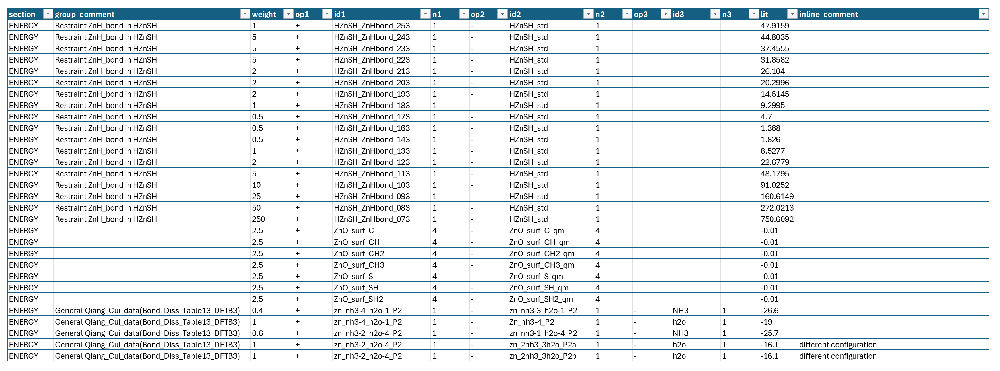

<!-- AUTO-GENERATED by docs/scripts/generate_workflow_cli_docs.py -->
# Trainset Workflow

::: reaxkit.workflows.file_tools.trainset_workflow
    options:
      show_root_heading: false
      show_root_full_path: false
      members: []

## Command: `gen_template_yaml_for_elastic_settings`

<div class="analysis-section-indent" markdown="1">

### Arguments

_No command-specific arguments found._

</div>

## Command: `gen_template_yaml_for_heatfo_settings`

<div class="analysis-section-indent" markdown="1">

### Arguments

_No command-specific arguments found._

</div>

## Command: `gen_elastic_trainset`

<div class="analysis-section-indent" markdown="1">

### Arguments

_No command-specific arguments found._

</div>

## Command: `gen_heatfo_trainset`

<div class="analysis-section-indent" markdown="1">

### Arguments

_No command-specific arguments found._

</div>

## Command: `make-trainset-settings`

<div class="analysis-section-indent" markdown="1">

### Arguments

_No command-specific arguments found._

</div>

## Command: `make-trainset-settings-heatfo`

<div class="analysis-section-indent" markdown="1">

### Arguments

_No command-specific arguments found._

</div>

## Command: `make-trainset-elastic`

<div class="analysis-section-indent" markdown="1">

### Arguments

_No command-specific arguments found._

</div>

## Command: `make-trainset-heatfo`

<div class="analysis-section-indent" markdown="1">

### Arguments

_No command-specific arguments found._

</div>

## Command: `get_trainset_data`

<div class="analysis-section-indent" markdown="1">

Read trainset entries from one section or all sections and return them as a table.
There are multiple sections in a training set file such as ENRGY, CHARGET, etc., and they are separated by lines starting with keyword END.

### Examples
-----

```text
 1. Getting all training sets in all sections:
   reaxkit get_trainset_data --section all --export trainset_data.csv

 2. Getting training sets in a specific section, for example geometry:
  reaxkit get_trainset_data --section geometry --export geometry_trainset_data.csv
```

### Arguments

| Flag | Required | Default | Help | Choices |
|---|---|---|---|---|
| `--run-dir, --dir` | No | . | Run directory fallback for engine detection |  |
| `--trainset` | No | trainset.in | Path to trainset file |  |
| `--log` | No |  | Logging level | verbose, quiet |
| `--plot` | No |  | Render a plot | single, subplot |
| `--show` | No |  | Show the generated plot window |  |
| `--save` | No |  | Save the generated plot to a file path |  |
| `--export` | No |  | Write the result table to CSV |  |
| `--grid` | No |  | Subplot grid like 2x2 or 2*2 |  |
| `--xaxis` | No |  | Optional x-axis column override |  |
| `--section` | No | all | Section to keep: all, charge, heatfo, geometry, cell_parameters, energy. |  |
| `--run-id` | No |  | Run identifier for run-scoped layout (e.g., run_91ac0e). |  |
| `--project-root` | No |  | Project root that contains inputs/, data/, analysis/, etc. |  |
| `--analysis-id` | No |  | Optional analysis artifact id; defaults to run id. |  |

<a id="TrainsetDataTask"></a>

The figure below shows an example CSV output for trainset data. Group comments are the comments above each set of data, which shows what does data are related to.
In contrast, inline-comment is the comment line in front of each trainset line.
 
<div style="text-align:center;" markdown="1">
{ style="width:85%; max-width:800px;" }

*Figure: Sample CSV output for trainset data.*
</div>

</div>

## Command: `get_trainset_group_comments`

<div class="analysis-section-indent" markdown="1">

Read grouped/comment metadata from trainset sections.
In each section of training set files, different data are separated by line comments above them which shows what those data are exactly (for example separating the EOS data for a material from the reaction barriers in the ENERGY seciton.
Getting these group comments helps user get a summary of training set and understand what the ffield was trained against.

### Examples
-----

```text
 1. Getting all group comments in all sections:
   reaxkit get_trainset_group_comments --section all --export trainset_group_comments.csv

 2. Getting group comments in a specific section, for example geometry:
   reaxkit get_trainset_group_comments --section geometry --export geometry_group_comments.csv
```

### Arguments

_No command-specific arguments found._

</div>

## Common Runtime and Presentation Arguments

<div class="analysis-section-indent" markdown="1">

These are shared workflow-level CLI flags added before command-specific options, covering runtime context (engine/input/storage) and output presentation/export behavior.

| Flag | Required | Default | Help | Choices |
|---|---|---|---|---|
| `--run-dir, --dir` | No | . | Run directory fallback for engine detection |  |
| `--trainset` | No | trainset.in | Path to trainset file |  |
| `--log` | No |  | Logging level | verbose, quiet |
| `--plot` | No |  | Render a plot | single, subplot |
| `--show` | No |  | Show the generated plot window |  |
| `--save` | No |  | Save the generated plot to a file path |  |
| `--export` | No |  | Write the result table to CSV |  |
| `--grid` | No |  | Subplot grid like 2x2 or 2*2 |  |
| `--xaxis` | No |  | Optional x-axis column override |  |
| `--section` | No | all | Section to keep: all, charge, heatfo, geometry, cell_parameters, energy. |  |
| `--run-id` | No |  | Run identifier for run-scoped layout (e.g., run_91ac0e). |  |
| `--project-root` | No |  | Project root that contains inputs/, data/, analysis/, etc. |  |
| `--analysis-id` | No |  | Optional analysis artifact id; defaults to run id. |  |
| `--output` | No | trainset_settings.yaml | Output YAML path |  |
| `--copy-to-dot` | No |  | Also copy generated output to current directory |  |
| `--input-mode` | No | yaml |  | yaml, material-id, batch |
| `--source` | No | mp | Data source. | mp, jarvis |
| `--yaml` | No |  | Existing trainset_settings.yaml file (yaml mode). |  |
| `--mat-id, --mp-id` | No |  | Material id (material-id mode). |  |
| `--elements` | No |  | Comma-separated elements for batch mode, for example Ba,B,O |  |
| `--element-count-scope` | No | exact |  | exact, up-to |
| `--max-materials` | No |  | Optional cap for batch mode. |  |
| `--api-key` | Yes |  | Source API key (MP uses --api-key or MP_API_KEY). |  |
| `--bulk-mode` | No | voigt | Bulk modulus mode for supported sources. | voigt, reuss, vrh |
| `--crystallographic-setting-conversion` | No | to-primitive | Convert fetched crystal structure setting before generating files | to-conventional, to-primitive |
| `--out-yaml` | No | trainset_settings_source.yaml | Generated YAML filename in source-backed modes. |  |
| `--structure-dir` | No |  | Directory for downloaded source structures. |  |
| `--skip-not-orthogonal` | No |  | Skip lattices with non-orthogonal cell angles (alpha/beta/gamma not all 90). |  |
| `--verbose` | No |  | Verbose source fetching/logging |  |
| `--weight` | No | 1.0 | Weight used for elastic ENERGY lines in the training set. |  |
| `--references` | No |  | Optional reference map: element=identifier:atoms,... (example: "Ba=Babcc_opt:2,B=B_alp:12,O=O2:2"). If omitted, unary references are auto-selected from the source. |  |
| `--trainset-file` | No | trainset_heatfo.in | Output trainset filename. |  |
| `--geo-file` | No | geo | Output concatenated geo filename. |  |

</div>
