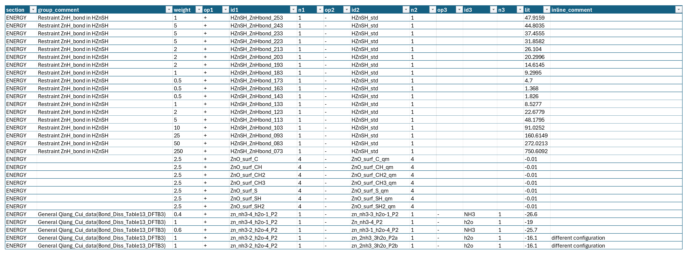

<!-- AUTO-GENERATED by docs/scripts/generate_workflow_cli_docs.py -->
# Trainset Workflow

::: reaxkit.workflows.file_tools.trainset_workflow
    options:
      show_root_heading: false
      show_root_full_path: false
      members: []

## Command: `get_trainset_data`

<div class="analysis-section-indent" markdown="1">

Read trainset entries from one section or all sections and return them as a table.
There are multiple sections in a training set file such as ENERGY, CHARGE, etc., and they are separated by lines starting with keyword END.

### Examples
-----

```text
 1. Getting all training sets in all sections:
   reaxkit get_trainset_data --section all --export trainset_data

 2. Getting training sets in a specific section, for example geometry:
  reaxkit get_trainset_data --section geometry --export geometry_trainset_data
```

### Arguments

#### Scientific choices

| Flag | Required | Default | Help | Choices |
|---|---|---|---|---|
| `--section` | No | all | Section to keep: all, charge, heatfo, geometry, cell_parameters, energy. |  |

#### Input and file selection

| Flag | Required | Default | Help | Choices |
|---|---|---|---|---|
| `--run-dir, --dir` | No | . | Run directory fallback for engine detection |  |
| `--trainset` | No | trainset.in | Path to trainset file |  |

#### Outputs and plots

| Flag | Required | Default | Help | Choices |
|---|---|---|---|---|
| `--plot` | No |  | Render a plot | single, subplot |
| `--show` | No | False | Show the generated plot window |  |
| `--save` | No |  | Save the generated plot to a file path |  |
| `--export` | No |  | Write one CSV per selected trainset section to DIRECTORY. If DIRECTORY is omitted, use 'trainset_data'. |  |
| `--grid` | No |  | Subplot grid like 2x2 or 2*2 |  |
| `--xaxis` | No |  | Optional x-axis column override |  |
| `--detail-format` | No |  | Optional detail format (default: Parquet; legacy: CSV). | parquet, csv |

#### Execution

| Flag | Required | Default | Help | Choices |
|---|---|---|---|---|
| `--execution` | No | auto | Execution backend; unsupported backends fall back to serial with a logged reason. | auto, serial, threads, processes |
| `--workers` | No | 0 | Frame workers: auto or N (default: auto). |  |
| `--chunk-size` | No | 0 | Maximum in-flight frames: auto or N. |  |

#### Storage and cache

| Flag | Required | Default | Help | Choices |
|---|---|---|---|---|
| `--run-id` | No |  | Run identifier for run-scoped layout. Example: --run-id run_91ac0e, which reuses that run identifier. |  |
| `--project-root` | No | reaxkit_workspace | Project root that contains inputs/, data/, analysis/, etc. Example: --project-root ./workspace, which stores run artifacts there. |  |
| `--analysis-id` | No |  | Optional analysis artifact id; defaults to run id. Example: --analysis-id comparison-a, which names the analysis artifact explicitly. |  |
| `--input-cache, --no-input-cache` | No | True | Reuse parsed input frames across commands (default: enabled; use --no-input-cache to force source reads for reproducibility checks or benchmarks). Example: --no-input-cache, which reloads frames from their source files. |  |
| `--frame-cache-max-gb` | No | 10.0 | Maximum workspace frame-cache size in GiB (default: 10; use 0 for unlimited). Example: --frame-cache-max-gb 20, which caps cached frames at 20 GiB. |  |
| `--output-profile` | No | standard | Select the shared artifact policy. Standard writes declared default outputs; minimal keeps core tables; full and legacy include optional details. Default: standard. Example: --output-profile full, which includes declared optional detail tables. | minimal, standard, full, legacy |

#### Diagnostics and compatibility

| Flag | Required | Default | Help | Choices |
|---|---|---|---|---|
| `-h, --help` | No |  | show this help message and exit |  |
| `--help-all, --all-flags` | No |  | Show every option, grouped by purpose. |  |
| `--log` | No |  | Logging level | verbose, quiet |


<a id="TrainsetDataTask"></a>

The figure below shows an example CSV output for trainset data. Group comments are the comments above each set of data, which shows what does data are related to.
In contrast, inline-comment is the comment line in front of each trainset line.

<div style="text-align:center;" markdown="1">
{ style="width:85%; max-width:800px;" }

*Figure: Sample CSV output for trainset data.*
</div>

</div>

## Command: `get_trainset_group_comments`

<div class="analysis-section-indent" markdown="1">

Read every grouped/comment occurrence from trainset sections, including repeated and empty comments.
In each section of training set files, different data are separated by line comments above them which shows what those data are exactly (for example separating the EOS data for a material from the reaction barriers in the ENERGY seciton.
Getting these group comments helps user get a summary of training set and understand what the ffield was trained against.

### Examples
-----

```text
 1. Getting all group comments in all sections:
   reaxkit get_trainset_group_comments --section all --export trainset_group_comments.csv

 2. Getting group comments in a specific section, for example geometry:
   reaxkit get_trainset_group_comments --section geometry --export geometry_group_comments.csv
```

### Arguments

#### Scientific choices

| Flag | Required | Default | Help | Choices |
|---|---|---|---|---|
| `--section` | No | all | Section to keep: all, charge, heatfo, geometry, cell_parameters, energy. |  |

#### Input and file selection

| Flag | Required | Default | Help | Choices |
|---|---|---|---|---|
| `--run-dir, --dir` | No | . | Run directory fallback for engine detection |  |
| `--trainset` | No | trainset.in | Path to trainset file |  |

#### Outputs and plots

| Flag | Required | Default | Help | Choices |
|---|---|---|---|---|
| `--plot` | No |  | Render a plot | single, subplot |
| `--show` | No | False | Show the generated plot window |  |
| `--save` | No |  | Save the generated plot to a file path |  |
| `--export` | No |  | Write the result table to CSV |  |
| `--grid` | No |  | Subplot grid like 2x2 or 2*2 |  |
| `--xaxis` | No |  | Optional x-axis column override |  |
| `--detail-format` | No |  | Optional detail format (default: Parquet; legacy: CSV). | parquet, csv |

#### Execution

| Flag | Required | Default | Help | Choices |
|---|---|---|---|---|
| `--execution` | No | auto | Execution backend; unsupported backends fall back to serial with a logged reason. | auto, serial, threads, processes |
| `--workers` | No | 0 | Frame workers: auto or N (default: auto). |  |
| `--chunk-size` | No | 0 | Maximum in-flight frames: auto or N. |  |

#### Storage and cache

| Flag | Required | Default | Help | Choices |
|---|---|---|---|---|
| `--run-id` | No |  | Run identifier for run-scoped layout. Example: --run-id run_91ac0e, which reuses that run identifier. |  |
| `--project-root` | No | reaxkit_workspace | Project root that contains inputs/, data/, analysis/, etc. Example: --project-root ./workspace, which stores run artifacts there. |  |
| `--analysis-id` | No |  | Optional analysis artifact id; defaults to run id. Example: --analysis-id comparison-a, which names the analysis artifact explicitly. |  |
| `--input-cache, --no-input-cache` | No | True | Reuse parsed input frames across commands (default: enabled; use --no-input-cache to force source reads for reproducibility checks or benchmarks). Example: --no-input-cache, which reloads frames from their source files. |  |
| `--frame-cache-max-gb` | No | 10.0 | Maximum workspace frame-cache size in GiB (default: 10; use 0 for unlimited). Example: --frame-cache-max-gb 20, which caps cached frames at 20 GiB. |  |
| `--output-profile` | No | standard | Select the shared artifact policy. Standard writes declared default outputs; minimal keeps core tables; full and legacy include optional details. Default: standard. Example: --output-profile full, which includes declared optional detail tables. | minimal, standard, full, legacy |

#### Diagnostics and compatibility

| Flag | Required | Default | Help | Choices |
|---|---|---|---|---|
| `-h, --help` | No |  | show this help message and exit |  |
| `--help-all, --all-flags` | No |  | Show every option, grouped by purpose. |  |
| `--log` | No |  | Logging level | verbose, quiet |


</div>

## Command: `gen_template_yaml_for_elastic_settings`

<div class="analysis-section-indent" markdown="1">

Write a sample trainset settings YAML for generating elastic-based training set (i.e., EOS).
This command only writes the template YAML file but does not generate any trainset data. Once you have the YAML file, you can edit it to specify what materials/systems you want to generate elastic training data for and then run 'gen_elastic_trainset' with '--input-mode yaml' to generate the trainset based on the YAML config.

### Examples
-----

```text
  1. Generate a template YAML with default name 'trainset_settings.yaml':
  reaxkit gen_template_yaml_for_elastic_settings

  2. Generate a template YAML with a custom name:
  reaxkit gen_template_yaml_for_elastic_settings --output trainset_settings.yaml
```

### Arguments

#### Outputs and plots

| Flag | Required | Default | Help | Choices |
|---|---|---|---|---|
| `--output` | No | trainset_settings.yaml | Output YAML path |  |
| `--copy-to-dot` | No | False | Also copy generated output to current directory |  |
| `--detail-format` | No |  | Optional detail format (default: Parquet; legacy: CSV). | parquet, csv |

#### Execution

| Flag | Required | Default | Help | Choices |
|---|---|---|---|---|
| `--execution` | No | auto | Execution backend; unsupported backends fall back to serial with a logged reason. | auto, serial, threads, processes |
| `--workers` | No | 0 | Frame workers: auto or N (default: auto). |  |
| `--chunk-size` | No | 0 | Maximum in-flight frames: auto or N. |  |

#### Storage and cache

| Flag | Required | Default | Help | Choices |
|---|---|---|---|---|
| `--run-id` | No |  | Run identifier for run-scoped layout. Example: --run-id run_91ac0e, which reuses that run identifier. |  |
| `--project-root` | No | reaxkit_workspace | Project root that contains inputs/, data/, analysis/, etc. Example: --project-root ./workspace, which stores run artifacts there. |  |
| `--analysis-id` | No |  | Optional analysis artifact id; defaults to run id. Example: --analysis-id comparison-a, which names the analysis artifact explicitly. |  |
| `--input-cache, --no-input-cache` | No | True | Reuse parsed input frames across commands (default: enabled; use --no-input-cache to force source reads for reproducibility checks or benchmarks). Example: --no-input-cache, which reloads frames from their source files. |  |
| `--frame-cache-max-gb` | No | 10.0 | Maximum workspace frame-cache size in GiB (default: 10; use 0 for unlimited). Example: --frame-cache-max-gb 20, which caps cached frames at 20 GiB. |  |
| `--output-profile` | No | standard | Select the shared artifact policy. Standard writes declared default outputs; minimal keeps core tables; full and legacy include optional details. Default: standard. Example: --output-profile full, which includes declared optional detail tables. | minimal, standard, full, legacy |

#### Diagnostics and compatibility

| Flag | Required | Default | Help | Choices |
|---|---|---|---|---|
| `-h, --help` | No |  | show this help message and exit |  |
| `--help-all, --all-flags` | No |  | Show every option, grouped by purpose. |  |


</div>

## Command: `gen_template_yaml_for_heatfo_settings`

<div class="analysis-section-indent" markdown="1">

Write a sample trainset settings YAML for generating heat-of-formation-based-training data.
This command only writes the template YAML file but does not generate any trainset data. Once you have the YAML file, you can edit it to specify what materials/systems you want to generate heatfo (i.e., heat of formation) training data for and then run 'gen_heatfo_trainset' with '--input-mode yaml' to generate the trainset based on the YAML config.

### Examples
-----

```text
  1. Generate a template YAML with default name 'trainset_heatfo_settings.yaml':
  reaxkit gen_template_yaml_for_heatfo_settings --output trainset_heatfo_settings.yaml
```

### Arguments

#### Outputs and plots

| Flag | Required | Default | Help | Choices |
|---|---|---|---|---|
| `--output` | No | trainset_heatfo_settings.yaml | Output YAML path |  |
| `--copy-to-dot` | No | False | Also copy generated output to current directory |  |
| `--detail-format` | No |  | Optional detail format (default: Parquet; legacy: CSV). | parquet, csv |

#### Execution

| Flag | Required | Default | Help | Choices |
|---|---|---|---|---|
| `--execution` | No | auto | Execution backend; unsupported backends fall back to serial with a logged reason. | auto, serial, threads, processes |
| `--workers` | No | 0 | Frame workers: auto or N (default: auto). |  |
| `--chunk-size` | No | 0 | Maximum in-flight frames: auto or N. |  |

#### Storage and cache

| Flag | Required | Default | Help | Choices |
|---|---|---|---|---|
| `--run-id` | No |  | Run identifier for run-scoped layout. Example: --run-id run_91ac0e, which reuses that run identifier. |  |
| `--project-root` | No | reaxkit_workspace | Project root that contains inputs/, data/, analysis/, etc. Example: --project-root ./workspace, which stores run artifacts there. |  |
| `--analysis-id` | No |  | Optional analysis artifact id; defaults to run id. Example: --analysis-id comparison-a, which names the analysis artifact explicitly. |  |
| `--input-cache, --no-input-cache` | No | True | Reuse parsed input frames across commands (default: enabled; use --no-input-cache to force source reads for reproducibility checks or benchmarks). Example: --no-input-cache, which reloads frames from their source files. |  |
| `--frame-cache-max-gb` | No | 10.0 | Maximum workspace frame-cache size in GiB (default: 10; use 0 for unlimited). Example: --frame-cache-max-gb 20, which caps cached frames at 20 GiB. |  |
| `--output-profile` | No | standard | Select the shared artifact policy. Standard writes declared default outputs; minimal keeps core tables; full and legacy include optional details. Default: standard. Example: --output-profile full, which includes declared optional detail tables. | minimal, standard, full, legacy |

#### Diagnostics and compatibility

| Flag | Required | Default | Help | Choices |
|---|---|---|---|---|
| `-h, --help` | No |  | show this help message and exit |  |
| `--help-all, --all-flags` | No |  | Show every option, grouped by purpose. |  |


</div>

## Command: `gen_elastic_trainset`

<div class="analysis-section-indent" markdown="1">

Generate elastic trainsets (i.e., EOS data).
This comamnd supports 3 input-mode options:
  1. yaml: which needs an existing trainset YAML.
           This trainset YAML can be generated using command 'gen_template_yaml_for_elastic_settings'
  2. material-id: fetch one source material id (i.e., material ID [mp-1234] from material's project website)
  3. batch: fetch many source systems by elements (i.e., all materials with Ba, B, and O)

[NOTE] To use the source-backed modes (material-id or batch), you need to provide the your API key and specify the source (MP (material's project) or Jarvis, where default is MP). You API-key can be obtained from the source website. For example, for MP, you can:
 1. login to your account on MP website
 2. on the top right of the page, near your account logo, click on the API access page link,
 3. this brings you to https://next-gen.materialsproject.org/api 4. you can now copy your personal API key, which you will provide it to this command using --api-key flag or set it as an environment variable MP_API_KEY.

### Examples
-----

```text
  1. YAML mode:
    reaxkit gen_elastic_trainset --input-mode yaml --yaml trainset_settings.yaml --output trainset_elastic_generated
  2. Material-id mode:
    reaxkit gen_elastic_trainset --input-mode material-id --mat-id mp-1234 --output trainset_elastic_mp-1234 --api-key YOUR_KEY
  3. Batch mode:
    - for materials containing only and exactly Ba, B, O elements as in Ba2B2O5:
       reaxkit gen_elastic_trainset --input-mode batch --elements Ba,B,O --api-key YOUR_KEY
    - for materials any or all of Ba, B, O elements (now, BaO10 is also acceptable):
       reaxkit gen_elastic_trainset --input-mode batch --elements Ba,B,O --api-key YOUR_KEY --element-count-scope up-to
     - for materials containing any or all of Ba, B, O elements but with a cap of 100 materials to prevent large training set genration:
       reaxkit gen_elastic_trainset --input-mode batch --elements Ba,B,O --api-key YOUR_KEY --element-count-scope up-to --max-materials 100

[NOTE] As the documentation on https://docs.materialsproject.org/methodology/materials-methodology/understanding-structures-and-properties-in-the-materials-project shows,  retrieved structures from the new Materials Project (MP) API may have different lattice parameters and angles thanthat of conventional or primitive unit cells you might expect from textbooks or the legacy MP database (i.e., seen on the website). For this purpose, we have a flag --crystallographic-setting-conversion which can convert the fetched crystal structure setting before generating files. By default, it is set to 'to-primitive' to convert the fetched structure to its primitive setting, but you can also set it to 'to-conventional' to convert the fetched structure to its conventional setting.

[Note] As you may know, the trainset generator for elastic data is developed only for orthogonal systems (i.e., with alpha=beta=gamma=90). If you use the source-backed modes to fetch structures from sources like MP, you may encounter some non-orthogonal structures. If you want to skip those non-orthogonal structures, you can use the flag --skip-not-orthogonal to automatically skip them and only generate training data for orthogonal structures.
```

### Arguments

#### Scientific choices

| Flag | Required | Default | Help | Choices |
|---|---|---|---|---|
| `--elements` | No |  | Comma-separated elements for batch mode, for example Ba,B,O |  |
| `--element-count-scope` | No | exact |  | exact, up-to |
| `--max-materials` | No |  | Optional cap for batch mode. |  |
| `--bulk-mode` | No | voigt | Bulk modulus mode for supported sources. | voigt, reuss, vrh |
| `--crystallographic-setting-conversion` | No | to-conventional | Convert fetched crystal structure setting before generating files | to-conventional, to-primitive |
| `--skip-not-orthogonal` | No | True | Skip lattices with non-orthogonal cell angles (alpha/beta/gamma not all 90). |  |
| `--skip-negative-elastic-data` | No | False | Skip materials whose elastic tensor contains negative cij values. |  |
| `--weight` | No | 1.0 | Weight used for elastic ENERGY lines in the training set. |  |

#### Input and file selection

| Flag | Required | Default | Help | Choices |
|---|---|---|---|---|
| `--input-mode` | No | yaml |  | yaml, material-id, batch |
| `--source` | No | mp | Data source. | mp, jarvis |
| `--yaml` | No |  | Existing trainset_settings.yaml file (yaml mode). |  |
| `--mat-id, --mp-id` | No |  | Material id (material-id mode). |  |
| `--structure-dir` | No |  | Directory for downloaded source structures. |  |

#### Outputs and plots

| Flag | Required | Default | Help | Choices |
|---|---|---|---|---|
| `--out-yaml` | No | trainset_settings_source.yaml | Generated YAML filename in source-backed modes. |  |
| `--output` | No | trainset_elastic_generated | Directory for outputs. |  |
| `--copy-to-dot` | No | False | Also copy generated output to current directory |  |
| `--detail-format` | No |  | Optional detail format (default: Parquet; legacy: CSV). | parquet, csv |

#### Execution

| Flag | Required | Default | Help | Choices |
|---|---|---|---|---|
| `--execution` | No | auto | Execution backend; unsupported backends fall back to serial with a logged reason. | auto, serial, threads, processes |
| `--workers` | No | 0 | Frame workers: auto or N (default: auto). |  |
| `--chunk-size` | No | 0 | Maximum in-flight frames: auto or N. |  |

#### Storage and cache

| Flag | Required | Default | Help | Choices |
|---|---|---|---|---|
| `--run-id` | No |  | Run identifier for run-scoped layout. Example: --run-id run_91ac0e, which reuses that run identifier. |  |
| `--project-root` | No | reaxkit_workspace | Project root that contains inputs/, data/, analysis/, etc. Example: --project-root ./workspace, which stores run artifacts there. |  |
| `--analysis-id` | No |  | Optional analysis artifact id; defaults to run id. Example: --analysis-id comparison-a, which names the analysis artifact explicitly. |  |
| `--input-cache, --no-input-cache` | No | True | Reuse parsed input frames across commands (default: enabled; use --no-input-cache to force source reads for reproducibility checks or benchmarks). Example: --no-input-cache, which reloads frames from their source files. |  |
| `--frame-cache-max-gb` | No | 10.0 | Maximum workspace frame-cache size in GiB (default: 10; use 0 for unlimited). Example: --frame-cache-max-gb 20, which caps cached frames at 20 GiB. |  |
| `--output-profile` | No | standard | Select the shared artifact policy. Standard writes declared default outputs; minimal keeps core tables; full and legacy include optional details. Default: standard. Example: --output-profile full, which includes declared optional detail tables. | minimal, standard, full, legacy |

#### Diagnostics and compatibility

| Flag | Required | Default | Help | Choices |
|---|---|---|---|---|
| `-h, --help` | No |  | show this help message and exit |  |
| `--help-all, --all-flags` | No |  | Show every option, grouped by purpose. |  |
| `--api-key` | Yes |  | Source API key (MP uses --api-key or MP_API_KEY). |  |
| `--verbose` | No | False | Verbose source fetching/logging |  |


</div>

## Command: `gen_heatfo_trainset`

<div class="analysis-section-indent" markdown="1">

Generate heat-of-formation training sets.
It gets the heat of formation data and balances the equation element-wise.

This comamnd supports 3 input-mode options:
  1. yaml: which needs an existing heatfo trainset YAML.
           This trainset YAML can be generated using command 'gen_template_yaml_for_heatfo_settings'
  2. material-id: fetch one source material id (i.e., material ID [mp-1234] from material's project website)
  3. batch: fetch many source systems by elements (i.e., all materials with Ba, B, and O)

[NOTE] To use the source-backed modes (material-id or batch), you need to provide the your API key and specify the source (MP (material's project) or Jarvis, where default is MP). You API-key can be obtained from the source website. For example, for MP, you can:
 1. login to your account on MP website
 2. on the top right of the page, near your account logo, click on the API access page link,
 3. this brings you to https://next-gen.materialsproject.org/api 4. you can now copy your personal API key, which you will provide it to this command using --api-key flag or set it as an environment variable MP_API_KEY.

### Examples
-----

```text
  1. YAML mode:
    reaxkit gen_heatfo_trainset --input-mode yaml --yaml trainset_heatfo_settings.yaml --output trainset_heatfo_generated
  2.   Material-id mode:
    reaxkit gen_heatfo_trainset --input-mode material-id --mat-id mp-1234 --output trainset_heatfo_mp-1234 --api-key YOUR_KEY
  3. Batch mode:
    - for materials containing only and exactly Ba, B, O elements as in Ba2B2O5:
       reaxkit gen_heatfo_trainset --input-mode batch --elements Ba,B,O --api-key YOUR_KEY
    - for materials any or all of Ba, B, O elements (now, BaO10 is also acceptable):
       reaxkit gen_heatfo_trainset --input-mode batch --elements Ba,B,O --api-key YOUR_KEY --element-count-scope up-to
     - same as the first one but this time passing reference list. This means that for balancing the heat of formation equation, the reference geo files will be geo file Babcc_opt with 2 atoms for Ba, geo file B_alp with 12 atoms for B, and the geo file O2 with 2 atoms for O. If you don't provide the reference list, the command will automatically find the most stable structure of elemnts from the sourcewebsite and uses them for balancing purposes:
       reaxkit gen_heatfo_trainset --input-mode batch --elements Ba,B,O --api-key YOUR_KEY --references Ba=Babcc_opt:2,B=B_alp:12,O=O2:2
    - for materials containing any or all of Ba, B, O elements but with a cap of 100 materials to prevent large training set genration:
       reaxkit gen_heatfo_trainset --input-mode batch --elements Ba,B,O --api-key YOUR_KEY --element-count-scope up-to --max-materials 100

[NOTE] As the documentation on https://docs.materialsproject.org/methodology/materials-methodology/understanding-structures-and-properties-in-the-materials-project shows,  retrieved structures from the new Materials Project (MP) API may have different lattice parameters and angles thanthat of conventional or primitive unit cells you might expect from textbooks or the legacy MP database (i.e., seen on the website). For this purpose, we have a flag --crystallographic-setting-conversion which can convert the fetched crystal structure setting before generating files. By default, it is set to 'to-primitive' to convert the fetched structure to its primitive setting, but you can also set it to 'to-conventional' to convert the fetched structure to its conventional setting.
```

### Arguments

#### Scientific choices

| Flag | Required | Default | Help | Choices |
|---|---|---|---|---|
| `--elements` | No |  | Comma-separated elements for batch mode, for example Ba,B,O |  |
| `--element-count-scope` | No | exact |  | exact, up-to |
| `--max-materials` | No |  | Optional cap for batch mode. |  |
| `--crystallographic-setting-conversion` | No | to-conventional | Convert fetched crystal structure setting before generating files. | to-conventional, to-primitive |
| `--weight` | No | 1.0 | Weight used for heatfo ENERGY lines in the training set. |  |

#### Input and file selection

| Flag | Required | Default | Help | Choices |
|---|---|---|---|---|
| `--source` | No | mp | Data source. | mp, jarvis |
| `--input-mode` | No | batch |  | yaml, material-id, batch |
| `--yaml` | No |  | Heatfo YAML settings file (yaml mode). |  |
| `--mat-id, --mp-id` | No |  | Material id (material-id mode). |  |
| `--references` | No |  | Optional reference map: element=identifier:atoms,... (example: "Ba=Babcc_opt:2,B=B_alp:12,O=O2:2"). If omitted, unary references are auto-selected from the source. |  |
| `--trainset-file` | No | trainset_heatfo.in | Output trainset filename. |  |
| `--geo-file` | No | geo | Output concatenated geo filename. |  |

#### Outputs and plots

| Flag | Required | Default | Help | Choices |
|---|---|---|---|---|
| `--output` | No | trainset_heatfo_generated | Directory for outputs. |  |
| `--copy-to-dot` | No | False | Also copy generated output to current directory |  |
| `--detail-format` | No |  | Optional detail format (default: Parquet; legacy: CSV). | parquet, csv |

#### Execution

| Flag | Required | Default | Help | Choices |
|---|---|---|---|---|
| `--execution` | No | auto | Execution backend; unsupported backends fall back to serial with a logged reason. | auto, serial, threads, processes |
| `--workers` | No | 0 | Frame workers: auto or N (default: auto). |  |
| `--chunk-size` | No | 0 | Maximum in-flight frames: auto or N. |  |

#### Storage and cache

| Flag | Required | Default | Help | Choices |
|---|---|---|---|---|
| `--run-id` | No |  | Run identifier for run-scoped layout. Example: --run-id run_91ac0e, which reuses that run identifier. |  |
| `--project-root` | No | reaxkit_workspace | Project root that contains inputs/, data/, analysis/, etc. Example: --project-root ./workspace, which stores run artifacts there. |  |
| `--analysis-id` | No |  | Optional analysis artifact id; defaults to run id. Example: --analysis-id comparison-a, which names the analysis artifact explicitly. |  |
| `--input-cache, --no-input-cache` | No | True | Reuse parsed input frames across commands (default: enabled; use --no-input-cache to force source reads for reproducibility checks or benchmarks). Example: --no-input-cache, which reloads frames from their source files. |  |
| `--frame-cache-max-gb` | No | 10.0 | Maximum workspace frame-cache size in GiB (default: 10; use 0 for unlimited). Example: --frame-cache-max-gb 20, which caps cached frames at 20 GiB. |  |
| `--output-profile` | No | standard | Select the shared artifact policy. Standard writes declared default outputs; minimal keeps core tables; full and legacy include optional details. Default: standard. Example: --output-profile full, which includes declared optional detail tables. | minimal, standard, full, legacy |

#### Diagnostics and compatibility

| Flag | Required | Default | Help | Choices |
|---|---|---|---|---|
| `-h, --help` | No |  | show this help message and exit |  |
| `--help-all, --all-flags` | No |  | Show every option, grouped by purpose. |  |
| `--api-key` | No |  | Source API key (MP uses --api-key or MP_API_KEY). |  |
| `--verbose` | No | False | Verbose source fetching/logging |  |


</div>

## Command: `make-trainset-settings`

<div class="analysis-section-indent" markdown="1">

Write a sample trainset settings YAML for generating elastic-based training set (i.e., EOS).
This command only writes the template YAML file but does not generate any trainset data. Once you have the YAML file, you can edit it to specify what materials/systems you want to generate elastic training data for and then run 'gen_elastic_trainset' with '--input-mode yaml' to generate the trainset based on the YAML config.

### Examples
-----

```text
  1. Generate a template YAML with default name 'trainset_settings.yaml':
  reaxkit gen_template_yaml_for_elastic_settings

  2. Generate a template YAML with a custom name:
  reaxkit gen_template_yaml_for_elastic_settings --output trainset_settings.yaml
```

### Arguments

#### Outputs and plots

| Flag | Required | Default | Help | Choices |
|---|---|---|---|---|
| `--output` | No | trainset_settings.yaml | Output YAML path |  |
| `--copy-to-dot` | No | False | Also copy generated output to current directory |  |
| `--detail-format` | No |  | Optional detail format (default: Parquet; legacy: CSV). | parquet, csv |

#### Execution

| Flag | Required | Default | Help | Choices |
|---|---|---|---|---|
| `--execution` | No | auto | Execution backend; unsupported backends fall back to serial with a logged reason. | auto, serial, threads, processes |
| `--workers` | No | 0 | Frame workers: auto or N (default: auto). |  |
| `--chunk-size` | No | 0 | Maximum in-flight frames: auto or N. |  |

#### Storage and cache

| Flag | Required | Default | Help | Choices |
|---|---|---|---|---|
| `--run-id` | No |  | Run identifier for run-scoped layout. Example: --run-id run_91ac0e, which reuses that run identifier. |  |
| `--project-root` | No | reaxkit_workspace | Project root that contains inputs/, data/, analysis/, etc. Example: --project-root ./workspace, which stores run artifacts there. |  |
| `--analysis-id` | No |  | Optional analysis artifact id; defaults to run id. Example: --analysis-id comparison-a, which names the analysis artifact explicitly. |  |
| `--input-cache, --no-input-cache` | No | True | Reuse parsed input frames across commands (default: enabled; use --no-input-cache to force source reads for reproducibility checks or benchmarks). Example: --no-input-cache, which reloads frames from their source files. |  |
| `--frame-cache-max-gb` | No | 10.0 | Maximum workspace frame-cache size in GiB (default: 10; use 0 for unlimited). Example: --frame-cache-max-gb 20, which caps cached frames at 20 GiB. |  |
| `--output-profile` | No | standard | Select the shared artifact policy. Standard writes declared default outputs; minimal keeps core tables; full and legacy include optional details. Default: standard. Example: --output-profile full, which includes declared optional detail tables. | minimal, standard, full, legacy |

#### Diagnostics and compatibility

| Flag | Required | Default | Help | Choices |
|---|---|---|---|---|
| `-h, --help` | No |  | show this help message and exit |  |
| `--help-all, --all-flags` | No |  | Show every option, grouped by purpose. |  |


</div>

## Command: `make-trainset-settings-heatfo`

<div class="analysis-section-indent" markdown="1">

Write a sample trainset settings YAML for generating heat-of-formation-based-training data.
This command only writes the template YAML file but does not generate any trainset data. Once you have the YAML file, you can edit it to specify what materials/systems you want to generate heatfo (i.e., heat of formation) training data for and then run 'gen_heatfo_trainset' with '--input-mode yaml' to generate the trainset based on the YAML config.

### Examples
-----

```text
  1. Generate a template YAML with default name 'trainset_heatfo_settings.yaml':
  reaxkit gen_template_yaml_for_heatfo_settings --output trainset_heatfo_settings.yaml
```

### Arguments

#### Outputs and plots

| Flag | Required | Default | Help | Choices |
|---|---|---|---|---|
| `--output` | No | trainset_heatfo_settings.yaml | Output YAML path |  |
| `--copy-to-dot` | No | False | Also copy generated output to current directory |  |
| `--detail-format` | No |  | Optional detail format (default: Parquet; legacy: CSV). | parquet, csv |

#### Execution

| Flag | Required | Default | Help | Choices |
|---|---|---|---|---|
| `--execution` | No | auto | Execution backend; unsupported backends fall back to serial with a logged reason. | auto, serial, threads, processes |
| `--workers` | No | 0 | Frame workers: auto or N (default: auto). |  |
| `--chunk-size` | No | 0 | Maximum in-flight frames: auto or N. |  |

#### Storage and cache

| Flag | Required | Default | Help | Choices |
|---|---|---|---|---|
| `--run-id` | No |  | Run identifier for run-scoped layout. Example: --run-id run_91ac0e, which reuses that run identifier. |  |
| `--project-root` | No | reaxkit_workspace | Project root that contains inputs/, data/, analysis/, etc. Example: --project-root ./workspace, which stores run artifacts there. |  |
| `--analysis-id` | No |  | Optional analysis artifact id; defaults to run id. Example: --analysis-id comparison-a, which names the analysis artifact explicitly. |  |
| `--input-cache, --no-input-cache` | No | True | Reuse parsed input frames across commands (default: enabled; use --no-input-cache to force source reads for reproducibility checks or benchmarks). Example: --no-input-cache, which reloads frames from their source files. |  |
| `--frame-cache-max-gb` | No | 10.0 | Maximum workspace frame-cache size in GiB (default: 10; use 0 for unlimited). Example: --frame-cache-max-gb 20, which caps cached frames at 20 GiB. |  |
| `--output-profile` | No | standard | Select the shared artifact policy. Standard writes declared default outputs; minimal keeps core tables; full and legacy include optional details. Default: standard. Example: --output-profile full, which includes declared optional detail tables. | minimal, standard, full, legacy |

#### Diagnostics and compatibility

| Flag | Required | Default | Help | Choices |
|---|---|---|---|---|
| `-h, --help` | No |  | show this help message and exit |  |
| `--help-all, --all-flags` | No |  | Show every option, grouped by purpose. |  |


</div>

## Command: `make-trainset-elastic`

<div class="analysis-section-indent" markdown="1">

Generate elastic trainsets (i.e., EOS data).
This comamnd supports 3 input-mode options:
  1. yaml: which needs an existing trainset YAML.
           This trainset YAML can be generated using command 'gen_template_yaml_for_elastic_settings'
  2. material-id: fetch one source material id (i.e., material ID [mp-1234] from material's project website)
  3. batch: fetch many source systems by elements (i.e., all materials with Ba, B, and O)

[NOTE] To use the source-backed modes (material-id or batch), you need to provide the your API key and specify the source (MP (material's project) or Jarvis, where default is MP). You API-key can be obtained from the source website. For example, for MP, you can:
 1. login to your account on MP website
 2. on the top right of the page, near your account logo, click on the API access page link,
 3. this brings you to https://next-gen.materialsproject.org/api 4. you can now copy your personal API key, which you will provide it to this command using --api-key flag or set it as an environment variable MP_API_KEY.

### Examples
-----

```text
  1. YAML mode:
    reaxkit gen_elastic_trainset --input-mode yaml --yaml trainset_settings.yaml --output trainset_elastic_generated
  2. Material-id mode:
    reaxkit gen_elastic_trainset --input-mode material-id --mat-id mp-1234 --output trainset_elastic_mp-1234 --api-key YOUR_KEY
  3. Batch mode:
    - for materials containing only and exactly Ba, B, O elements as in Ba2B2O5:
       reaxkit gen_elastic_trainset --input-mode batch --elements Ba,B,O --api-key YOUR_KEY
    - for materials any or all of Ba, B, O elements (now, BaO10 is also acceptable):
       reaxkit gen_elastic_trainset --input-mode batch --elements Ba,B,O --api-key YOUR_KEY --element-count-scope up-to
     - for materials containing any or all of Ba, B, O elements but with a cap of 100 materials to prevent large training set genration:
       reaxkit gen_elastic_trainset --input-mode batch --elements Ba,B,O --api-key YOUR_KEY --element-count-scope up-to --max-materials 100

[NOTE] As the documentation on https://docs.materialsproject.org/methodology/materials-methodology/understanding-structures-and-properties-in-the-materials-project shows,  retrieved structures from the new Materials Project (MP) API may have different lattice parameters and angles thanthat of conventional or primitive unit cells you might expect from textbooks or the legacy MP database (i.e., seen on the website). For this purpose, we have a flag --crystallographic-setting-conversion which can convert the fetched crystal structure setting before generating files. By default, it is set to 'to-primitive' to convert the fetched structure to its primitive setting, but you can also set it to 'to-conventional' to convert the fetched structure to its conventional setting.

[Note] As you may know, the trainset generator for elastic data is developed only for orthogonal systems (i.e., with alpha=beta=gamma=90). If you use the source-backed modes to fetch structures from sources like MP, you may encounter some non-orthogonal structures. If you want to skip those non-orthogonal structures, you can use the flag --skip-not-orthogonal to automatically skip them and only generate training data for orthogonal structures.
```

### Arguments

#### Scientific choices

| Flag | Required | Default | Help | Choices |
|---|---|---|---|---|
| `--elements` | No |  | Comma-separated elements for batch mode, for example Ba,B,O |  |
| `--element-count-scope` | No | exact |  | exact, up-to |
| `--max-materials` | No |  | Optional cap for batch mode. |  |
| `--bulk-mode` | No | voigt | Bulk modulus mode for supported sources. | voigt, reuss, vrh |
| `--crystallographic-setting-conversion` | No | to-conventional | Convert fetched crystal structure setting before generating files | to-conventional, to-primitive |
| `--skip-not-orthogonal` | No | True | Skip lattices with non-orthogonal cell angles (alpha/beta/gamma not all 90). |  |
| `--skip-negative-elastic-data` | No | False | Skip materials whose elastic tensor contains negative cij values. |  |
| `--weight` | No | 1.0 | Weight used for elastic ENERGY lines in the training set. |  |

#### Input and file selection

| Flag | Required | Default | Help | Choices |
|---|---|---|---|---|
| `--input-mode` | No | yaml |  | yaml, material-id, batch |
| `--source` | No | mp | Data source. | mp, jarvis |
| `--yaml` | No |  | Existing trainset_settings.yaml file (yaml mode). |  |
| `--mat-id, --mp-id` | No |  | Material id (material-id mode). |  |
| `--structure-dir` | No |  | Directory for downloaded source structures. |  |

#### Outputs and plots

| Flag | Required | Default | Help | Choices |
|---|---|---|---|---|
| `--out-yaml` | No | trainset_settings_source.yaml | Generated YAML filename in source-backed modes. |  |
| `--output` | No | trainset_elastic_generated | Directory for outputs. |  |
| `--copy-to-dot` | No | False | Also copy generated output to current directory |  |
| `--detail-format` | No |  | Optional detail format (default: Parquet; legacy: CSV). | parquet, csv |

#### Execution

| Flag | Required | Default | Help | Choices |
|---|---|---|---|---|
| `--execution` | No | auto | Execution backend; unsupported backends fall back to serial with a logged reason. | auto, serial, threads, processes |
| `--workers` | No | 0 | Frame workers: auto or N (default: auto). |  |
| `--chunk-size` | No | 0 | Maximum in-flight frames: auto or N. |  |

#### Storage and cache

| Flag | Required | Default | Help | Choices |
|---|---|---|---|---|
| `--run-id` | No |  | Run identifier for run-scoped layout. Example: --run-id run_91ac0e, which reuses that run identifier. |  |
| `--project-root` | No | reaxkit_workspace | Project root that contains inputs/, data/, analysis/, etc. Example: --project-root ./workspace, which stores run artifacts there. |  |
| `--analysis-id` | No |  | Optional analysis artifact id; defaults to run id. Example: --analysis-id comparison-a, which names the analysis artifact explicitly. |  |
| `--input-cache, --no-input-cache` | No | True | Reuse parsed input frames across commands (default: enabled; use --no-input-cache to force source reads for reproducibility checks or benchmarks). Example: --no-input-cache, which reloads frames from their source files. |  |
| `--frame-cache-max-gb` | No | 10.0 | Maximum workspace frame-cache size in GiB (default: 10; use 0 for unlimited). Example: --frame-cache-max-gb 20, which caps cached frames at 20 GiB. |  |
| `--output-profile` | No | standard | Select the shared artifact policy. Standard writes declared default outputs; minimal keeps core tables; full and legacy include optional details. Default: standard. Example: --output-profile full, which includes declared optional detail tables. | minimal, standard, full, legacy |

#### Diagnostics and compatibility

| Flag | Required | Default | Help | Choices |
|---|---|---|---|---|
| `-h, --help` | No |  | show this help message and exit |  |
| `--help-all, --all-flags` | No |  | Show every option, grouped by purpose. |  |
| `--api-key` | Yes |  | Source API key (MP uses --api-key or MP_API_KEY). |  |
| `--verbose` | No | False | Verbose source fetching/logging |  |


</div>

## Command: `make-trainset-heatfo`

<div class="analysis-section-indent" markdown="1">

Generate heat-of-formation training sets.
It gets the heat of formation data and balances the equation element-wise.

This comamnd supports 3 input-mode options:
  1. yaml: which needs an existing heatfo trainset YAML.
           This trainset YAML can be generated using command 'gen_template_yaml_for_heatfo_settings'
  2. material-id: fetch one source material id (i.e., material ID [mp-1234] from material's project website)
  3. batch: fetch many source systems by elements (i.e., all materials with Ba, B, and O)

[NOTE] To use the source-backed modes (material-id or batch), you need to provide the your API key and specify the source (MP (material's project) or Jarvis, where default is MP). You API-key can be obtained from the source website. For example, for MP, you can:
 1. login to your account on MP website
 2. on the top right of the page, near your account logo, click on the API access page link,
 3. this brings you to https://next-gen.materialsproject.org/api 4. you can now copy your personal API key, which you will provide it to this command using --api-key flag or set it as an environment variable MP_API_KEY.

### Examples
-----

```text
  1. YAML mode:
    reaxkit gen_heatfo_trainset --input-mode yaml --yaml trainset_heatfo_settings.yaml --output trainset_heatfo_generated
  2.   Material-id mode:
    reaxkit gen_heatfo_trainset --input-mode material-id --mat-id mp-1234 --output trainset_heatfo_mp-1234 --api-key YOUR_KEY
  3. Batch mode:
    - for materials containing only and exactly Ba, B, O elements as in Ba2B2O5:
       reaxkit gen_heatfo_trainset --input-mode batch --elements Ba,B,O --api-key YOUR_KEY
    - for materials any or all of Ba, B, O elements (now, BaO10 is also acceptable):
       reaxkit gen_heatfo_trainset --input-mode batch --elements Ba,B,O --api-key YOUR_KEY --element-count-scope up-to
     - same as the first one but this time passing reference list. This means that for balancing the heat of formation equation, the reference geo files will be geo file Babcc_opt with 2 atoms for Ba, geo file B_alp with 12 atoms for B, and the geo file O2 with 2 atoms for O. If you don't provide the reference list, the command will automatically find the most stable structure of elemnts from the sourcewebsite and uses them for balancing purposes:
       reaxkit gen_heatfo_trainset --input-mode batch --elements Ba,B,O --api-key YOUR_KEY --references Ba=Babcc_opt:2,B=B_alp:12,O=O2:2
    - for materials containing any or all of Ba, B, O elements but with a cap of 100 materials to prevent large training set genration:
       reaxkit gen_heatfo_trainset --input-mode batch --elements Ba,B,O --api-key YOUR_KEY --element-count-scope up-to --max-materials 100

[NOTE] As the documentation on https://docs.materialsproject.org/methodology/materials-methodology/understanding-structures-and-properties-in-the-materials-project shows,  retrieved structures from the new Materials Project (MP) API may have different lattice parameters and angles thanthat of conventional or primitive unit cells you might expect from textbooks or the legacy MP database (i.e., seen on the website). For this purpose, we have a flag --crystallographic-setting-conversion which can convert the fetched crystal structure setting before generating files. By default, it is set to 'to-primitive' to convert the fetched structure to its primitive setting, but you can also set it to 'to-conventional' to convert the fetched structure to its conventional setting.
```

### Arguments

#### Scientific choices

| Flag | Required | Default | Help | Choices |
|---|---|---|---|---|
| `--elements` | No |  | Comma-separated elements for batch mode, for example Ba,B,O |  |
| `--element-count-scope` | No | exact |  | exact, up-to |
| `--max-materials` | No |  | Optional cap for batch mode. |  |
| `--crystallographic-setting-conversion` | No | to-conventional | Convert fetched crystal structure setting before generating files. | to-conventional, to-primitive |
| `--weight` | No | 1.0 | Weight used for heatfo ENERGY lines in the training set. |  |

#### Input and file selection

| Flag | Required | Default | Help | Choices |
|---|---|---|---|---|
| `--source` | No | mp | Data source. | mp, jarvis |
| `--input-mode` | No | batch |  | yaml, material-id, batch |
| `--yaml` | No |  | Heatfo YAML settings file (yaml mode). |  |
| `--mat-id, --mp-id` | No |  | Material id (material-id mode). |  |
| `--references` | No |  | Optional reference map: element=identifier:atoms,... (example: "Ba=Babcc_opt:2,B=B_alp:12,O=O2:2"). If omitted, unary references are auto-selected from the source. |  |
| `--trainset-file` | No | trainset_heatfo.in | Output trainset filename. |  |
| `--geo-file` | No | geo | Output concatenated geo filename. |  |

#### Outputs and plots

| Flag | Required | Default | Help | Choices |
|---|---|---|---|---|
| `--output` | No | trainset_heatfo_generated | Directory for outputs. |  |
| `--copy-to-dot` | No | False | Also copy generated output to current directory |  |
| `--detail-format` | No |  | Optional detail format (default: Parquet; legacy: CSV). | parquet, csv |

#### Execution

| Flag | Required | Default | Help | Choices |
|---|---|---|---|---|
| `--execution` | No | auto | Execution backend; unsupported backends fall back to serial with a logged reason. | auto, serial, threads, processes |
| `--workers` | No | 0 | Frame workers: auto or N (default: auto). |  |
| `--chunk-size` | No | 0 | Maximum in-flight frames: auto or N. |  |

#### Storage and cache

| Flag | Required | Default | Help | Choices |
|---|---|---|---|---|
| `--run-id` | No |  | Run identifier for run-scoped layout. Example: --run-id run_91ac0e, which reuses that run identifier. |  |
| `--project-root` | No | reaxkit_workspace | Project root that contains inputs/, data/, analysis/, etc. Example: --project-root ./workspace, which stores run artifacts there. |  |
| `--analysis-id` | No |  | Optional analysis artifact id; defaults to run id. Example: --analysis-id comparison-a, which names the analysis artifact explicitly. |  |
| `--input-cache, --no-input-cache` | No | True | Reuse parsed input frames across commands (default: enabled; use --no-input-cache to force source reads for reproducibility checks or benchmarks). Example: --no-input-cache, which reloads frames from their source files. |  |
| `--frame-cache-max-gb` | No | 10.0 | Maximum workspace frame-cache size in GiB (default: 10; use 0 for unlimited). Example: --frame-cache-max-gb 20, which caps cached frames at 20 GiB. |  |
| `--output-profile` | No | standard | Select the shared artifact policy. Standard writes declared default outputs; minimal keeps core tables; full and legacy include optional details. Default: standard. Example: --output-profile full, which includes declared optional detail tables. | minimal, standard, full, legacy |

#### Diagnostics and compatibility

| Flag | Required | Default | Help | Choices |
|---|---|---|---|---|
| `-h, --help` | No |  | show this help message and exit |  |
| `--help-all, --all-flags` | No |  | Show every option, grouped by purpose. |  |
| `--api-key` | No |  | Source API key (MP uses --api-key or MP_API_KEY). |  |
| `--verbose` | No | False | Verbose source fetching/logging |  |


</div>

## Common Runtime and Presentation Arguments

<div class="analysis-section-indent" markdown="1">

These are shared workflow-level CLI flags added before command-specific options, covering runtime context (engine/input/storage) and output presentation/export behavior.

Each command table above includes its shared and inherited options.

</div>
