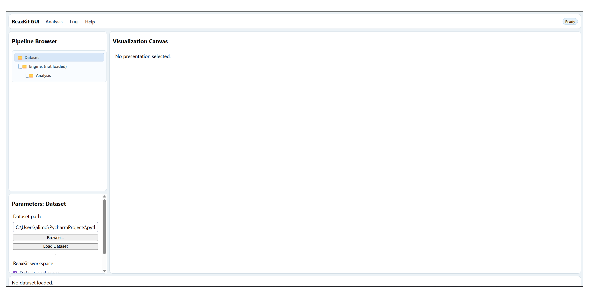

<!-- AUTO-GENERATED by docs/scripts/generate_workflow_cli_docs.py -->
# Gui Workflow

::: reaxkit.workflows.meta.gui_workflow
    options:
      show_root_heading: false
      show_root_full_path: false
      members: []

## Command: `gui`

### Arguments

_No command-specific arguments found._

A view of the graphical user interface (GUI) is seen below:

{ style="width:85%; max-width:800px;" }

*Figure: View of ReaxKit's GUI.*

## Common Runtime and Presentation Arguments

These are shared workflow-level CLI flags added before command-specific options, covering runtime context (engine/input/storage) and output presentation/export behavior.

_No common arguments found._

