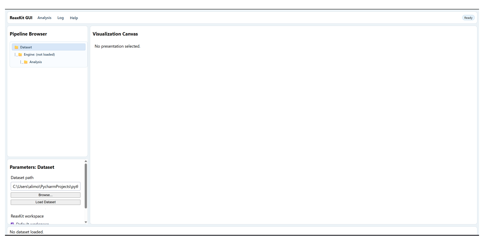

<!-- AUTO-GENERATED by docs/scripts/generate_workflow_cli_docs.py -->
# Gui Workflow

::: reaxkit.workflows.meta.gui_workflow
    options:
      show_root_heading: false
      show_root_full_path: false
      members: []

## Command: `gui`

Launch the ReaxKit Web UI.
Simply run 'reaxkit gui' to generate a GUI on localhost.
Once you open the GUI, you need to follow these steps:
 1. in the bottom left where you see the settings panel, click on 'Browse...' to locate the ReaxFF files, then clik 'Load Dataset' to automatically read the data and detect the engine. If the engine is detected, it will show the engine name and number of frames at the bottom of the screen.

 2. If the engine was no automatically detected (because it couldn't find the characteristicc files for each engine, such as xmolout for ReaxFF Standalone engine, you need to manually select the engine in 'Engine' in the pipeline browser.

 3. once the data is loaded and the engine is detected, you can add analyzers by clicking on 'Analysis' in the pipeline browser, and then adding the appropriate analyzer.

 4. Once the analyzer is added, it shows a list of settings for that analyzer in the settings panel (bottom left of the screen). Determine the settings, and start the analyzer. It takes some time to do the calculations and return the results.

 5. for each analyzer, a number of default presentations (usually a table view and a plot) are generated. However, you are not limited to these presentations, and you can simply click on 'Presentation' to add more presentations.

 6. If you want, you can apply some utilities such as signal processing utilities to smooth the data, etc. by clicking on 'Utilities' and selecting the approporiate utility. Once the utility is applied on your data, it generates a new column to you data, which can be visualized later on by adding presentation layers.

### Arguments

#### Outputs and plots

| Flag | Required | Default | Help | Choices |
|---|---|---|---|---|
| `--detail-format` | No |  | Optional detail format (default: Parquet; legacy: CSV). | parquet, csv |

#### Execution

| Flag | Required | Default | Help | Choices |
|---|---|---|---|---|
| `--execution` | No | auto | Execution backend; unsupported backends fall back to serial with a logged reason. | auto, serial, threads, processes |
| `--workers` | No | 0 | Frame workers: auto or N (default: auto). |  |
| `--chunk-size` | No | 0 | Maximum in-flight frames: auto or N. |  |

#### Storage and cache

| Flag | Required | Default | Help | Choices |
|---|---|---|---|---|
| `--output-profile` | No | standard | Artifact profile (default: standard). | standard, minimal, full, legacy |

#### Diagnostics and compatibility

| Flag | Required | Default | Help | Choices |
|---|---|---|---|---|
| `-h, --help` | No |  | show this help message and exit |  |
| `--help-all, --all-flags` | No |  | Show every option, grouped by purpose. |  |

A view of the graphical user interface (GUI) is seen below:

{ style="width:85%; max-width:800px;" }

*Figure: View of ReaxKit's GUI.*

## Common Runtime and Presentation Arguments

These are shared workflow-level CLI flags added before command-specific options, covering runtime context (engine/input/storage) and output presentation/export behavior.

Each command table above includes its shared and inherited options.

