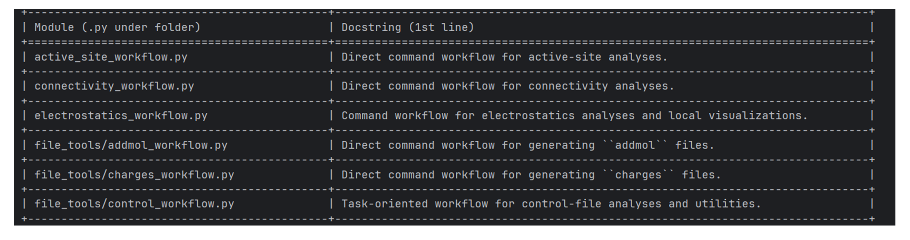

<!-- AUTO-GENERATED by docs/scripts/generate_workflow_cli_docs.py -->
# Introspection Workflow

::: reaxkit.workflows.meta.introspection_workflow
    options:
      show_root_heading: false
      show_root_full_path: false
      members: []

## Command: `intspec`

<div class="analysis-section-indent" markdown="1">

Inspect ReaxKit modules and folders for quick codebase discovery.
This command supports two mutually exclusive modes:
  1. `--file`   -> inspect one module/file and list public symbols
  2. `--folder` -> recursively list modules with docstring summaries
Use it to understand available functionality without opening files manually.

### Examples
-----

```text
  1. Recursively inspect the workflows package via shorthand:
   reaxkit intspec --folder workflows

  2. Inspect a specific dotted package path:
   reaxkit intspec --folder reaxkit.workflows.meta

  3. Inspect a module by dotted module name:
   reaxkit intspec --file reaxkit.workflows.meta.help_workflow
```

### Arguments

#### Input and file selection

| Flag | Required | Default | Help | Choices |
|---|---|---|---|---|
| `--file` | No |  | Module name or path to .py. Example: --file reaxkit.workflows.meta.help_workflow, which inspects that module and lists public symbols. |  |
| `--folder` | No |  | Folder/package to scan recursively. Example: --folder workflows, which expands to the workflows package and lists contained modules. |  |

#### Outputs and plots

| Flag | Required | Default | Help | Choices |
|---|---|---|---|---|
| `--detail-format` | No |  | Optional detail format (default: Parquet; legacy: CSV). | parquet, csv |

#### Execution

| Flag | Required | Default | Help | Choices |
|---|---|---|---|---|
| `--execution` | No | auto | Execution backend; unsupported backends fall back to serial with a logged reason. | auto, serial, threads, processes |
| `--workers` | No | 0 | Frame workers: auto or N (default: auto). |  |
| `--chunk-size` | No | 0 | Maximum in-flight frames: auto or N. |  |

#### Storage and cache

| Flag | Required | Default | Help | Choices |
|---|---|---|---|---|
| `--output-profile` | No | standard | Artifact profile (default: standard). | standard, minimal, full, legacy |

#### Diagnostics and compatibility

| Flag | Required | Default | Help | Choices |
|---|---|---|---|---|
| `-h, --help` | No |  | show this help message and exit |  |
| `--help-all, --all-flags` | No |  | Show every option, grouped by purpose. |  |


<a id="Intspec_folder_workflows"></a>

The figure below shows an example terminal output when running intspec on workflows.

<div style="text-align:center;" markdown="1">
{ style="width:85%; max-width:800px;" }

*Figure: Sample terminal output when running intspec on workflows.*
</div>

</div>

## Common Runtime and Presentation Arguments

<div class="analysis-section-indent" markdown="1">

These are shared workflow-level CLI flags added before command-specific options, covering runtime context (engine/input/storage) and output presentation/export behavior.

Each command table above includes its shared and inherited options.

</div>
