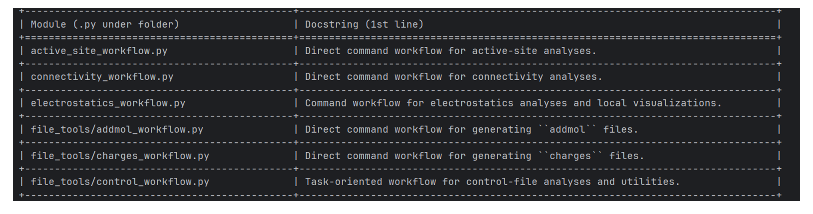

<!-- AUTO-GENERATED by docs/scripts/generate_workflow_cli_docs.py -->
# Introspection Workflow

::: reaxkit.workflows.meta.introspection_workflow
    options:
      show_root_heading: false
      show_root_full_path: false
      members: []

## Command: `intspec`

<div class="analysis-section-indent" markdown="1">

Inspect ReaxKit modules and folders for quick codebase discovery.
This command supports two mutually exclusive modes:
  1. `--file`   -> inspect one module/file and list public symbols
  2. `--folder` -> recursively list modules with docstring summaries
Use it to understand available functionality without opening files manually.

### Examples
-----

```text
  1. Recursively inspect the workflows package via shorthand:
   reaxkit intspec --folder workflows

  2. Inspect a specific dotted package path:
   reaxkit intspec --folder reaxkit.workflows.meta

  3. Inspect a module by dotted module name:
   reaxkit intspec --file reaxkit.workflows.meta.help_workflow
```

### Arguments

#### Input and file selection

| Flag | Required | Default | Help | Choices |
|---|---|---|---|---|
| `--file` | No |  | Module name or path to .py. Example: --file reaxkit.workflows.meta.help_workflow, which inspects that module and lists public symbols. |  |
| `--folder` | No |  | Folder/package to scan recursively. Example: --folder workflows, which expands to the workflows package and lists contained modules. |  |

#### Outputs and plots

| Flag | Required | Default | Help | Choices |
|---|---|---|---|---|
| `--plot-style` | No | default | Plot appearance: default preserves existing styling; publication uses clear fonts and an accessible palette; publication-bold uses larger bold text and heavier lines. Example: --plot-style publication-bold, which improves readability when figures are reduced in a manuscript. | default, publication, publication-bold |
| `--detail-format` | No |  | Optional detail format (default: Parquet; legacy: CSV). Example: --detail-format csv, which writes requested detail tables as CSV. | parquet, csv |

#### Execution

| Flag | Required | Default | Help | Choices |
|---|---|---|---|---|
| `--execution` | No | auto | Execution backend; unsupported backends fall back to serial with a logged reason. Example: --execution serial, which processes work sequentially. | auto, serial, threads, processes |
| `--workers` | No | 0 | Frame workers: auto or N (default: auto). Example: --workers 4, which requests four frame workers. |  |
| `--chunk-size` | No | 0 | Maximum in-flight frames: auto or N. Example: --chunk-size 8, which limits concurrent frame processing to eight frames. |  |

#### Storage and cache

| Flag | Required | Default | Help | Choices |
|---|---|---|---|---|
| `--checkpoint, --no-checkpoint` | No |  | Enable durable result batches for audited commands. Example: --no-checkpoint, disables recovery storage. |  |
| `--resume` | No |  | Resume a compatible result checkpoint; repeat the original scientific options. Example: --resume ./checkpoint, skips committed calculations. |  |
| `--checkpoint-buffer-mb` | No | 32 | Result buffer in MiB, plus one oversized frame. Example: --checkpoint-buffer-mb 32, bounds pending result payloads to approximately 32 MiB. |  |
| `--checkpoint-interval-seconds` | No | 30 | Flush at the next completed frame after this interval. Example: --checkpoint-interval-seconds 30, commits roughly every 30 seconds. |  |
| `--output-profile` | No | standard | Artifact profile (default: standard). Example: --output-profile full, which includes declared optional detail artifacts. | standard, minimal, full, legacy |

#### Diagnostics and compatibility

| Flag | Required | Default | Help | Choices |
|---|---|---|---|---|
| `-h, --help` | No |  | show this help message and exit |  |
| `--help-all, --all-flags` | No |  | Show every option, grouped by purpose. Example: --help-all, which includes advanced flags in the help output. |  |


<a id="Intspec_folder_workflows"></a>

The figure below shows an example terminal output when running intspec on workflows.

<div style="text-align:center;" markdown="1">
{ style="width:85%; max-width:800px;" }

*Figure: Sample terminal output when running intspec on workflows.*
</div>

</div>

## Common Runtime and Presentation Arguments

<div class="analysis-section-indent" markdown="1">

These are shared workflow-level CLI flags added before command-specific options, covering runtime context (engine/input/storage) and output presentation/export behavior.

Each command table above includes its shared and inherited options.

</div>
