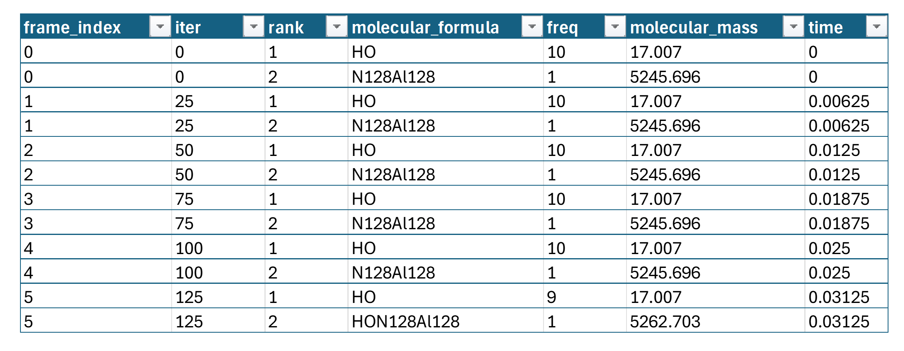
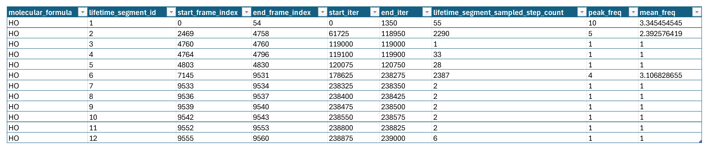

<!-- AUTO-GENERATED by docs/scripts/generate_workflow_cli_docs.py -->
# Molecular Analysis Workflow

::: reaxkit.workflows.molecular_analysis_workflow
    options:
      show_root_heading: false
      show_root_full_path: false
      members: []

## Command: `get_dominant_species`

<div class="analysis-section-indent" markdown="1">

Return dominant molecular species for selected frames.
This command ranks species by frequency per frame and can return multiple top ranks,
with optional frequency threshold filtering.

### Examples
-----

```text
  1. Export top 3 species per frame:
   reaxkit get_dominant_species --top-n 3 --export dominant_species.csv

  2. Analyze selected frames with minimum frequency and plot:
   reaxkit get_dominant_species --frames 0 10 20 --min-freq 2 --plot single

  3. Use frame stride and iteration axis in saved figure:
   reaxkit get_dominant_species --every 5 --xaxis iter --save dominant_species.png
```

### Arguments

| Flag | Required | Default | Help | Choices |
|---|---|---|---|---|
| `--top-n` | No | 1 | Number of ranked species per frame. Example: --top-n 3, which returns first/second/third dominant species. |  |
| `--min-freq` | No | 0.0 | Minimum species frequency to include. Example: --min-freq 2, which filters out low-frequency species. |  |

<a id="get_dominant_species"></a>

The figure below shows an example CSV output for the top 2 dominant species across a simulation. 

<div style="text-align:center;" markdown="1">
{ style="width:85%; max-width:800px;" }

*Figure: Sample CSV output for the top 2 dominant species across a simulation.*
</div>

</div>

## Command: `get_largest_molecule_by_mass`

<div class="analysis-section-indent" markdown="1">

Return the heaviest molecular species for selected frames.
Use this command to track how the maximum molecular mass evolves over trajectory frames.

### Examples
-----

```text
  1. Export largest-mass species table:
   reaxkit get_largest_molecule_by_mass --export largest_mass.csv

  2. Plot largest-mass trend on selected frames:
   reaxkit get_largest_molecule_by_mass --frames 0 20 40 --plot single

  3. Subsample frames and save iteration-axis plot:
   reaxkit get_largest_molecule_by_mass --every 10 --xaxis iter --save largest_mass.png
```

### Arguments

_No command-specific arguments found._

</div>

## Command: `get_largest_molecule_composition`

<div class="analysis-section-indent" markdown="1">

Return elemental composition of the heaviest molecular species per frame.
This command reports element counts for the dominant-by-mass molecule in each frame,
which helps track composition shifts over time.

### Examples
-----

```text
  1. Export composition table:
   reaxkit get_largest_molecule_composition --export composition.csv

  2. Plot selected frames with subplot layout:
   reaxkit get_largest_molecule_composition --frames 0 10 20 --plot subplot

  3. Subsample frames and save iteration-axis plot:
   reaxkit get_largest_molecule_composition --every 5 --xaxis iter --save composition.png
```

### Arguments

_No command-specific arguments found._

</div>

## Command: `get_molecule_lifetime`

<div class="analysis-section-indent" markdown="1">

Compute lifetimes of molecular species across selected frames.
You can restrict to target formulas and filter by minimum activity frequency before
lifetime statistics are reported.

### Examples
-----

```text
  1. Compute lifetimes for selected molecules and export:
   reaxkit get_molecule_lifetime --molecules H2O OH --export lifetimes.csv

  2. Compute and plot lifetimes for all detected molecules:
   reaxkit get_molecule_lifetime --plot single

  3. Apply frequency threshold on selected frames and save plot:
   reaxkit get_molecule_lifetime --min-freq 2 --frames 0 50 100 --save molecule_lifetimes.png
```

### Arguments

| Flag | Required | Default | Help | Choices |
|---|---|---|---|---|
| `--molecules` | No |  | Restrict to selected molecular formulae. Example: --molecules H2O OH, which limits analysis to water and hydroxyl. |  |
| `--min-freq` | No | 1.0 | Minimum frequency for an active molecule. Example: --min-freq 2, which treats only sufficiently frequent molecules as active. |  |

<a id="get_molecule_lifetime"></a>

The figure below shows an example CSV output for the lifetime of OH. This table shows during which OH was available, so cycles of OH generation can be detected. 

<div style="text-align:center;" markdown="1">
{ style="width:85%; max-width:800px;" }

*Figure: Sample CSV output for the lifetime of a molecule.*
</div>

</div>

## Common Runtime and Presentation Arguments

<div class="analysis-section-indent" markdown="1">

These are shared workflow-level CLI flags added before command-specific options, covering runtime context (engine/input/storage) and output presentation/export behavior.

| Flag | Required | Default | Help | Choices |
|---|---|---|---|---|
| `--engine` | No |  | Engine override. Example: --engine reaxff, which forces ReaxFF parser/loader behavior. | reaxff, ams, lammps |
| `--input` | No | . | Input file or directory for engine resolution. Example: --input runs/job1, which sets data-loading context. |  |
| `--run-dir, --dir` | No | . | Run directory fallback for engine detection. Example: --run-dir runs/job1, which acts as backup lookup path. |  |
| `--molfra, --file` | No | molfra.out | Molecular analysis file path. Example: --molfra molfra.out, which reads species-frequency data from that file. |  |
| `--log` | No |  | Logging level. Example: --log verbose, which prints more runtime details. | verbose, quiet |
| `--run-id` | No |  | Run identifier for run-scoped layout (e.g., run_91ac0e). |  |
| `--project-root` | No |  | Project root that contains inputs/, data/, analysis/, etc. |  |
| `--analysis-id` | No |  | Optional analysis artifact id; defaults to run id. |  |
| `--plot` | No |  | Render a plot. Example: --plot single, which draws one combined chart. | single, subplot |
| `--show` | No |  | Show the generated plot window. Example: --show, which opens the plot interactively. |  |
| `--save` | No |  | Save the generated plot to a file path. Example: --save dominant_species.png, which writes the figure image. |  |
| `--export` | No |  | Write the result table to CSV. Example: --export dominant_species.csv, which saves tabular output. |  |
| `--grid` | No |  | Subplot grid like 2x2 or 2*2. Example: --grid 2x2, which arranges subplots in a 2-by-2 layout. |  |
| `--xaxis` | No | frame | Quantity on x-axis. Example: --xaxis iter, which uses iteration values on horizontal axis. | frame, iter |
| `--frames` | No |  | Frame selector syntax. Example: --frames 0:20:2, which selects frames 0,2,4,...,20. |  |
| `--every` | No | 1 | Frame stride. Example: --every 5, which keeps every fifth selected frame. |  |

</div>
