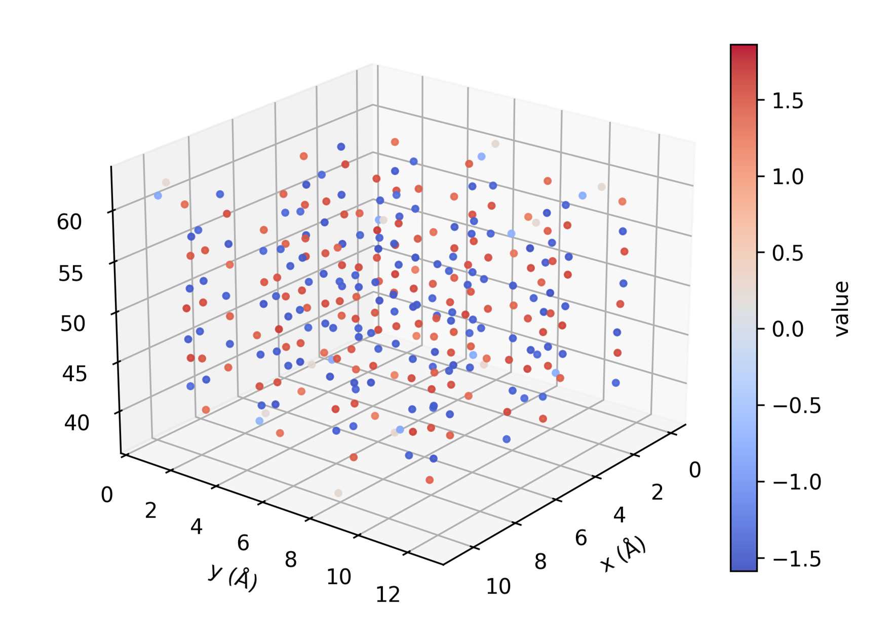

<!-- AUTO-GENERATED by docs/scripts/generate_workflow_cli_docs.py -->
# Plot Atom Property Workflow

::: reaxkit.workflows.presentation.plot_atom_property_workflow
    options:
      show_root_heading: false
      show_root_full_path: false
      members: []

## Command: `plot_atom_property`

<div class="analysis-section-indent" markdown="1">

Plot per-atom properties in 2D heatmap or 3D scatter mode.
Use --type to select the plot style while keeping one unified command.

### Examples
-----

```text
  1. 3D scatter of charges:
   reaxkit plot_atom_property --type scatter3d --property charge --frames 0 10 20 --save plots3d

  2. 2D heatmap of connectivity values:
   reaxkit plot_atom_property --type heatmap2d --property sum_BOs --plane xz --bins 60 --save heatmaps

  3. Export table without plotting:
   reaxkit plot_atom_property --type scatter3d --property q --export atom_charge_coords.csv
```

### Arguments

#### Scientific choices

| Flag | Required | Default | Help | Choices |
|---|---|---|---|---|
| `--property` | No |  | Property to map: charge, q, partial_charge, sum_BOs, connectivity. Example: --property charge, which colors atoms by partial charge. |  |
| `--frames` | No |  | Frame selector syntax. Example: --frames 0:20:2, which selects frames 0,2,4,...,20. |  |
| `--every` | No | 1 | Use every Nth selected frame. Example: --every 5, which subsamples selected frames by a factor of five. |  |
| `--atom-ids` | No |  | Restrict to selected 1-based atom ids. Example: --atom-ids 1 2 5, which keeps only those atoms. |  |
| `--atom-types` | No |  | Restrict to selected atom types/elements. Example: --atom-types O H, which keeps only oxygen and hydrogen. |  |
| `--type` | Yes |  | Plot type selector. Example: --type heatmap2d, which projects atom data and aggregates it on a 2D grid. | heatmap2d, scatter3d |
| `--size` | No | 8.0 | Marker size for scatter3d. Example: --size 12, which renders larger point markers. |  |
| `--alpha` | No | 0.9 | Marker transparency for scatter3d. Example: --alpha 0.6, which makes points more transparent. |  |
| `--plane` | No | xy | Projection plane for heatmap2d. Example: --plane xz, which projects points onto XZ before binning. | xy, xz, yz |
| `--bins` | No | 40 | Grid bins for heatmap2d: "N" or "Nx,Ny". Example: --bins 80,60, which sets non-square grid resolution. |  |
| `--agg` | No | mean | Aggregation for heatmap2d: mean\|max\|min\|sum\|count. Example: --agg max, which stores the maximum value in each bin. |  |

#### Input and file selection

| Flag | Required | Default | Help | Choices |
|---|---|---|---|---|
| `--engine` | No |  | Engine override. Example: --engine reaxff, which applies ReaxFF-specific loading rules. | reaxff, ams, lammps |
| `--input` | No | . | Input file or directory for engine resolution. Example: --input runs/job1, which sets base context for file discovery. |  |
| `--run-dir, --dir` | No | . | Run directory fallback for engine detection. Example: --run-dir runs/job1, which acts as backup lookup path. |  |
| `--xmolout` | No | xmolout | Path to trajectory file. Example: --xmolout runs/job1/xmolout, which provides atom coordinates over frames. |  |
| `--fort7` | No | fort.7 | Path to fort.7 file. Example: --fort7 runs/job1/fort.7, which provides connectivity/bond-order data. |  |
| `--summary` | No |  | Optional summary.txt path. Example: --summary runs/job1/summary.txt, which supplies auxiliary simulation metadata when available. |  |

#### Outputs and plots

| Flag | Required | Default | Help | Choices |
|---|---|---|---|---|
| `--save` | No |  | Directory used when saving frame plots. Example: --save plots3d, which writes one image per frame to that folder. |  |
| `--show` | No | False | Show the generated plot windows. Example: --show, which opens plots interactively. |  |
| `--export` | No |  | Export the assembled per-atom table to CSV. Example: --export atom_values.csv, which saves coordinates and mapped values. |  |
| `--vmin` | No |  | Color scale minimum. Example: --vmin -0.5, which clamps the lower color bound. |  |
| `--vmax` | No |  | Color scale maximum. Example: --vmax 0.5, which clamps the upper color bound. |  |
| `--cmap` | No |  | Matplotlib colormap. Example: --cmap coolwarm, which sets the visualization color palette. |  |
| `--elev` | No | 22.0 | 3D view elevation for scatter3d. Example: --elev 30, which raises the camera tilt angle. |  |
| `--azim` | No | 38.0 | 3D view azimuth for scatter3d. Example: --azim 120, which rotates camera around the scene. |  |
| `--detail-format` | No |  | Optional detail format (default: Parquet; legacy: CSV). | parquet, csv |

#### Execution

| Flag | Required | Default | Help | Choices |
|---|---|---|---|---|
| `--execution` | No | auto | Execution backend; unsupported backends fall back to serial with a logged reason. | auto, serial, threads, processes |
| `--workers` | No | 0 | Frame workers: auto or N (default: auto). |  |
| `--chunk-size` | No | 0 | Maximum in-flight frames: auto or N. |  |

#### Storage and cache

| Flag | Required | Default | Help | Choices |
|---|---|---|---|---|
| `--run-id` | No |  | Run identifier for run-scoped layout. Example: --run-id run_91ac0e, which reuses that run identifier. |  |
| `--project-root` | No | reaxkit_workspace | Project root that contains inputs/, data/, analysis/, etc. Example: --project-root ./workspace, which stores run artifacts there. |  |
| `--analysis-id` | No |  | Optional analysis artifact id; defaults to run id. Example: --analysis-id comparison-a, which names the analysis artifact explicitly. |  |
| `--input-cache, --no-input-cache` | No | True | Reuse parsed input frames across commands (default: enabled; use --no-input-cache to force source reads for reproducibility checks or benchmarks). Example: --no-input-cache, which reloads frames from their source files. |  |
| `--frame-cache-max-gb` | No | 10.0 | Maximum workspace frame-cache size in GiB (default: 10; use 0 for unlimited). Example: --frame-cache-max-gb 20, which caps cached frames at 20 GiB. |  |
| `--output-profile` | No | standard | Select the shared artifact policy. Standard writes declared default outputs; minimal keeps core tables; full and legacy include optional details. Default: standard. Example: --output-profile full, which includes declared optional detail tables. | minimal, standard, full, legacy |

#### Diagnostics and compatibility

| Flag | Required | Default | Help | Choices |
|---|---|---|---|---|
| `-h, --help` | No |  | show this help message and exit |  |
| `--help-all, --all-flags` | No |  | Show every option, grouped by purpose. |  |
| `--log` | No |  | Logging level. Example: --log verbose, which prints more runtime details. | verbose, quiet |


<a id="plot_atom_property_3d"></a>

The figure below shows an example output plot when plotting the charges of atoms at a specific frame across their 3D coordinates.

<div style="text-align:center;" markdown="1">
{ style="width:85%; max-width:800px;" }

*Figure: Sample plot for charges of atoms at a specific frame across their 3D coordinates.*
</div>

</div>

## Common Runtime and Presentation Arguments

<div class="analysis-section-indent" markdown="1">

These are shared workflow-level CLI flags added before command-specific options, covering runtime context (engine/input/storage) and output presentation/export behavior.

Each command table above includes its shared and inherited options.

</div>
