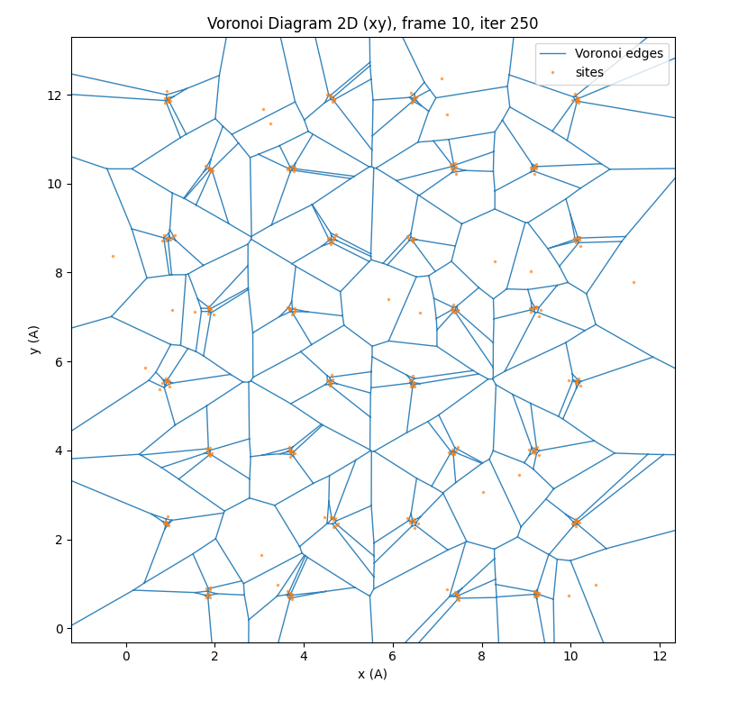

<!-- AUTO-GENERATED by docs/scripts/generate_workflow_cli_docs.py -->
# Trajectory Workflow

::: reaxkit.workflows.trajectory_workflow
    options:
      show_root_heading: false
      show_root_full_path: false
      members: []

## Command: `msd`

<div class="analysis-section-indent" markdown="1">

Compute time-origin averaged mean-squared displacement (MSD) for selected atoms.
The output is averaged over selected atoms and all valid time origins, giving MSD vs lag time.

### Examples
-----

```text
  1. Plot MSD for selected atom ids:
   reaxkit get_msd --atom-ids 1 2 3 --max-lag 500 --delta-t-ps 0.25 --plot single

  2. Save oxygen-only MSD vs lag time:
   reaxkit get_msd --atom-types O --max-lag 800 --delta-t-ps 1.0 --save msd_oxygen.png

  3. Export MSD using selected frames:
   reaxkit get_msd --atom-ids 5 --frames 0:1000:10 --max-lag 80 --export msd_atom5.csv
```

### Arguments

#### Scientific choices

| Flag | Required | Default | Help | Choices |
|---|---|---|---|---|
| `--frames` | No |  | Frame selector syntax. Example: --frames 0:20:2, which selects frames 0,2,4,...,20. |  |
| `--every` | No | 1 | Frame stride. Example: --every 5, which keeps every fifth selected frame. |  |
| `--atom-ids` | No |  | 1-based atom ids. Example: --atom-ids 1 2 3, which restricts MSD to those atoms. |  |
| `--atom-types` | No |  | Element symbols to include. Example: --atom-types O, which computes MSD for oxygen atoms only. |  |
| `--dims` | No | x, y, z | Coordinate dimensions to include. Example: --dims x y, which computes MSD using in-plane displacement. |  |
| `--max-lag` | No |  | Maximum lag in number of selected frames. Example: --max-lag 800, which computes MSD from lag 0 to lag 799. |  |
| `--delta-t-ps` | No | 1.0 | Time between selected trajectory frames in ps. Example: --delta-t-ps 0.25, which reports lag time in ps. |  |
| `--unwrap, --no-unwrap` | No | True | Unwrap coordinates across periodic boundaries when cell data exists. Example: --no-unwrap, which keeps wrapped coordinates. |  |

#### Input and file selection

| Flag | Required | Default | Help | Choices |
|---|---|---|---|---|
| `--engine` | No |  | Engine override. Example: --engine reaxff, which applies ReaxFF-specific trajectory loading behavior. | reaxff, ams, lammps |
| `--run-dir, --dir` | No | . | Run directory (fallback for detection). Example: --run-dir runs/job1, which sets backup path for file discovery. |  |
| `--xmolout, --file` | No |  | Trajectory file path. Example: --xmolout runs/job1/xmolout, which provides coordinate trajectory input. |  |

#### Outputs and plots

| Flag | Required | Default | Help | Choices |
|---|---|---|---|---|
| `--plot` | No |  | Render a plot. Example: --plot single, which creates one combined figure. | single, subplot |
| `--show` | No | False | Show the generated plot window. Example: --show, which opens the figure interactively. |  |
| `--save` | No |  | Save the generated plot to a file path. Example: --save msd.png, which writes the figure image to disk. |  |
| `--export` | No |  | Write the result table to CSV. Example: --export rdf.csv, which saves tabular analysis output. |  |
| `--grid` | No |  | Subplot grid like 2x2 or 2*2. Example: --grid 2x2, which arranges subplot panels in a 2-by-2 layout. |  |
| `--xaxis` | No | frame | Quantity on x-axis. Example: --xaxis time, which uses converted physical time when available. | iter, frame, time |
| `--detail-format` | No |  | Optional detail format (default: Parquet; legacy: CSV). | parquet, csv |

#### Execution

| Flag | Required | Default | Help | Choices |
|---|---|---|---|---|
| `--execution` | No | auto | Execution backend; unsupported backends fall back to serial with a logged reason. | auto, serial, threads, processes |
| `--workers` | No | 0 | Frame workers: auto or N (default: auto). |  |
| `--chunk-size` | No | 0 | Maximum in-flight frames: auto or N. |  |

#### Storage and cache

| Flag | Required | Default | Help | Choices |
|---|---|---|---|---|
| `--run-id` | No |  | Run identifier for run-scoped layout. Example: --run-id run_91ac0e, which reuses that run identifier. |  |
| `--project-root` | No | reaxkit_workspace | Project root that contains inputs/, data/, analysis/, etc. Example: --project-root ./workspace, which stores run artifacts there. |  |
| `--analysis-id` | No |  | Optional analysis artifact id; defaults to run id. Example: --analysis-id comparison-a, which names the analysis artifact explicitly. |  |
| `--input-cache, --no-input-cache` | No | True | Reuse parsed input frames across commands (default: enabled; use --no-input-cache to force source reads for reproducibility checks or benchmarks). Example: --no-input-cache, which reloads frames from their source files. |  |
| `--frame-cache-max-gb` | No | 10.0 | Maximum workspace frame-cache size in GiB (default: 10; use 0 for unlimited). Example: --frame-cache-max-gb 20, which caps cached frames at 20 GiB. |  |
| `--output-profile` | No | standard | Select the shared artifact policy. Standard writes declared default outputs; minimal keeps core tables; full and legacy include optional details. Default: standard. Example: --output-profile full, which includes declared optional detail tables. | minimal, standard, full, legacy |

#### Diagnostics and compatibility

| Flag | Required | Default | Help | Choices |
|---|---|---|---|---|
| `-h, --help` | No |  | show this help message and exit |  |
| `--help-all, --all-flags` | No |  | Show every option, grouped by purpose. |  |
| `--log` | No | quiet | Logging level. Example: --log verbose, which prints more runtime details. | verbose, quiet |


</div>

## Command: `get_msd`

<div class="analysis-section-indent" markdown="1">

Compute time-origin averaged mean-squared displacement (MSD) for selected atoms.
The output is averaged over selected atoms and all valid time origins, giving MSD vs lag time.

### Examples
-----

```text
  1. Plot MSD for selected atom ids:
   reaxkit get_msd --atom-ids 1 2 3 --max-lag 500 --delta-t-ps 0.25 --plot single

  2. Save oxygen-only MSD vs lag time:
   reaxkit get_msd --atom-types O --max-lag 800 --delta-t-ps 1.0 --save msd_oxygen.png

  3. Export MSD using selected frames:
   reaxkit get_msd --atom-ids 5 --frames 0:1000:10 --max-lag 80 --export msd_atom5.csv
```

### Arguments

#### Scientific choices

| Flag | Required | Default | Help | Choices |
|---|---|---|---|---|
| `--frames` | No |  | Frame selector syntax. Example: --frames 0:20:2, which selects frames 0,2,4,...,20. |  |
| `--every` | No | 1 | Frame stride. Example: --every 5, which keeps every fifth selected frame. |  |
| `--atom-ids` | No |  | 1-based atom ids. Example: --atom-ids 1 2 3, which restricts MSD to those atoms. |  |
| `--atom-types` | No |  | Element symbols to include. Example: --atom-types O, which computes MSD for oxygen atoms only. |  |
| `--dims` | No | x, y, z | Coordinate dimensions to include. Example: --dims x y, which computes MSD using in-plane displacement. |  |
| `--max-lag` | No |  | Maximum lag in number of selected frames. Example: --max-lag 800, which computes MSD from lag 0 to lag 799. |  |
| `--delta-t-ps` | No | 1.0 | Time between selected trajectory frames in ps. Example: --delta-t-ps 0.25, which reports lag time in ps. |  |
| `--unwrap, --no-unwrap` | No | True | Unwrap coordinates across periodic boundaries when cell data exists. Example: --no-unwrap, which keeps wrapped coordinates. |  |

#### Input and file selection

| Flag | Required | Default | Help | Choices |
|---|---|---|---|---|
| `--engine` | No |  | Engine override. Example: --engine reaxff, which applies ReaxFF-specific trajectory loading behavior. | reaxff, ams, lammps |
| `--run-dir, --dir` | No | . | Run directory (fallback for detection). Example: --run-dir runs/job1, which sets backup path for file discovery. |  |
| `--xmolout, --file` | No |  | Trajectory file path. Example: --xmolout runs/job1/xmolout, which provides coordinate trajectory input. |  |

#### Outputs and plots

| Flag | Required | Default | Help | Choices |
|---|---|---|---|---|
| `--plot` | No |  | Render a plot. Example: --plot single, which creates one combined figure. | single, subplot |
| `--show` | No | False | Show the generated plot window. Example: --show, which opens the figure interactively. |  |
| `--save` | No |  | Save the generated plot to a file path. Example: --save msd.png, which writes the figure image to disk. |  |
| `--export` | No |  | Write the result table to CSV. Example: --export rdf.csv, which saves tabular analysis output. |  |
| `--grid` | No |  | Subplot grid like 2x2 or 2*2. Example: --grid 2x2, which arranges subplot panels in a 2-by-2 layout. |  |
| `--xaxis` | No | frame | Quantity on x-axis. Example: --xaxis time, which uses converted physical time when available. | iter, frame, time |
| `--detail-format` | No |  | Optional detail format (default: Parquet; legacy: CSV). | parquet, csv |

#### Execution

| Flag | Required | Default | Help | Choices |
|---|---|---|---|---|
| `--execution` | No | auto | Execution backend; unsupported backends fall back to serial with a logged reason. | auto, serial, threads, processes |
| `--workers` | No | 0 | Frame workers: auto or N (default: auto). |  |
| `--chunk-size` | No | 0 | Maximum in-flight frames: auto or N. |  |

#### Storage and cache

| Flag | Required | Default | Help | Choices |
|---|---|---|---|---|
| `--run-id` | No |  | Run identifier for run-scoped layout. Example: --run-id run_91ac0e, which reuses that run identifier. |  |
| `--project-root` | No | reaxkit_workspace | Project root that contains inputs/, data/, analysis/, etc. Example: --project-root ./workspace, which stores run artifacts there. |  |
| `--analysis-id` | No |  | Optional analysis artifact id; defaults to run id. Example: --analysis-id comparison-a, which names the analysis artifact explicitly. |  |
| `--input-cache, --no-input-cache` | No | True | Reuse parsed input frames across commands (default: enabled; use --no-input-cache to force source reads for reproducibility checks or benchmarks). Example: --no-input-cache, which reloads frames from their source files. |  |
| `--frame-cache-max-gb` | No | 10.0 | Maximum workspace frame-cache size in GiB (default: 10; use 0 for unlimited). Example: --frame-cache-max-gb 20, which caps cached frames at 20 GiB. |  |
| `--output-profile` | No | standard | Select the shared artifact policy. Standard writes declared default outputs; minimal keeps core tables; full and legacy include optional details. Default: standard. Example: --output-profile full, which includes declared optional detail tables. | minimal, standard, full, legacy |

#### Diagnostics and compatibility

| Flag | Required | Default | Help | Choices |
|---|---|---|---|---|
| `-h, --help` | No |  | show this help message and exit |  |
| `--help-all, --all-flags` | No |  | Show every option, grouped by purpose. |  |
| `--log` | No | quiet | Logging level. Example: --log verbose, which prints more runtime details. | verbose, quiet |


</div>

## Command: `diffusivity`

<div class="analysis-section-indent" markdown="1">

Estimate diffusivity from time-origin averaged MSD using the Einstein relation `MSD = 2*d*D*t`.
This command first computes MSD averaged over selected atoms and valid time origins, then fits
MSD versus lag time to estimate a diffusion coefficient for the selected atom group.

### Examples
-----

```text
  1. Plot diffusivity for selected atom ids:
   reaxkit get_diffusivity --atom-ids 1 2 3 --max-lag 500 --delta-t-ps 1.0 --d 3 --plot single

  2. Export oxygen diffusivity using 3D Einstein dimensionality:
   reaxkit get_diffusivity --atom-types O --max-lag 800 --delta-t-ps 0.25 --d 3 --export diffusivity_oxygen.csv

  3. Estimate diffusivity from sampled frames without PBC unwrapping:
   reaxkit get_diffusivity --atom-ids 1 2 3 4 5 --frames 0:999:1 --max-lag 800 --delta-t-ps 1.0 --d 3 --no-unwrap --export diffusivity.csv
```

### Arguments

#### Scientific choices

| Flag | Required | Default | Help | Choices |
|---|---|---|---|---|
| `--frames` | No |  | Frame selector syntax. Example: --frames 0:20:2, which selects frames 0,2,4,...,20. |  |
| `--every` | No | 1 | Frame stride. Example: --every 5, which keeps every fifth selected frame. |  |
| `--atom-ids` | No |  | 1-based atom ids. Example: --atom-ids 1 2 3, which restricts diffusivity estimates to those atoms. |  |
| `--atom-types` | No |  | Element symbols to include. Example: --atom-types O, which limits analysis to oxygen atoms. |  |
| `--dims` | No | x, y, z | Coordinate dimensions to include. Example: --dims x y z, which uses full 3D displacement. |  |
| `--origin` | No | first | Reference frame: 'first' or explicit index. Example: --origin first, which measures displacement from initial frame. |  |
| `--d` | No | 3.0 | Einstein dimensionality in MSD = 2*d*D*t. Example: --d 2, which applies 2D diffusivity relation. |  |
| `--max-lag` | No |  |  |  |
| `--delta-t-ps` | No | 1.0 |  |  |
| `--unwrap, --no-unwrap` | No | True | Unwrap coordinates across periodic boundaries when cell data exists. Example: --no-unwrap, which keeps wrapped coordinates. |  |

#### Input and file selection

| Flag | Required | Default | Help | Choices |
|---|---|---|---|---|
| `--engine` | No |  | Engine override. Example: --engine reaxff, which applies ReaxFF-specific trajectory loading behavior. | reaxff, ams, lammps |
| `--run-dir, --dir` | No | . | Run directory (fallback for detection). Example: --run-dir runs/job1, which sets backup path for file discovery. |  |
| `--xmolout, --file` | No |  | Trajectory file path. Example: --xmolout runs/job1/xmolout, which provides coordinate trajectory input. |  |

#### Outputs and plots

| Flag | Required | Default | Help | Choices |
|---|---|---|---|---|
| `--plot` | No |  | Render a plot. Example: --plot single, which creates one combined figure. | single, subplot |
| `--show` | No | False | Show the generated plot window. Example: --show, which opens the figure interactively. |  |
| `--save` | No |  | Save the generated plot to a file path. Example: --save msd.png, which writes the figure image to disk. |  |
| `--export` | No |  | Write the result table to CSV. Example: --export rdf.csv, which saves tabular analysis output. |  |
| `--grid` | No |  | Subplot grid like 2x2 or 2*2. Example: --grid 2x2, which arranges subplot panels in a 2-by-2 layout. |  |
| `--xaxis` | No | frame | Quantity on x-axis. Example: --xaxis time, which uses converted physical time when available. | iter, frame, time |
| `--detail-format` | No |  | Optional detail format (default: Parquet; legacy: CSV). | parquet, csv |

#### Execution

| Flag | Required | Default | Help | Choices |
|---|---|---|---|---|
| `--execution` | No | auto | Execution backend; unsupported backends fall back to serial with a logged reason. | auto, serial, threads, processes |
| `--workers` | No | 0 | Frame workers: auto or N (default: auto). |  |
| `--chunk-size` | No | 0 | Maximum in-flight frames: auto or N. |  |

#### Storage and cache

| Flag | Required | Default | Help | Choices |
|---|---|---|---|---|
| `--run-id` | No |  | Run identifier for run-scoped layout. Example: --run-id run_91ac0e, which reuses that run identifier. |  |
| `--project-root` | No | reaxkit_workspace | Project root that contains inputs/, data/, analysis/, etc. Example: --project-root ./workspace, which stores run artifacts there. |  |
| `--analysis-id` | No |  | Optional analysis artifact id; defaults to run id. Example: --analysis-id comparison-a, which names the analysis artifact explicitly. |  |
| `--input-cache, --no-input-cache` | No | True | Reuse parsed input frames across commands (default: enabled; use --no-input-cache to force source reads for reproducibility checks or benchmarks). Example: --no-input-cache, which reloads frames from their source files. |  |
| `--frame-cache-max-gb` | No | 10.0 | Maximum workspace frame-cache size in GiB (default: 10; use 0 for unlimited). Example: --frame-cache-max-gb 20, which caps cached frames at 20 GiB. |  |
| `--output-profile` | No | standard | Select the shared artifact policy. Standard writes declared default outputs; minimal keeps core tables; full and legacy include optional details. Default: standard. Example: --output-profile full, which includes declared optional detail tables. | minimal, standard, full, legacy |

#### Diagnostics and compatibility

| Flag | Required | Default | Help | Choices |
|---|---|---|---|---|
| `-h, --help` | No |  | show this help message and exit |  |
| `--help-all, --all-flags` | No |  | Show every option, grouped by purpose. |  |
| `--log` | No | quiet | Logging level. Example: --log verbose, which prints more runtime details. | verbose, quiet |


</div>

## Command: `get_diffusivity`

<div class="analysis-section-indent" markdown="1">

Estimate diffusivity from time-origin averaged MSD using the Einstein relation `MSD = 2*d*D*t`.
This command first computes MSD averaged over selected atoms and valid time origins, then fits
MSD versus lag time to estimate a diffusion coefficient for the selected atom group.

### Examples
-----

```text
  1. Plot diffusivity for selected atom ids:
   reaxkit get_diffusivity --atom-ids 1 2 3 --max-lag 500 --delta-t-ps 1.0 --d 3 --plot single

  2. Export oxygen diffusivity using 3D Einstein dimensionality:
   reaxkit get_diffusivity --atom-types O --max-lag 800 --delta-t-ps 0.25 --d 3 --export diffusivity_oxygen.csv

  3. Estimate diffusivity from sampled frames without PBC unwrapping:
   reaxkit get_diffusivity --atom-ids 1 2 3 4 5 --frames 0:999:1 --max-lag 800 --delta-t-ps 1.0 --d 3 --no-unwrap --export diffusivity.csv
```

### Arguments

#### Scientific choices

| Flag | Required | Default | Help | Choices |
|---|---|---|---|---|
| `--frames` | No |  | Frame selector syntax. Example: --frames 0:20:2, which selects frames 0,2,4,...,20. |  |
| `--every` | No | 1 | Frame stride. Example: --every 5, which keeps every fifth selected frame. |  |
| `--atom-ids` | No |  | 1-based atom ids. Example: --atom-ids 1 2 3, which restricts diffusivity estimates to those atoms. |  |
| `--atom-types` | No |  | Element symbols to include. Example: --atom-types O, which limits analysis to oxygen atoms. |  |
| `--dims` | No | x, y, z | Coordinate dimensions to include. Example: --dims x y z, which uses full 3D displacement. |  |
| `--origin` | No | first | Reference frame: 'first' or explicit index. Example: --origin first, which measures displacement from initial frame. |  |
| `--d` | No | 3.0 | Einstein dimensionality in MSD = 2*d*D*t. Example: --d 2, which applies 2D diffusivity relation. |  |
| `--max-lag` | No |  |  |  |
| `--delta-t-ps` | No | 1.0 |  |  |
| `--unwrap, --no-unwrap` | No | True | Unwrap coordinates across periodic boundaries when cell data exists. Example: --no-unwrap, which keeps wrapped coordinates. |  |

#### Input and file selection

| Flag | Required | Default | Help | Choices |
|---|---|---|---|---|
| `--engine` | No |  | Engine override. Example: --engine reaxff, which applies ReaxFF-specific trajectory loading behavior. | reaxff, ams, lammps |
| `--run-dir, --dir` | No | . | Run directory (fallback for detection). Example: --run-dir runs/job1, which sets backup path for file discovery. |  |
| `--xmolout, --file` | No |  | Trajectory file path. Example: --xmolout runs/job1/xmolout, which provides coordinate trajectory input. |  |

#### Outputs and plots

| Flag | Required | Default | Help | Choices |
|---|---|---|---|---|
| `--plot` | No |  | Render a plot. Example: --plot single, which creates one combined figure. | single, subplot |
| `--show` | No | False | Show the generated plot window. Example: --show, which opens the figure interactively. |  |
| `--save` | No |  | Save the generated plot to a file path. Example: --save msd.png, which writes the figure image to disk. |  |
| `--export` | No |  | Write the result table to CSV. Example: --export rdf.csv, which saves tabular analysis output. |  |
| `--grid` | No |  | Subplot grid like 2x2 or 2*2. Example: --grid 2x2, which arranges subplot panels in a 2-by-2 layout. |  |
| `--xaxis` | No | frame | Quantity on x-axis. Example: --xaxis time, which uses converted physical time when available. | iter, frame, time |
| `--detail-format` | No |  | Optional detail format (default: Parquet; legacy: CSV). | parquet, csv |

#### Execution

| Flag | Required | Default | Help | Choices |
|---|---|---|---|---|
| `--execution` | No | auto | Execution backend; unsupported backends fall back to serial with a logged reason. | auto, serial, threads, processes |
| `--workers` | No | 0 | Frame workers: auto or N (default: auto). |  |
| `--chunk-size` | No | 0 | Maximum in-flight frames: auto or N. |  |

#### Storage and cache

| Flag | Required | Default | Help | Choices |
|---|---|---|---|---|
| `--run-id` | No |  | Run identifier for run-scoped layout. Example: --run-id run_91ac0e, which reuses that run identifier. |  |
| `--project-root` | No | reaxkit_workspace | Project root that contains inputs/, data/, analysis/, etc. Example: --project-root ./workspace, which stores run artifacts there. |  |
| `--analysis-id` | No |  | Optional analysis artifact id; defaults to run id. Example: --analysis-id comparison-a, which names the analysis artifact explicitly. |  |
| `--input-cache, --no-input-cache` | No | True | Reuse parsed input frames across commands (default: enabled; use --no-input-cache to force source reads for reproducibility checks or benchmarks). Example: --no-input-cache, which reloads frames from their source files. |  |
| `--frame-cache-max-gb` | No | 10.0 | Maximum workspace frame-cache size in GiB (default: 10; use 0 for unlimited). Example: --frame-cache-max-gb 20, which caps cached frames at 20 GiB. |  |
| `--output-profile` | No | standard | Select the shared artifact policy. Standard writes declared default outputs; minimal keeps core tables; full and legacy include optional details. Default: standard. Example: --output-profile full, which includes declared optional detail tables. | minimal, standard, full, legacy |

#### Diagnostics and compatibility

| Flag | Required | Default | Help | Choices |
|---|---|---|---|---|
| `-h, --help` | No |  | show this help message and exit |  |
| `--help-all, --all-flags` | No |  | Show every option, grouped by purpose. |  |
| `--log` | No | quiet | Logging level. Example: --log verbose, which prints more runtime details. | verbose, quiet |


</div>

## Command: `rdf`

<div class="analysis-section-indent" markdown="1">

Compute radial distribution functions (RDF) for selected atom groups.
Group A and B can be defined by atom ids or atom types, with configurable bins/radius.

### Examples
-----

```text
  1. Plot O-H RDF using type selectors:
   reaxkit get_rdf --atom-types-a O --atom-types-b H --plot single

  2. Save RDF for specific atom-id groups with higher resolution bins:
   reaxkit get_rdf --atom-ids-a 1 2 --atom-ids-b 10 11 --bins 300 --save rdf_pairs.png

  3. Plot frame-wise RDF subplots for Al-O:
   reaxkit get_rdf --atom-types-a Al --atom-types-b O --frames 0 50 100 --plot subplot
```

### Arguments

#### Scientific choices

| Flag | Required | Default | Help | Choices |
|---|---|---|---|---|
| `--frames` | No |  | Frame selector syntax. Example: --frames 0:20:2, which selects frames 0,2,4,...,20. |  |
| `--every` | No | 1 | Frame stride. Example: --every 5, which keeps every fifth selected frame. |  |
| `--atom-ids-a` | No |  | 1-based atom ids for group A. Example: --atom-ids-a 1 2, which defines source RDF group. |  |
| `--atom-ids-b` | No |  | 1-based atom ids for group B. Example: --atom-ids-b 10 11, which defines target RDF group. |  |
| `--atom-types-a` | No |  | Element symbols for group A. Example: --atom-types-a O, which sets group A by atom type. |  |
| `--atom-types-b` | No |  | Element symbols for group B. Example: --atom-types-b H, which sets group B by atom type. |  |
| `--bins` | No | 200 | Number of RDF bins. Example: --bins 300, which increases radial histogram resolution. |  |
| `--r-max` | No |  | Maximum radius. Example: --r-max 8.0, which truncates RDF computation at radius 8.0. |  |

#### Input and file selection

| Flag | Required | Default | Help | Choices |
|---|---|---|---|---|
| `--engine` | No |  | Engine override. Example: --engine reaxff, which applies ReaxFF-specific trajectory loading behavior. | reaxff, ams, lammps |
| `--run-dir, --dir` | No | . | Run directory (fallback for detection). Example: --run-dir runs/job1, which sets backup path for file discovery. |  |
| `--xmolout, --file` | No |  | Trajectory file path. Example: --xmolout runs/job1/xmolout, which provides coordinate trajectory input. |  |

#### Outputs and plots

| Flag | Required | Default | Help | Choices |
|---|---|---|---|---|
| `--plot` | No |  | Render a plot. Example: --plot single, which creates one combined figure. | single, subplot |
| `--show` | No | False | Show the generated plot window. Example: --show, which opens the figure interactively. |  |
| `--save` | No |  | Save the generated plot to a file path. Example: --save msd.png, which writes the figure image to disk. |  |
| `--export` | No |  | Write the result table to CSV. Example: --export rdf.csv, which saves tabular analysis output. |  |
| `--grid` | No |  | Subplot grid like 2x2 or 2*2. Example: --grid 2x2, which arranges subplot panels in a 2-by-2 layout. |  |
| `--xaxis` | No | frame | Quantity on x-axis. Example: --xaxis time, which uses converted physical time when available. | iter, frame, time |
| `--detail-format` | No |  | Optional detail format (default: Parquet; legacy: CSV). | parquet, csv |

#### Execution

| Flag | Required | Default | Help | Choices |
|---|---|---|---|---|
| `--backend` | No | freud | RDF backend. Example: --backend ovito, which computes RDF using OVITO backend. | freud, ovito |
| `--execution` | No | auto | Execution backend; unsupported backends fall back to serial with a logged reason. | auto, serial, threads, processes |
| `--workers` | No | 0 | Frame workers: auto or N (default: auto). |  |
| `--chunk-size` | No | 0 | Maximum in-flight frames: auto or N. |  |

#### Storage and cache

| Flag | Required | Default | Help | Choices |
|---|---|---|---|---|
| `--run-id` | No |  | Run identifier for run-scoped layout. Example: --run-id run_91ac0e, which reuses that run identifier. |  |
| `--project-root` | No | reaxkit_workspace | Project root that contains inputs/, data/, analysis/, etc. Example: --project-root ./workspace, which stores run artifacts there. |  |
| `--analysis-id` | No |  | Optional analysis artifact id; defaults to run id. Example: --analysis-id comparison-a, which names the analysis artifact explicitly. |  |
| `--input-cache, --no-input-cache` | No | True | Reuse parsed input frames across commands (default: enabled; use --no-input-cache to force source reads for reproducibility checks or benchmarks). Example: --no-input-cache, which reloads frames from their source files. |  |
| `--frame-cache-max-gb` | No | 10.0 | Maximum workspace frame-cache size in GiB (default: 10; use 0 for unlimited). Example: --frame-cache-max-gb 20, which caps cached frames at 20 GiB. |  |
| `--output-profile` | No | standard | Select the shared artifact policy. Standard writes declared default outputs; minimal keeps core tables; full and legacy include optional details. Default: standard. Example: --output-profile full, which includes declared optional detail tables. | minimal, standard, full, legacy |

#### Diagnostics and compatibility

| Flag | Required | Default | Help | Choices |
|---|---|---|---|---|
| `-h, --help` | No |  | show this help message and exit |  |
| `--help-all, --all-flags` | No |  | Show every option, grouped by purpose. |  |
| `--log` | No | quiet | Logging level. Example: --log verbose, which prints more runtime details. | verbose, quiet |


</div>

## Command: `get_rdf`

<div class="analysis-section-indent" markdown="1">

Compute radial distribution functions (RDF) for selected atom groups.
Group A and B can be defined by atom ids or atom types, with configurable bins/radius.

### Examples
-----

```text
  1. Plot O-H RDF using type selectors:
   reaxkit get_rdf --atom-types-a O --atom-types-b H --plot single

  2. Save RDF for specific atom-id groups with higher resolution bins:
   reaxkit get_rdf --atom-ids-a 1 2 --atom-ids-b 10 11 --bins 300 --save rdf_pairs.png

  3. Plot frame-wise RDF subplots for Al-O:
   reaxkit get_rdf --atom-types-a Al --atom-types-b O --frames 0 50 100 --plot subplot
```

### Arguments

#### Scientific choices

| Flag | Required | Default | Help | Choices |
|---|---|---|---|---|
| `--frames` | No |  | Frame selector syntax. Example: --frames 0:20:2, which selects frames 0,2,4,...,20. |  |
| `--every` | No | 1 | Frame stride. Example: --every 5, which keeps every fifth selected frame. |  |
| `--atom-ids-a` | No |  | 1-based atom ids for group A. Example: --atom-ids-a 1 2, which defines source RDF group. |  |
| `--atom-ids-b` | No |  | 1-based atom ids for group B. Example: --atom-ids-b 10 11, which defines target RDF group. |  |
| `--atom-types-a` | No |  | Element symbols for group A. Example: --atom-types-a O, which sets group A by atom type. |  |
| `--atom-types-b` | No |  | Element symbols for group B. Example: --atom-types-b H, which sets group B by atom type. |  |
| `--bins` | No | 200 | Number of RDF bins. Example: --bins 300, which increases radial histogram resolution. |  |
| `--r-max` | No |  | Maximum radius. Example: --r-max 8.0, which truncates RDF computation at radius 8.0. |  |

#### Input and file selection

| Flag | Required | Default | Help | Choices |
|---|---|---|---|---|
| `--engine` | No |  | Engine override. Example: --engine reaxff, which applies ReaxFF-specific trajectory loading behavior. | reaxff, ams, lammps |
| `--run-dir, --dir` | No | . | Run directory (fallback for detection). Example: --run-dir runs/job1, which sets backup path for file discovery. |  |
| `--xmolout, --file` | No |  | Trajectory file path. Example: --xmolout runs/job1/xmolout, which provides coordinate trajectory input. |  |

#### Outputs and plots

| Flag | Required | Default | Help | Choices |
|---|---|---|---|---|
| `--plot` | No |  | Render a plot. Example: --plot single, which creates one combined figure. | single, subplot |
| `--show` | No | False | Show the generated plot window. Example: --show, which opens the figure interactively. |  |
| `--save` | No |  | Save the generated plot to a file path. Example: --save msd.png, which writes the figure image to disk. |  |
| `--export` | No |  | Write the result table to CSV. Example: --export rdf.csv, which saves tabular analysis output. |  |
| `--grid` | No |  | Subplot grid like 2x2 or 2*2. Example: --grid 2x2, which arranges subplot panels in a 2-by-2 layout. |  |
| `--xaxis` | No | frame | Quantity on x-axis. Example: --xaxis time, which uses converted physical time when available. | iter, frame, time |
| `--detail-format` | No |  | Optional detail format (default: Parquet; legacy: CSV). | parquet, csv |

#### Execution

| Flag | Required | Default | Help | Choices |
|---|---|---|---|---|
| `--backend` | No | freud | RDF backend. Example: --backend ovito, which computes RDF using OVITO backend. | freud, ovito |
| `--execution` | No | auto | Execution backend; unsupported backends fall back to serial with a logged reason. | auto, serial, threads, processes |
| `--workers` | No | 0 | Frame workers: auto or N (default: auto). |  |
| `--chunk-size` | No | 0 | Maximum in-flight frames: auto or N. |  |

#### Storage and cache

| Flag | Required | Default | Help | Choices |
|---|---|---|---|---|
| `--run-id` | No |  | Run identifier for run-scoped layout. Example: --run-id run_91ac0e, which reuses that run identifier. |  |
| `--project-root` | No | reaxkit_workspace | Project root that contains inputs/, data/, analysis/, etc. Example: --project-root ./workspace, which stores run artifacts there. |  |
| `--analysis-id` | No |  | Optional analysis artifact id; defaults to run id. Example: --analysis-id comparison-a, which names the analysis artifact explicitly. |  |
| `--input-cache, --no-input-cache` | No | True | Reuse parsed input frames across commands (default: enabled; use --no-input-cache to force source reads for reproducibility checks or benchmarks). Example: --no-input-cache, which reloads frames from their source files. |  |
| `--frame-cache-max-gb` | No | 10.0 | Maximum workspace frame-cache size in GiB (default: 10; use 0 for unlimited). Example: --frame-cache-max-gb 20, which caps cached frames at 20 GiB. |  |
| `--output-profile` | No | standard | Select the shared artifact policy. Standard writes declared default outputs; minimal keeps core tables; full and legacy include optional details. Default: standard. Example: --output-profile full, which includes declared optional detail tables. | minimal, standard, full, legacy |

#### Diagnostics and compatibility

| Flag | Required | Default | Help | Choices |
|---|---|---|---|---|
| `-h, --help` | No |  | show this help message and exit |  |
| `--help-all, --all-flags` | No |  | Show every option, grouped by purpose. |  |
| `--log` | No | quiet | Logging level. Example: --log verbose, which prints more runtime details. | verbose, quiet |


</div>

## Command: `rdf_property`

<div class="analysis-section-indent" markdown="1">

Compute RDF-derived properties across selected frames.
Supported properties include first peak, dominant peak, area, and excess area.

### Examples
-----

```text
  1. Plot first-peak position for O-H pairs:
   reaxkit get_rdf_property --property first_peak --atom-types-a O --atom-types-b H --plot single

  2. Save RDF area series using legacy alias flag:
   reaxkit get_rdf_property --prop area --atom-types-a Al --atom-types-b O --xaxis iter --save rdf_area.png

  3. Export dominant-peak series on selected frames:
   reaxkit get_rdf_property --property dominant_peak --frames 0 20 40 --export rdf_peak.csv
```

### Arguments

#### Scientific choices

| Flag | Required | Default | Help | Choices |
|---|---|---|---|---|
| `--frames` | No |  | Frame selector syntax. Example: --frames 0:20:2, which selects frames 0,2,4,...,20. |  |
| `--every` | No | 1 | Frame stride. Example: --every 5, which keeps every fifth selected frame. |  |
| `--property` | No |  | RDF property to extract. Example: --property first_peak, which returns first-peak position series. |  |
| `--prop` | No |  | Legacy alias for --property. Example: --prop area, which requests integrated RDF area series. | first_peak, dominant_peak, area, excess_area |
| `--atom-ids-a` | No |  | 1-based atom ids for group A. Example: --atom-ids-a 1 2, which sets RDF group A atoms. |  |
| `--atom-ids-b` | No |  | 1-based atom ids for group B. Example: --atom-ids-b 10 11, which sets RDF group B atoms. |  |
| `--atom-types-a` | No |  | Element symbols for group A. Example: --atom-types-a Al, which sets group A by type. |  |
| `--atom-types-b` | No |  | Element symbols for group B. Example: --atom-types-b O, which sets group B by type. |  |
| `--bins` | No | 200 | Number of RDF bins. Example: --bins 250, which refines radial resolution. |  |
| `--r-max` | No |  | Maximum radius. Example: --r-max 10.0, which sets RDF cutoff radius. |  |

#### Input and file selection

| Flag | Required | Default | Help | Choices |
|---|---|---|---|---|
| `--engine` | No |  | Engine override. Example: --engine reaxff, which applies ReaxFF-specific trajectory loading behavior. | reaxff, ams, lammps |
| `--run-dir, --dir` | No | . | Run directory (fallback for detection). Example: --run-dir runs/job1, which sets backup path for file discovery. |  |
| `--xmolout, --file` | No |  | Trajectory file path. Example: --xmolout runs/job1/xmolout, which provides coordinate trajectory input. |  |

#### Outputs and plots

| Flag | Required | Default | Help | Choices |
|---|---|---|---|---|
| `--plot` | No |  | Render a plot. Example: --plot single, which creates one combined figure. | single, subplot |
| `--show` | No | False | Show the generated plot window. Example: --show, which opens the figure interactively. |  |
| `--save` | No |  | Save the generated plot to a file path. Example: --save msd.png, which writes the figure image to disk. |  |
| `--export` | No |  | Write the result table to CSV. Example: --export rdf.csv, which saves tabular analysis output. |  |
| `--grid` | No |  | Subplot grid like 2x2 or 2*2. Example: --grid 2x2, which arranges subplot panels in a 2-by-2 layout. |  |
| `--xaxis` | No | frame | Quantity on x-axis. Example: --xaxis time, which uses converted physical time when available. | iter, frame, time |
| `--detail-format` | No |  | Optional detail format (default: Parquet; legacy: CSV). | parquet, csv |

#### Execution

| Flag | Required | Default | Help | Choices |
|---|---|---|---|---|
| `--backend` | No | freud | RDF backend. Example: --backend freud, which uses freud-based RDF implementation. | freud, ovito |
| `--execution` | No | auto | Execution backend; unsupported backends fall back to serial with a logged reason. | auto, serial, threads, processes |
| `--workers` | No | 0 | Frame workers: auto or N (default: auto). |  |
| `--chunk-size` | No | 0 | Maximum in-flight frames: auto or N. |  |

#### Storage and cache

| Flag | Required | Default | Help | Choices |
|---|---|---|---|---|
| `--run-id` | No |  | Run identifier for run-scoped layout. Example: --run-id run_91ac0e, which reuses that run identifier. |  |
| `--project-root` | No | reaxkit_workspace | Project root that contains inputs/, data/, analysis/, etc. Example: --project-root ./workspace, which stores run artifacts there. |  |
| `--analysis-id` | No |  | Optional analysis artifact id; defaults to run id. Example: --analysis-id comparison-a, which names the analysis artifact explicitly. |  |
| `--input-cache, --no-input-cache` | No | True | Reuse parsed input frames across commands (default: enabled; use --no-input-cache to force source reads for reproducibility checks or benchmarks). Example: --no-input-cache, which reloads frames from their source files. |  |
| `--frame-cache-max-gb` | No | 10.0 | Maximum workspace frame-cache size in GiB (default: 10; use 0 for unlimited). Example: --frame-cache-max-gb 20, which caps cached frames at 20 GiB. |  |
| `--output-profile` | No | standard | Select the shared artifact policy. Standard writes declared default outputs; minimal keeps core tables; full and legacy include optional details. Default: standard. Example: --output-profile full, which includes declared optional detail tables. | minimal, standard, full, legacy |

#### Diagnostics and compatibility

| Flag | Required | Default | Help | Choices |
|---|---|---|---|---|
| `-h, --help` | No |  | show this help message and exit |  |
| `--help-all, --all-flags` | No |  | Show every option, grouped by purpose. |  |
| `--log` | No | quiet | Logging level. Example: --log verbose, which prints more runtime details. | verbose, quiet |


</div>

## Command: `get_rdf_property`

<div class="analysis-section-indent" markdown="1">

Compute RDF-derived properties across selected frames.
Supported properties include first peak, dominant peak, area, and excess area.

### Examples
-----

```text
  1. Plot first-peak position for O-H pairs:
   reaxkit get_rdf_property --property first_peak --atom-types-a O --atom-types-b H --plot single

  2. Save RDF area series using legacy alias flag:
   reaxkit get_rdf_property --prop area --atom-types-a Al --atom-types-b O --xaxis iter --save rdf_area.png

  3. Export dominant-peak series on selected frames:
   reaxkit get_rdf_property --property dominant_peak --frames 0 20 40 --export rdf_peak.csv
```

### Arguments

#### Scientific choices

| Flag | Required | Default | Help | Choices |
|---|---|---|---|---|
| `--frames` | No |  | Frame selector syntax. Example: --frames 0:20:2, which selects frames 0,2,4,...,20. |  |
| `--every` | No | 1 | Frame stride. Example: --every 5, which keeps every fifth selected frame. |  |
| `--property` | No |  | RDF property to extract. Example: --property first_peak, which returns first-peak position series. |  |
| `--prop` | No |  | Legacy alias for --property. Example: --prop area, which requests integrated RDF area series. | first_peak, dominant_peak, area, excess_area |
| `--atom-ids-a` | No |  | 1-based atom ids for group A. Example: --atom-ids-a 1 2, which sets RDF group A atoms. |  |
| `--atom-ids-b` | No |  | 1-based atom ids for group B. Example: --atom-ids-b 10 11, which sets RDF group B atoms. |  |
| `--atom-types-a` | No |  | Element symbols for group A. Example: --atom-types-a Al, which sets group A by type. |  |
| `--atom-types-b` | No |  | Element symbols for group B. Example: --atom-types-b O, which sets group B by type. |  |
| `--bins` | No | 200 | Number of RDF bins. Example: --bins 250, which refines radial resolution. |  |
| `--r-max` | No |  | Maximum radius. Example: --r-max 10.0, which sets RDF cutoff radius. |  |

#### Input and file selection

| Flag | Required | Default | Help | Choices |
|---|---|---|---|---|
| `--engine` | No |  | Engine override. Example: --engine reaxff, which applies ReaxFF-specific trajectory loading behavior. | reaxff, ams, lammps |
| `--run-dir, --dir` | No | . | Run directory (fallback for detection). Example: --run-dir runs/job1, which sets backup path for file discovery. |  |
| `--xmolout, --file` | No |  | Trajectory file path. Example: --xmolout runs/job1/xmolout, which provides coordinate trajectory input. |  |

#### Outputs and plots

| Flag | Required | Default | Help | Choices |
|---|---|---|---|---|
| `--plot` | No |  | Render a plot. Example: --plot single, which creates one combined figure. | single, subplot |
| `--show` | No | False | Show the generated plot window. Example: --show, which opens the figure interactively. |  |
| `--save` | No |  | Save the generated plot to a file path. Example: --save msd.png, which writes the figure image to disk. |  |
| `--export` | No |  | Write the result table to CSV. Example: --export rdf.csv, which saves tabular analysis output. |  |
| `--grid` | No |  | Subplot grid like 2x2 or 2*2. Example: --grid 2x2, which arranges subplot panels in a 2-by-2 layout. |  |
| `--xaxis` | No | frame | Quantity on x-axis. Example: --xaxis time, which uses converted physical time when available. | iter, frame, time |
| `--detail-format` | No |  | Optional detail format (default: Parquet; legacy: CSV). | parquet, csv |

#### Execution

| Flag | Required | Default | Help | Choices |
|---|---|---|---|---|
| `--backend` | No | freud | RDF backend. Example: --backend freud, which uses freud-based RDF implementation. | freud, ovito |
| `--execution` | No | auto | Execution backend; unsupported backends fall back to serial with a logged reason. | auto, serial, threads, processes |
| `--workers` | No | 0 | Frame workers: auto or N (default: auto). |  |
| `--chunk-size` | No | 0 | Maximum in-flight frames: auto or N. |  |

#### Storage and cache

| Flag | Required | Default | Help | Choices |
|---|---|---|---|---|
| `--run-id` | No |  | Run identifier for run-scoped layout. Example: --run-id run_91ac0e, which reuses that run identifier. |  |
| `--project-root` | No | reaxkit_workspace | Project root that contains inputs/, data/, analysis/, etc. Example: --project-root ./workspace, which stores run artifacts there. |  |
| `--analysis-id` | No |  | Optional analysis artifact id; defaults to run id. Example: --analysis-id comparison-a, which names the analysis artifact explicitly. |  |
| `--input-cache, --no-input-cache` | No | True | Reuse parsed input frames across commands (default: enabled; use --no-input-cache to force source reads for reproducibility checks or benchmarks). Example: --no-input-cache, which reloads frames from their source files. |  |
| `--frame-cache-max-gb` | No | 10.0 | Maximum workspace frame-cache size in GiB (default: 10; use 0 for unlimited). Example: --frame-cache-max-gb 20, which caps cached frames at 20 GiB. |  |
| `--output-profile` | No | standard | Select the shared artifact policy. Standard writes declared default outputs; minimal keeps core tables; full and legacy include optional details. Default: standard. Example: --output-profile full, which includes declared optional detail tables. | minimal, standard, full, legacy |

#### Diagnostics and compatibility

| Flag | Required | Default | Help | Choices |
|---|---|---|---|---|
| `-h, --help` | No |  | show this help message and exit |  |
| `--help-all, --all-flags` | No |  | Show every option, grouped by purpose. |  |
| `--log` | No | quiet | Logging level. Example: --log verbose, which prints more runtime details. | verbose, quiet |


</div>

## Command: `voronoi`

<div class="analysis-section-indent" markdown="1">

Compute per-atom Voronoi metrics or Voronoi diagrams for selected frames.
Use metrics mode for scalar series (e.g., volume) and diagram mode for cell geometry visualization.
For a more discussion on voronoi plots, see the main documentaion at: https://docs.scipy.org/doc/scipy/reference/generated/scipy.spatial.voronoi_plot_2d.html

### Examples
-----

```text
  1. Export Voronoi metrics table:
   reaxkit get_voronoi --frames 0 10 20 --export voronoi.csv

  2. Plot Voronoi metric series for selected atom types:
   reaxkit get_voronoi --plot single --plot-target metrics --atom-types O --frames 0:100:5

  3. Plot a 2D Voronoi diagram projection:
   reaxkit get_voronoi --plot single --plot-target diagram --diagram-dim 2d --projection xy --frames 10
```

### Arguments

#### Scientific choices

| Flag | Required | Default | Help | Choices |
|---|---|---|---|---|
| `--frames` | No |  | Frame selector syntax. Example: --frames 0:20:2, which selects frames 0,2,4,...,20. |  |
| `--every` | No | 1 | Frame stride. Example: --every 5, which keeps every fifth selected frame. |  |
| `--atom-ids` | No |  | 1-based atom ids. Example: --atom-ids 1 2 3, which limits Voronoi analysis to those atoms. |  |
| `--atom-types` | No |  | Element symbols to include. Example: --atom-types O, which restricts analysis to oxygen atoms. |  |
| `--projection` | No | xy | Projection plane for 2D diagram mode. Example: --projection xz, which projects 2D diagram onto XZ plane. | xy, xz, yz |

#### Input and file selection

| Flag | Required | Default | Help | Choices |
|---|---|---|---|---|
| `--engine` | No |  | Engine override. Example: --engine reaxff, which applies ReaxFF-specific trajectory loading behavior. | reaxff, ams, lammps |
| `--run-dir, --dir` | No | . | Run directory (fallback for detection). Example: --run-dir runs/job1, which sets backup path for file discovery. |  |
| `--xmolout, --file` | No |  | Trajectory file path. Example: --xmolout runs/job1/xmolout, which provides coordinate trajectory input. |  |

#### Outputs and plots

| Flag | Required | Default | Help | Choices |
|---|---|---|---|---|
| `--plot` | No |  | Render a plot. Example: --plot single, which creates one combined figure. | single, subplot |
| `--show` | No | False | Show the generated plot window. Example: --show, which opens the figure interactively. |  |
| `--save` | No |  | Save the generated plot to a file path. Example: --save msd.png, which writes the figure image to disk. |  |
| `--export` | No |  | Write the result table to CSV. Example: --export rdf.csv, which saves tabular analysis output. |  |
| `--grid` | No |  | Subplot grid like 2x2 or 2*2. Example: --grid 2x2, which arranges subplot panels in a 2-by-2 layout. |  |
| `--xaxis` | No | frame | Quantity on x-axis. Example: --xaxis time, which uses converted physical time when available. | iter, frame, time |
| `--plot-target` | No | metrics | Plot Voronoi metrics or cell diagrams. Example: --plot-target diagram, which switches to geometry visualization mode. | metrics, diagram |
| `--diagram-dim` | No | 2d | Diagram dimensionality. Example: --diagram-dim 3d, which renders 3D Voronoi cell wireframes. | 2d, 3d |
| `--detail-format` | No |  | Optional detail format (default: Parquet; legacy: CSV). | parquet, csv |

#### Execution

| Flag | Required | Default | Help | Choices |
|---|---|---|---|---|
| `--backend` | No | scipy | Voronoi backend. Example: --backend pyvoro, which uses pyvoro-based computation. | scipy, pyvoro |
| `--execution` | No | auto | Execution backend; unsupported backends fall back to serial with a logged reason. | auto, serial, threads, processes |
| `--workers` | No | 0 | Frame workers: auto or N (default: auto). |  |
| `--chunk-size` | No | 0 | Maximum in-flight frames: auto or N. |  |

#### Storage and cache

| Flag | Required | Default | Help | Choices |
|---|---|---|---|---|
| `--run-id` | No |  | Run identifier for run-scoped layout. Example: --run-id run_91ac0e, which reuses that run identifier. |  |
| `--project-root` | No | reaxkit_workspace | Project root that contains inputs/, data/, analysis/, etc. Example: --project-root ./workspace, which stores run artifacts there. |  |
| `--analysis-id` | No |  | Optional analysis artifact id; defaults to run id. Example: --analysis-id comparison-a, which names the analysis artifact explicitly. |  |
| `--input-cache, --no-input-cache` | No | True | Reuse parsed input frames across commands (default: enabled; use --no-input-cache to force source reads for reproducibility checks or benchmarks). Example: --no-input-cache, which reloads frames from their source files. |  |
| `--frame-cache-max-gb` | No | 10.0 | Maximum workspace frame-cache size in GiB (default: 10; use 0 for unlimited). Example: --frame-cache-max-gb 20, which caps cached frames at 20 GiB. |  |
| `--output-profile` | No | standard | Select the shared artifact policy. Standard writes declared default outputs; minimal keeps core tables; full and legacy include optional details. Default: standard. Example: --output-profile full, which includes declared optional detail tables. | minimal, standard, full, legacy |

#### Diagnostics and compatibility

| Flag | Required | Default | Help | Choices |
|---|---|---|---|---|
| `-h, --help` | No |  | show this help message and exit |  |
| `--help-all, --all-flags` | No |  | Show every option, grouped by purpose. |  |
| `--log` | No | quiet | Logging level. Example: --log verbose, which prints more runtime details. | verbose, quiet |


</div>

## Command: `get_dihedral`

<div class="analysis-section-indent" markdown="1">

Compute a dihedral angle (atom1-atom2-atom3-atom4) over selected frames.
Use this command to track torsional evolution for a specific four-atom tuple.

### Examples
-----

```text
  1. Plot dihedral trajectory for one atom tuple:
   reaxkit get_dihedral --atom-ids 1 2 3 4 --plot single

  2. Export sampled frames in radians:
   reaxkit get_dihedral --atom-ids 8 3 4 9 --frames 0:500:10 --units rad --export dih.csv

  3. Save dihedral plot on iteration axis:
   reaxkit get_dihedral --atom-ids 5 7 9 11 --xaxis iter --save dihedral_iter.png
```

### Arguments

#### Scientific choices

| Flag | Required | Default | Help | Choices |
|---|---|---|---|---|
| `--frames` | No |  | Frame selector syntax. Example: --frames 0:20:2, which selects frames 0,2,4,...,20. |  |
| `--every` | No | 1 | Frame stride. Example: --every 5, which keeps every fifth selected frame. |  |
| `--atom-ids` | Yes |  | Exactly four 1-based atom ids. Example: --atom-ids 1 2 3 4, which defines the torsion tuple order. |  |
| `--units` | No | deg | Output angle units. Example: --units rad, which reports dihedral values in radians. | deg, rad |

#### Input and file selection

| Flag | Required | Default | Help | Choices |
|---|---|---|---|---|
| `--engine` | No |  | Engine override. Example: --engine reaxff, which applies ReaxFF-specific trajectory loading behavior. | reaxff, ams, lammps |
| `--run-dir, --dir` | No | . | Run directory (fallback for detection). Example: --run-dir runs/job1, which sets backup path for file discovery. |  |
| `--xmolout, --file` | No |  | Trajectory file path. Example: --xmolout runs/job1/xmolout, which provides coordinate trajectory input. |  |

#### Outputs and plots

| Flag | Required | Default | Help | Choices |
|---|---|---|---|---|
| `--plot` | No |  | Render a plot. Example: --plot single, which creates one combined figure. | single, subplot |
| `--show` | No | False | Show the generated plot window. Example: --show, which opens the figure interactively. |  |
| `--save` | No |  | Save the generated plot to a file path. Example: --save msd.png, which writes the figure image to disk. |  |
| `--export` | No |  | Write the result table to CSV. Example: --export rdf.csv, which saves tabular analysis output. |  |
| `--grid` | No |  | Subplot grid like 2x2 or 2*2. Example: --grid 2x2, which arranges subplot panels in a 2-by-2 layout. |  |
| `--xaxis` | No | frame | Quantity on x-axis. Example: --xaxis time, which uses converted physical time when available. | iter, frame, time |
| `--detail-format` | No |  | Optional detail format (default: Parquet; legacy: CSV). | parquet, csv |

#### Execution

| Flag | Required | Default | Help | Choices |
|---|---|---|---|---|
| `--backend` | No | numpy | Dihedral backend. Example: --backend mdanalysis, which uses MDAnalysis implementation. | numpy, mdanalysis |
| `--execution` | No | auto | Execution backend; unsupported backends fall back to serial with a logged reason. | auto, serial, threads, processes |
| `--workers` | No | 0 | Frame workers: auto or N (default: auto). |  |
| `--chunk-size` | No | 0 | Maximum in-flight frames: auto or N. |  |

#### Storage and cache

| Flag | Required | Default | Help | Choices |
|---|---|---|---|---|
| `--run-id` | No |  | Run identifier for run-scoped layout. Example: --run-id run_91ac0e, which reuses that run identifier. |  |
| `--project-root` | No | reaxkit_workspace | Project root that contains inputs/, data/, analysis/, etc. Example: --project-root ./workspace, which stores run artifacts there. |  |
| `--analysis-id` | No |  | Optional analysis artifact id; defaults to run id. Example: --analysis-id comparison-a, which names the analysis artifact explicitly. |  |
| `--input-cache, --no-input-cache` | No | True | Reuse parsed input frames across commands (default: enabled; use --no-input-cache to force source reads for reproducibility checks or benchmarks). Example: --no-input-cache, which reloads frames from their source files. |  |
| `--frame-cache-max-gb` | No | 10.0 | Maximum workspace frame-cache size in GiB (default: 10; use 0 for unlimited). Example: --frame-cache-max-gb 20, which caps cached frames at 20 GiB. |  |
| `--output-profile` | No | standard | Select the shared artifact policy. Standard writes declared default outputs; minimal keeps core tables; full and legacy include optional details. Default: standard. Example: --output-profile full, which includes declared optional detail tables. | minimal, standard, full, legacy |

#### Diagnostics and compatibility

| Flag | Required | Default | Help | Choices |
|---|---|---|---|---|
| `-h, --help` | No |  | show this help message and exit |  |
| `--help-all, --all-flags` | No |  | Show every option, grouped by purpose. |  |
| `--log` | No | quiet | Logging level. Example: --log verbose, which prints more runtime details. | verbose, quiet |


</div>

## Command: `get_voronoi`

<div class="analysis-section-indent" markdown="1">

Compute per-atom Voronoi metrics or Voronoi diagrams for selected frames.
Use metrics mode for scalar series (e.g., volume) and diagram mode for cell geometry visualization.
For a more discussion on voronoi plots, see the main documentaion at: https://docs.scipy.org/doc/scipy/reference/generated/scipy.spatial.voronoi_plot_2d.html

### Examples
-----

```text
  1. Export Voronoi metrics table:
   reaxkit get_voronoi --frames 0 10 20 --export voronoi.csv

  2. Plot Voronoi metric series for selected atom types:
   reaxkit get_voronoi --plot single --plot-target metrics --atom-types O --frames 0:100:5

  3. Plot a 2D Voronoi diagram projection:
   reaxkit get_voronoi --plot single --plot-target diagram --diagram-dim 2d --projection xy --frames 10
```

### Arguments

#### Scientific choices

| Flag | Required | Default | Help | Choices |
|---|---|---|---|---|
| `--frames` | No |  | Frame selector syntax. Example: --frames 0:20:2, which selects frames 0,2,4,...,20. |  |
| `--every` | No | 1 | Frame stride. Example: --every 5, which keeps every fifth selected frame. |  |
| `--atom-ids` | No |  | 1-based atom ids. Example: --atom-ids 1 2 3, which limits Voronoi analysis to those atoms. |  |
| `--atom-types` | No |  | Element symbols to include. Example: --atom-types O, which restricts analysis to oxygen atoms. |  |
| `--projection` | No | xy | Projection plane for 2D diagram mode. Example: --projection xz, which projects 2D diagram onto XZ plane. | xy, xz, yz |

#### Input and file selection

| Flag | Required | Default | Help | Choices |
|---|---|---|---|---|
| `--engine` | No |  | Engine override. Example: --engine reaxff, which applies ReaxFF-specific trajectory loading behavior. | reaxff, ams, lammps |
| `--run-dir, --dir` | No | . | Run directory (fallback for detection). Example: --run-dir runs/job1, which sets backup path for file discovery. |  |
| `--xmolout, --file` | No |  | Trajectory file path. Example: --xmolout runs/job1/xmolout, which provides coordinate trajectory input. |  |

#### Outputs and plots

| Flag | Required | Default | Help | Choices |
|---|---|---|---|---|
| `--plot` | No |  | Render a plot. Example: --plot single, which creates one combined figure. | single, subplot |
| `--show` | No | False | Show the generated plot window. Example: --show, which opens the figure interactively. |  |
| `--save` | No |  | Save the generated plot to a file path. Example: --save msd.png, which writes the figure image to disk. |  |
| `--export` | No |  | Write the result table to CSV. Example: --export rdf.csv, which saves tabular analysis output. |  |
| `--grid` | No |  | Subplot grid like 2x2 or 2*2. Example: --grid 2x2, which arranges subplot panels in a 2-by-2 layout. |  |
| `--xaxis` | No | frame | Quantity on x-axis. Example: --xaxis time, which uses converted physical time when available. | iter, frame, time |
| `--plot-target` | No | metrics | Plot Voronoi metrics or cell diagrams. Example: --plot-target diagram, which switches to geometry visualization mode. | metrics, diagram |
| `--diagram-dim` | No | 2d | Diagram dimensionality. Example: --diagram-dim 3d, which renders 3D Voronoi cell wireframes. | 2d, 3d |
| `--detail-format` | No |  | Optional detail format (default: Parquet; legacy: CSV). | parquet, csv |

#### Execution

| Flag | Required | Default | Help | Choices |
|---|---|---|---|---|
| `--backend` | No | scipy | Voronoi backend. Example: --backend pyvoro, which uses pyvoro-based computation. | scipy, pyvoro |
| `--execution` | No | auto | Execution backend; unsupported backends fall back to serial with a logged reason. | auto, serial, threads, processes |
| `--workers` | No | 0 | Frame workers: auto or N (default: auto). |  |
| `--chunk-size` | No | 0 | Maximum in-flight frames: auto or N. |  |

#### Storage and cache

| Flag | Required | Default | Help | Choices |
|---|---|---|---|---|
| `--run-id` | No |  | Run identifier for run-scoped layout. Example: --run-id run_91ac0e, which reuses that run identifier. |  |
| `--project-root` | No | reaxkit_workspace | Project root that contains inputs/, data/, analysis/, etc. Example: --project-root ./workspace, which stores run artifacts there. |  |
| `--analysis-id` | No |  | Optional analysis artifact id; defaults to run id. Example: --analysis-id comparison-a, which names the analysis artifact explicitly. |  |
| `--input-cache, --no-input-cache` | No | True | Reuse parsed input frames across commands (default: enabled; use --no-input-cache to force source reads for reproducibility checks or benchmarks). Example: --no-input-cache, which reloads frames from their source files. |  |
| `--frame-cache-max-gb` | No | 10.0 | Maximum workspace frame-cache size in GiB (default: 10; use 0 for unlimited). Example: --frame-cache-max-gb 20, which caps cached frames at 20 GiB. |  |
| `--output-profile` | No | standard | Select the shared artifact policy. Standard writes declared default outputs; minimal keeps core tables; full and legacy include optional details. Default: standard. Example: --output-profile full, which includes declared optional detail tables. | minimal, standard, full, legacy |

#### Diagnostics and compatibility

| Flag | Required | Default | Help | Choices |
|---|---|---|---|---|
| `-h, --help` | No |  | show this help message and exit |  |
| `--help-all, --all-flags` | No |  | Show every option, grouped by purpose. |  |
| `--log` | No | quiet | Logging level. Example: --log verbose, which prints more runtime details. | verbose, quiet |


<a id="get_voronoi_diagram_2d"></a>

The figure below shows an example 2D plot for the voronoi.

<div style="text-align:center;" markdown="1">
{ style="width:85%; max-width:800px;" }

*Figure: Sample an example 2D plot for the voronoi.*
</div>

</div>

## Common Runtime and Presentation Arguments

<div class="analysis-section-indent" markdown="1">

These are shared workflow-level CLI flags added before command-specific options, covering runtime context (engine/input/storage) and output presentation/export behavior.

Each command table above includes its shared and inherited options.

</div>
