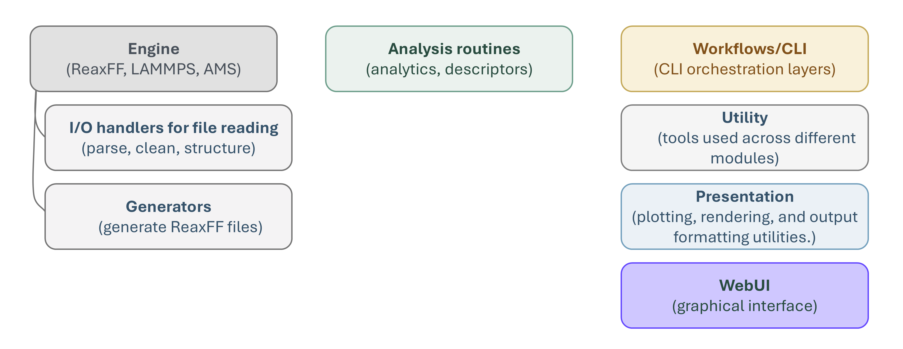
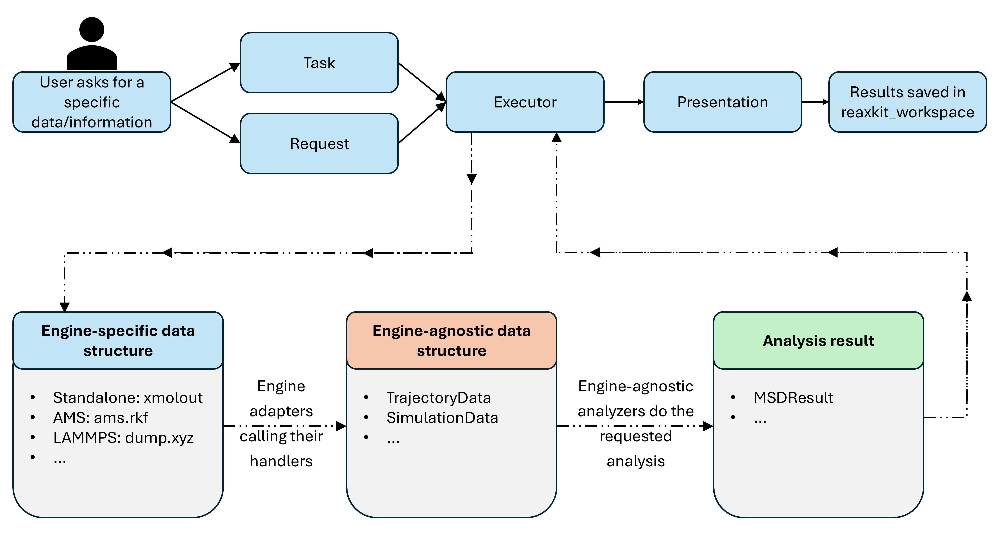
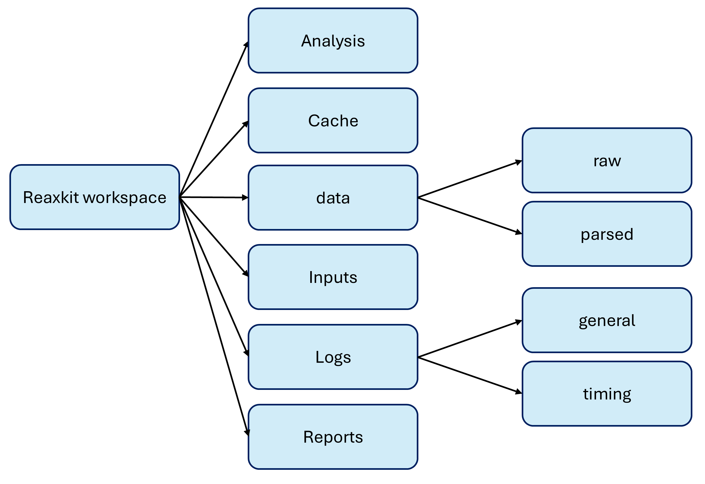

# Architecture Overview

This page gives a top-level mental model of how ReaxKit is organized and how data moves through it.

## 1) File Categories

ReaxKit modules are grouped by role:

- **Engine** (`src/reaxkit/engine/...`): file readers/writers, adapters, and generators tied to specific engines (ReaxFF, LAMMPS, AMS).
- **Analysis** (`src/reaxkit/analysis/...`): task-oriented computations with request-task-result contracts.
- **Workflows** (`src/reaxkit/workflows/...`): CLI orchestration layers that parse args, build requests, run tasks, and present/export outputs.
- **Utils** (`src/reaxkit/utils/...`): shared utility logic (numerical helpers, EOS tools, support functions).
- **Presentation** (`src/reaxkit/presentation/...`): plotting, rendering, and output formatting utilities.
- **WebUI** (`src/reaxkit/webui/...`): graphical interface and callback wiring.

### Note

```text
Worth mentioning that throughout this package, when we refer to 
'ReaxFF', we are referring to 'Standalone ReaxFF',
which is the original ReaxFF implementation by van Duin et al. 
This is to distinguish it from other engines that can produce 
ReaxFF-like outputs (e.g. LAMMPS with ReaxFF potential, AMS 
with ReaxFF module). The Engine category includes handlers 
for all engines, but the core 'ReaxFF' handlers are designed 
around the standalone ReaxFF output formats.
```


<a id="all_things_in_reaxkit_by_category"></a>

The figure below shows a category-level map of major ReaxKit components.

<div style="text-align:center;" markdown="1">
{ style="width:90%; max-width:800px;" }

*Figure: ReaxKit components organized by category.*
</div>

How to read this figure:

- Use it as a routing guide when deciding where new code belongs.
- Engine and Analysis form the core data-processing path, while Workflows orchestrate execution and user-facing commands.
- Utils and Presentation provide shared support layers used across multiple categories.
- WebUI sits on top of workflows/analysis for interactive usage patterns.

Examples by category:

- **Engine**: `src/reaxkit/engine/reaxff/io/xmolout_handler.py` is an Engine file because it parses a ReaxFF output format into structured data.
- **Analysis**: `src/reaxkit/analysis/trajectory/msd.py` is an Analysis file because it defines analysis requests/tasks/results and computes MSD from trajectory data.
- **Workflows**: `src/reaxkit/workflows/trajectory_workflow.py` is a Workflow file because it handles CLI arguments and dispatches analysis execution.
- **Utils**: `src/reaxkit/utils/equation_of_states.py` is a Utils file because it provides reusable numerical/helper functions shared by higher-level modules.
- **Presentation**: `src/reaxkit/presentation/plot/renderers/single.py` is a Presentation file because it is responsible for plot rendering/output formatting.
- **WebUI**: `src/reaxkit/webui/ui/analysis/callback_sections/execution_callbacks.py` is a WebUI file because it wires interactive UI callbacks to analysis execution actions.

## 2) How User Requests Are Processed (Engine-Independent)

This section focuses on how a user request for data/information is handled,
independent of whether the backing files came from ReaxFF, LAMMPS, AMS, or another source.

Core flow:

1. User submits a request (CLI or UI), including what to compute and optional filters.
2. Workflow layer validates/normalizes the request and builds a typed **request** object.
3. The request is routed to the matching analysis task based on task contract/type.
4. The **analysis executor** runs task logic and produces a typed **result** object.
5. Result is presented/exported (table, plot, file), using a consistent output contract.

<a id="how_requests_are_handled_and_analysis_executor_works"></a>

The figure below shows how request routing and analysis execution are connected.

<div style="text-align:center;" markdown="1">
{ style="width:90%; max-width:800px;" }

*Figure: Request parsing, routing, analysis execution, and result delivery flow.*
</div>

How to interpret this figure:

- The left side is user intent (what information is requested).
- The middle layers are request shaping and task routing.
- The executor layer runs task-specific computation with a uniform interface.
- The right side is output delivery (display/export), independent of source engine format.

Example:

- Command: `reaxkit timeseries --field trajectory[1].z --xaxis time --export atom1_z.csv`
- Why this fits the flow:
  - The request asks for one specific information stream (atom-1 z-coordinate over time).
  - Workflow converts CLI args into a typed request.
  - Executor dispatches to the timeseries task.
  - Task returns a structured series/table result.
  - Presentation/export writes `atom1_z.csv` using the same result contract used by other tasks.

## 3) `reaxkit-workspace` Structure

In order to have a structured way to organize ReaxKit's generated files and outputs, 
we have developed a dedicated folder, named `reaxkit-workspace`. This workspace is designed to keep all ReaxKit-related artifacts in a well-organized manner, facilitating easy access and management of inputs, outputs, and intermediate files.
This ensures **reproducibility, traceability, and a clear separation of raw data, processed data, analysis results, and visualizations**.

<a id="reaxkit_workspace_overall_folder_structure"></a>

Figure below shows the overall folder layout of a typical `reaxkit-workspace`.

<div style="text-align:center;" markdown="1">
{ style="width:90%; max-width:800px;" }

*Figure: Overall folder structure for organizing ReaxKit inputs, generated files, and outputs.*
</div>

How to navigate this structure:

- Original simulation artifacts can be found in `data/raw/<run_id>/...`. Every time you run a new task, its required raw files are automatically copied into a new run-specific folder here.
- Once the data is loaded and normalized into ReaxKit's main data classes, they sit in `data/parsed/<parsed_id>/` (for example `trajectorydata.h5` + `meta.json`).
- `data/run_index/<run_id>.json` can be used for run-level metadata and lookup to see which runs you had, what files they used, etc.
- Generated input files are by default stored under `inputs/<run_id>/...`. This can be a 'control' file which you will use for your simulations.
- Analysis tabular outputs and figures are saved under `analysis/<task>/<analysis_id>/...`.
- `cache` is a place for handler/analysis caches and cache indexes.
- Execution traces are saved in `logs` to see the timing of different steps and debug if needed.
- Higher-level deliverables in PDF or Word format are saved in `reports`.

### Note

```text
Different IDs (run_id, parsed_id, analysis_id, handler_id) are used 
to keep track of different artifacts and their relationships. 
These IDs are generated automatically when you run tasks or 
load data, and they are used to organize files in a way that 
maintains traceability between raw inputs, parsed data, 
analysis results, and caches. For example, a run_id might 
correspond to a specific simulation run, while a parsed_id 
corresponds to the normalized data extracted from that run, and 
an analysis_id corresponds to a specific analysis task 
performed on that data. This structured approach allows you to 
easily navigate and manage the various files and outputs 
generated during your work with ReaxKit, ensuring that you 
can always trace back from an analysis result to the original 
raw data and the specific analysis parameters used to produce it.

Once you run a task, you are informed where the relevant files are 
stored in the workspace, so finding your outputs and inputs is easy.
```

Example placement by folder:

- **inputs**: `ReaxKit/inputs/<run_id>/control` is a generated control file
- **data/raw**: `ReaxKit/data/raw/<run_id>/xmolout` is a snapshot of the original ReaxFF output file (i.e., xmolout) copied into the workspace for a specific run.
- **data/parsed**: `ReaxKit/data/parsed/<parsed_id>/trajectorydata.h5` and `ReaxKit/data/parsed/<parsed_id>/meta.json` are the ReaxKit's normalized and structured representations of the raw data, stored in HDF5 and JSON formats for efficient access and metadata storage.
- **data/run_index**: `ReaxKit/data/run_index/<run_id>.json` is a JSON file that serves as an index for all the runs you have executed, containing metadata about each run such as the files used, parameters, and timestamps.
- **analysis**: `ReaxKit/analysis/msd/<analysis_id>/result.csv` and `ReaxKit/analysis/msd/<analysis_id>/settings.json` are the outputs of an MSD analysis task, where `result.csv` contains the computed mean squared displacement values and `settings.json` contains the parameters and configuration used for that analysis.
- **cache/handlers**: `ReaxKit/cache/handlers/<handler_id>/cache.h5` is a cache file that stores intermediate data and results related to a specific handler (i.e., XmoloutHandler), allowing for faster access and reuse of previously computed information when the same handler is invoked again with the same parameters.
- **cache/analysis**: `ReaxKit/cache/analysis/<analysis_id>/cache.h5` is a cache file that stores intermediate data and results related to a specific analysis task (i.e., MSDTask), enabling efficient retrieval of previously computed results when the same analysis is performed again with the same parameters.
- **cache/index**: `ReaxKit/cache/index/handlers.json` and `ReaxKit/cache/index/analysis.json` are JSON files that serve as indexes for the handler and analysis caches, respectively, keeping track of which cache files correspond to which handlers and analyses, along with metadata such as timestamps, parameters, and relationships between different cached artifacts.
- **logs**: `ReaxKit/logs/general/reaxkit_general.log` and `ReaxKit/logs/timing/human_readable_timing.log` are log files that capture general logs and timing information for your ReaxKit runs, providing insights into the execution flow, performance, and any issues that may arise during the processing of your data and analyses.
- **reports**: `ReaxKit/reports/<analysis_id>/active_site_events_report.pdf` is a generated report that summarizes the findings of a specific analysis task (i.e., active site events), presenting the results in a structured and visually appealing format for easy interpretation and sharing.

---

For first usage flow, continue with [Installation](installation.md).
