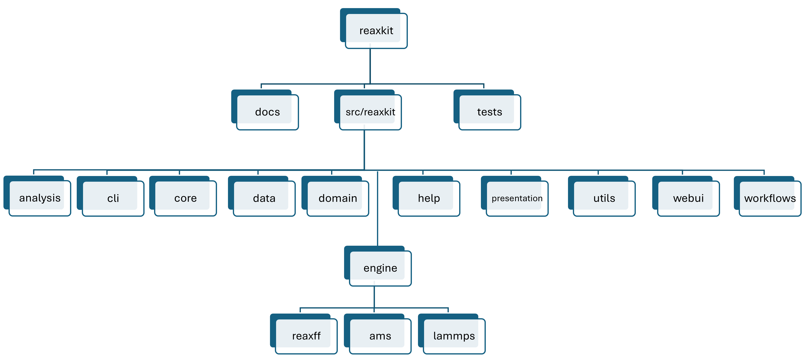
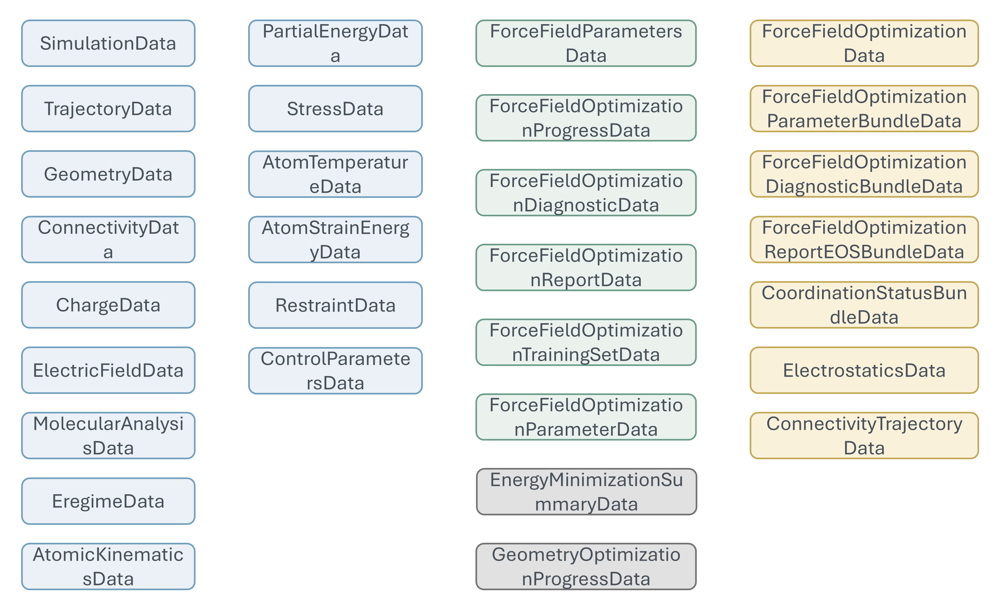

# ReaxKit's folder structure and domain data models

## 1) ReaxKit's folder structure

<a id="reaxkit_v200_folder_structure"></a>

Figure below shows the overall folder structure of the ReaxKit codebase:

<div style="text-align:center;" markdown="1">
{ style="width:90%; max-width:800px;" }

*Figure: ReaxKit folder structure.*
</div>

At the repository level, ReaxKit is organized into three main areas: 
1. `docs` for user and developer documentation, 
2. `src/reaxkit` for the installable Python package, 
3. and `tests` for validation. 

Inside `src/reaxkit`, the package is split by responsibility: 
1. `analysis` contains engine-agnostic analysis tasks, 
2. `cli` exposes command-line entry points, 
3. `core` holds registries and shared infrastructure, 
4. `data` stores packaged resources, 
5. `domain` defines the central data/request/result models, 
6. `help` supports introspection, 
7. `presentation` handles plots and rendered outputs, 
8. `utils` provides shared helpers, 
9. `webui` contains the Dash interface, 
10. and `workflows` orchestrates higher-level user actions. 

The `engine` package is the source-specific layer and is further divided into `reaxff`, `ams`, 
and `lammps`, which normalize engine-specific files into the shared domain models used by the rest of ReaxKit.

## 2) Domain data models

<a id="domain_dataclasses_in_reaxkit"></a>

Figure below shows a list of the main domain data models defined in `src/reaxkit/domain` and used across the codebase.

<div style="text-align:center;" markdown="1">
{ style="width:90%; max-width:800px;" }

*Figure: ReaxKit domain data models.*
</div>

Domain data models are defined as Python dataclasses and represent the core entities that ReaxKit operates on.
For example, `TrajectoryData` represents a molecular dynamics trajectory, while `EnergyData` encapsulates energy information extracted from engine outputs.
These models are designed to be engine-agnostic, allowing ReaxKit to work with different simulation engines while maintaining a consistent internal representation of data. 
They are used throughout the codebase for analysis, visualization, and workflow orchestration, enabling seamless integration between the engine-specific parsing and the higher-level functionalities provided by ReaxKit.

As a result, no matter what engine you are using, its data are mapped and normalized into these shared domain models, which are then consumed by the rest of ReaxKit's features.
Getting familiar with these domain data models is key to understanding how ReaxKit processes and analyzes simulation data across different engines, and to
developing new features that can work with any supported engine.

### Note

```
When you want to develop a new analyzer in ReaxKit, just think about what type of data you want, 
and not about how data is stored by a specific engine. For example, if you need the trajectory 
data to compute a new type of analysis, just define a function that takes `TrajectoryData` as 
input, and ReaxKit will take care of parsing the engine-specific files and mapping them to 
this domain model. This way, you no longer need to consider that trajectory data is stored 
in 'xmolout' files by ReaxFF Standalone, or in 'dump.xyz' files by LAMMPS, or in specific 
fields field of 'ams.rkf' by AMS.
```
