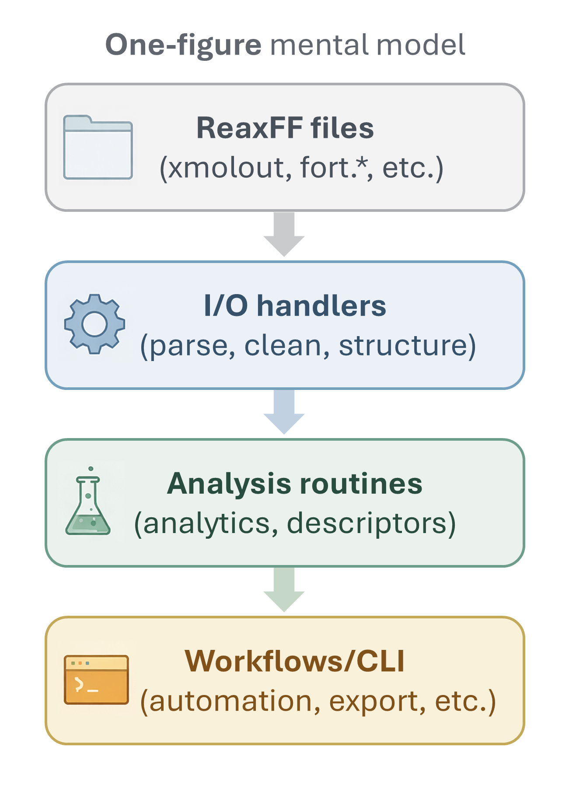

# ReaxKit Documentation

**ReaxKit** is a Python toolkit for **parsing, analyzing, and visualizing ReaxFF simulations**.
It provides a clean separation between **file I/O**, **analysis routines**, and **CLI workflows**,
making it easy to go from raw ReaxFF outputs to scientific insight.

---

## Getting started

If you are new to ReaxKit, start here:

- **[Installation](installation.md)** – Install ReaxKit and its dependencies  
- **[Quickstart](quickstart.md)** – First steps with handlers, analyzers, and workflows  
- **[Tutorials](tutorials/index.md)** – End-to-end, example-driven guides

---
## Core concepts

ReaxKit follows a simple, layered mental model that mirrors how scientists think about simulations:

### 📂 I/O handlers
Parse raw ReaxFF files into clean, structured data.

- `xmolout`, `fort.7`, `fort.74`, and more  

→ **[I/O API](api/io/index.md)**

### 📊 Analysis routines
Reusable, file-agnostic analysis functions built on top of handlers for scripting *and* CLI use.

- `Connectivity`, `coordination`, `electrostatics`, etc.  

→ **[Analysis API](api/analysis/index.md)**

### 🔁 Workflows (CLI)
User-facing commands that combine I/O + analysis + plotting.

- `reaxkit xmolout get …`  

→ **[Workflows API](api/workflows/index.md)**

{ loading=lazy }

---

## Examples

Runnable Python examples showing typical usage patterns:

- Basic `xmolout` parsing  
- Combined `xmolout` + `fort.7` analysis  
- Plotter meta workflows  

→ **[Examples](examples/README.md)**

---

## Reference material

Background documentation on ReaxFF input/output formats:

- Input files (`control`, `eregime`, etc.)
- Output files (`xmolout`, `fort.*`, summaries)

→ **[ReaxFF Reference](reaxff_reference/index.md)**

---

## Templates & contributing

For developers extending ReaxKit:

- Handler, analyzer, and workflow templates  
- Docstring conventions and style guides  

→ **[File templates](file_templates/index.md)**  
→ **[Contributing](contributing.md)**

---

## Design philosophy

- Explicit over implicit  
- File-format fidelity  
- Minimal magic, maximal inspectability  
- CLI and Python API are equally first-class  

---

If you’re unsure where to go next, the **[Tutorials](tutorials/index.md)** are the best entry point.
